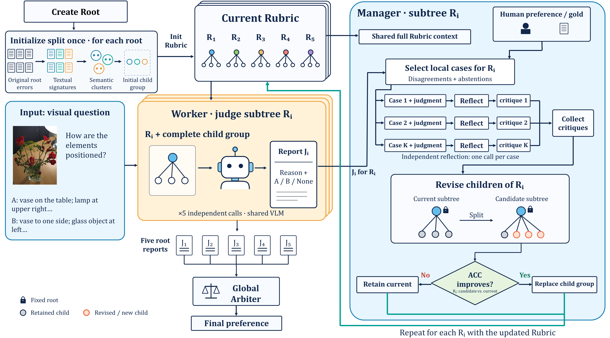

# 结构化 Rubric 的子树局部演化

本仓库研究如何从多模态人类偏好中构建并演化结构化 Rubric：先生成或指定高层 root 准则，再构造各 root 的子准则，最后通过逐案例反思和局部候选竞争更新子树。Worker 根据完整子树判断两条回答，Global Arbiter 综合各子树报告，得到最终偏好。



图以五根 Rubric 为例。root 在初始化后保持固定，演化更新其整组 children；每轮使用同一份冻结 Rubric 验证各 root 的候选，轮末组装获胜组。


## 方法流程

1. **R0：创建根准则。** G5 (Generated Five) 默认从五个偏好预热样例归纳五根，可通过 `--warmup-count` 设置预热数量；GN (Generated N) 从同一份预热对话归纳 2–7 根。F5 (Fixed Five) 使用人工固定五根对照。
2. **S0：初始化子准则。** 对各 root 判断错误的案例生成文本 signature，再通过语义聚类生成一整组 children。
3. **局部演化。** Worker 对每棵完整子树给出 A/B/None 与理由。Manager 以完整 Rubric 为背景，按 `(root, sample)` 遍历演化集独立反思，汇总非空 critique 后生成候选 children。程序在同一演化集上比较候选与当前子树，按配置的局部准确率接受，轮末提交获胜组。
4. **冻结与评测。** 冻结 Final 后在 VLRB 评测。

初始化使用 `signature → cluster → children`；演化使用逐例反思和整组 children 修订。具体 prompt、输入边界与代码职责见[架构说明](docs/architecture.md)。

## 仓库结构

```text
structured_rubrics/                     Agent、解析器与结构化 Rubric 基础组件
experiments/evolving_structured_rubrics/ 当前方法、命令入口与报告工具
  configs/                              实验配置示例
tests/                                  离线测试
docs/experiments/                        冻结协议、结果摘要与实验索引
assets/framework.png                    主要框架图
data/                                   本地数据与共享图像
output/                                 本地实验产物与调用缓存
```

## 配置与数据

三个配置示例对应不同的数据协议和局部接受设置：

| 配置示例 | 演化集 | 局部接受指标 | 保留正确案例 |
| --- | --- | --- | --- |
| [generated_roots.example.json](experiments/evolving_structured_rubrics/configs/generated_roots.example.json) | 冻结 Hallucination100，seed11 | Strict ACC | Preserve5，最多 5 条 |
| [subtree_local_reflection.example.json](experiments/evolving_structured_rubrics/configs/subtree_local_reflection.example.json) | 原 Discovery100 | Covered ACC | 0 条 |
| [subtree_local_reflection_strict.example.json](experiments/evolving_structured_rubrics/configs/subtree_local_reflection_strict.example.json) | 原 Discovery100 | Strict ACC | 0 条 |

**Strict ACC** 是正确数除以全部样例数，弃权计错；**Covered ACC** 是正确数除以输出 A/B 的样例数。候选必须严格提升配置指定的局部指标。**Preserve5** 在局部演化中使用，从当前子树判断正确的演化集案例中选取最多五条，作为修订提示中的保留案例；它与接受指标、root 生成预热数量分别设置。

配置中的 `worker` 指定模型和 OpenAI 兼容端点池，`manager` 指定模型、端点、请求参数及 API key 环境变量名。将凭据放入本地 `.env`，并通过 `env_file` 指定位置。示例使用 Worker Qwen3-VL-8B、Manager Qwen3.5-27B；Manager thinking 关闭，signature 和 case reflection 并发为 6，其余 Manager 调用并发为 4。当前冻结协议要求 Worker 总并发为 50。

示例最多演化五轮。R0 生成默认每个逻辑调用最多尝试 10 次，由 `--root-attempt-limit` 控制；S0、演化和外评中的 Manager/Worker 调用由 `--attempt-limit` 控制，默认同样为 10 次。

运行命令时工作目录为仓库根目录。准备好配置引用的本地文件：

- VL-RewardBench parquet：`data/VL_RewardBench/data/test-00000-of-00001.parquet`。
- Dev150：`data/discovery_v2_demo_v3/dev_150.jsonl` 及其引用的图像。
- Hallucination100 的样本 ID 和来源哈希由 [seed11 split manifest](docs/experiments/vlrb-hallucination100-generated-roots/seed11_split.json) 固定；`prepare` 从 parquet 生成演化集。

更换数据、模型、prompt 或接受规则时，使用新运行目录。

## 运行实验

统一入口为 `experiments.evolving_structured_rubrics.run_subtree_experiment`：

| 阶段 | 作用 |
| --- | --- |
| `prepare` | 生成冻结演化集与运行配置 |
| `roots` | 创建 R0；G5/GN 共用预热历史，F5 创建固定五根 |
| `vlrb-r0` | 评测裸 root 的正式 VLRB K=3 基线 |
| `init` | 独立生成 S0 后停止；可复用已有 R0 与发现集报告 |
| `vlrb-s0` | 独立评测已冻结 S0 的完整 VLRB K=3，无需 Final |
| `evolve` | 构造 S0，再执行局部演化并冻结 Final |
| `dev` | 在 Dev150 上评测 S0/Final，K=1 |
| `vlrb` | 在完整 VLRB 上评测 S0/Final，K=3 |
| `report` | 离线汇总已保存结果、阶段配对变化与成本 |
| `report-init` | 离线配对比较同一 R0、旧 S0 和新 S0 |

以 G5 为例，逐条执行以下命令。`prepare` 之后使用它保存的 `config.json`：

```powershell
python -m experiments.evolving_structured_rubrics.run_subtree_experiment prepare --config experiments\evolving_structured_rubrics\configs\generated_roots.example.json --output-root output/subtree_reflection/seed11
python -m experiments.evolving_structured_rubrics.run_subtree_experiment roots --config output/subtree_reflection/seed11/config.json --output-root output/subtree_reflection/seed11 --variant g5
python -m experiments.evolving_structured_rubrics.run_subtree_experiment vlrb-r0 --config output/subtree_reflection/seed11/config.json --output-root output/subtree_reflection/seed11 --variant g5
python -m experiments.evolving_structured_rubrics.run_subtree_experiment evolve --config output/subtree_reflection/seed11/config.json --output-root output/subtree_reflection/seed11 --variant g5
python -m experiments.evolving_structured_rubrics.run_subtree_experiment dev --config output/subtree_reflection/seed11/config.json --output-root output/subtree_reflection/seed11 --variant g5
python -m experiments.evolving_structured_rubrics.run_subtree_experiment vlrb --config output/subtree_reflection/seed11/config.json --output-root output/subtree_reflection/seed11 --variant g5
python -m experiments.evolving_structured_rubrics.run_subtree_experiment report --config output/subtree_reflection/seed11/config.json --output-root output/subtree_reflection/seed11 --variant g5
```

将 `--variant` 改为 `gn` 或 `f5` 可运行另两个对照，各变体使用独立子目录。G5/GN 在同一个输出根目录下复用预热对话，默认五个样例，生成请求分别规定五根或允许 2–7 根；F5 使用固定五根。原 Discovery100 配置的冻结协议见[子树实验方案](docs/experiments/subtree-local-reflection/plan.md)。

在 `roots` 命令中加入 `--warmup-count 10` 可使用十个预热样例，数量须在 1 到演化集样例数之间。G5 仍生成五根，F5 不使用预热。同一输出根目录中的 G5/GN 须使用相同预热数量；改变数量时使用新输出目录。其他阶段无需传入该参数。

### 只验证 Init Split

当前实验分支将初始化提示词与流程集中在 [init_split.py](experiments/evolving_structured_rubrics/init_split.py)：三套独立的中文系统提示词、带说明的用户模板及 signature → cluster → children 流程。三个阶段都提供全部根职责；signature 使用案例图像与目标 Worker 报告，不输入 Global Arbiter 报告。后续演化提示词保持原协议。详细设置见[初始化对比计划](docs/experiments/init-split-prompts/plan.md)。

复用已保存的 G5 seed11 五根 R0，逐条执行：

```powershell
$run = "output/init_split/seed11/template_zh_v1"
New-Item -ItemType Directory -Force "$run/g5" | Out-Null
python -m experiments.evolving_structured_rubrics.run_subtree_experiment init --config output/subtree_reflection/seed11/config.json --output-root $run --variant g5 --source-run output/subtree_reflection/seed11/g5 2>&1 | Tee-Object -FilePath "$run/g5/init.log"
python -m experiments.evolving_structured_rubrics.run_subtree_experiment vlrb-s0 --config output/subtree_reflection/seed11/config.json --output-root $run --variant g5 2>&1 | Tee-Object -FilePath "$run/g5/vlrb-s0.log"
python -m experiments.evolving_structured_rubrics.run_subtree_experiment report-init --config output/subtree_reflection/seed11/config.json --output-root $run --variant g5 2>&1 | Tee-Object -FilePath "$run/g5/report-init.log"
```

`--source-run` 指向旧变体目录，例如上述 g5，而非其 r0 子目录。初始化核对模型、发现集及 A/B 映射后，复制 R0 与已有 K=1 报告；旧目录只读。新目录保存模板、来源、请求缓存、S0 与正式评测。图像仍共用 data/VL_RewardBench/dataset_images。

init 完成后保存 epoch=0、completed=false 的演化状态；vlrb-s0 直接评测冻结 S0，不伪造 Final。以后可在同一目录运行 evolve 继续局部演化。report-init 从 source.json 恢复对照来源，写出 g5/init_comparison.json，包含正式切片、根诊断、配对变化、区间与成本。改变初始化模板必须使用新输出目录。

## 指标与结果产物

VLRB 正式 K=3 要求至少两票选择同一个原始回答，否则计为弃权。阶段日志标记 `official K=3`，打印的 Strict ACC 与正式报告一致。运行时的 A/B 相对多数指标用于诊断；正式结果读取 VLRB 阶段报告中的 `official`，或汇总报告中的切片指标。

`report` 对同一批完整 VLRB 预测离线统计 R0、S0 和 Final：

| 切片 | 样例数 | 含义 |
| --- | ---: | --- |
| `full` | 1247 | 完整 VLRB，包含参与演化的 100 条 |
| `train` | 100 | 参与演化的幻觉演化集，按正式 K=3 重新统计 |
| `nontrain_1147` | 1147 | 排除参与演化的 100 条 |
| `heldout_hallucination` | 648 | 冻结的未见幻觉留出集 |
| `General / Hallucination / Reasoning` | 181 / 749 / 317 | 三个官方类别 |

泛化分析使用 648 和 1146 切片；训练中的 K=1 分数与正式 K=3 分数分别报告。VL-RewardBench 的官方 OverallAcc 排除弃权，MacroAcc 为三个类别 Covered ACC 的平均值，它们与 Strict ACC 分开记录。

单变体结果写入 `output/subtree_reflection/seed11/<variant>/report.json`。F5、G5、GN 均有完整报告后，再生成 seed 目录的跨变体 `report.json`。汇总包含各 root 指标、阶段配对变化、区间估计及生成/推理成本，统计过程不会重新调用模型。

## 研究文档与历史分支

- [代码架构与输入边界](docs/architecture.md)
- [实验索引](docs/experiments/README.md)
- [子树逐例反思：冻结协议](docs/experiments/subtree-local-reflection/plan.md)与[最终实验结果](docs/experiments/subtree-local-reflection/results.md)
- [生成 root 对照：冻结方案、历史结果](docs/experiments/vlrb-hallucination100-generated-roots/plan.md)
- [框架 PPT](docs/experiments/subtree-local-reflection/framework.pptx)


 CritiQ-V 代码保存在 `CritiQ-V` 分支；早期 Gate/Cascade、joint、递归投票及其他实验的完整实现保存在 `codex/subtree-local-reflection` 分支和阶段标签。
