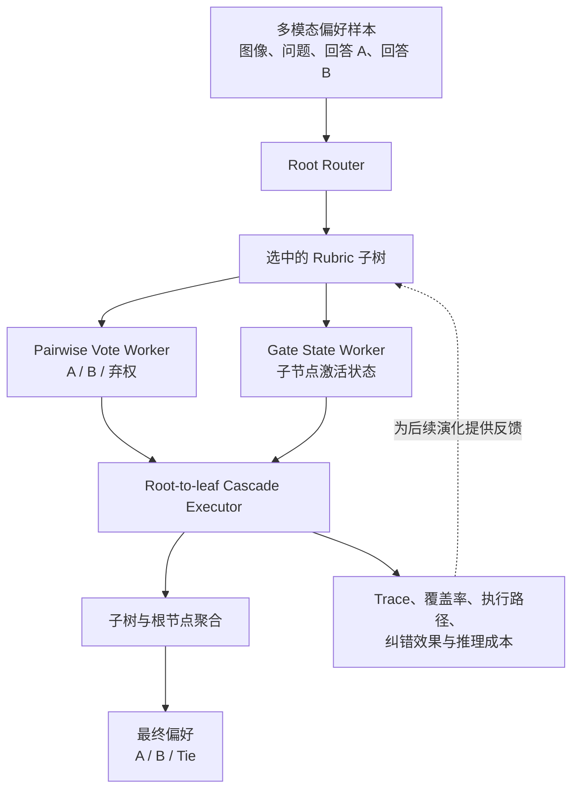

# Evolving Structured Rubrics from Multimodal Preferences

本项目研究如何从多模态偏好数据中，将扁平的自然语言评价准则逐步演化为可解释的结构化 Rubric Forest。给定图像、问题和两个候选回答，系统需要判断哪些准则与当前样本相关、应当沿哪条路径执行，以及如何聚合各节点的判断。

项目目前处于研究开发阶段。Rubric 的表示、执行和验证基础设施已经完成，具体的自动演化算法仍在持续设计和迭代。

## 我们要解决的问题

传统 Rubric 通常将所有准则视为相互独立的扁平列表，并对每个样本执行全部准则后进行多数投票。这种方式忽略了准则之间的前置依赖、粒度差异，以及不同样本可能需要不同评价路径的问题。

我们的目标是让 Rubric 从少量自然语言准则出发，在多模态偏好反馈的驱动下逐步生长、分化和精简。最终的层级与级联关系应当成为演化过程的自然产物，而不是预先手工固定的最终结构。

## 核心思想

Rubric 被表示为由多个根节点组成的 Forest，准则是其中的节点，条件依赖是节点之间的边。通用准则可以位于上层，细粒度准则只在父节点满足相应条件时继续执行。

系统将偏好投票与路径控制拆成两个通道：Pairwise Worker 负责输出权威的 `A`、`B` 或弃权投票，Gate Worker 负责提供是否进入子节点所需的状态。这样既保留原有准则的判断语义，也支持结构化的 root-to-leaf cascade。

## 整体架构



当前实现包含版本化的 Rubric Schema、确定性的遍历与聚合规则、离线重放、在线惰性执行、cache/trace 校验和多后端推理池。Shared-output 实验允许不同路由与聚合策略复用完全相同的模型判断，从而公平比较结构本身的作用。

## 当前完成状态

- [x] 结构化判断与聚合语义
- [x] 不可变的 Rubric Tree/Forest 表示与校验
- [x] Root Router 与 root-to-leaf Cascade Executor
- [x] Pairwise/Gate 双通道执行
- [x] Offline replay、cache、trace、telemetry 与 backend pool
- [x] 静态 Rubric 的 shared-output 实验
- [ ] 自动 Rubric evolution loop
- [ ] 基于反馈的准则与结构优化

当前基础设施已经能够稳定地表示、执行、重放和比较 Structured Rubrics。现有实验恢复了原 Pairwise baseline，但手工构造的静态 Forest 只带来了较小改善，当前 Root Router 也存在遗漏有用准则的问题。这些结果说明执行与反馈链路已经可用，下一阶段应重点演化 Rubric 本身。

## 当前实验入口

正式的实验入口为：

```powershell
python -m experiments.evolving_structured_rubrics.run_shared_output_pool --help
```

本地运行可以参考配置模板 [`shared_output_pool.example.json`](experiments/evolving_structured_rubrics/configs/shared_output_pool.example.json)。本地 endpoint、checkpoint 路径、prediction、trace 和 cache 不提交到 Git。

相关文档：

- [Idea 初稿](docs/Evolving%20Structured%20Rubrics%20from%20Multimodal%20Preferences.md)
- [实现计划](docs/Evolving%20Structured%20Rubrics%20Implementation%20Plan.md)
- [Shared-output 实验总结](docs/experiment-results/shared_output_pool_v1_summary.md)

## 基于 CritiQ-V

本项目建立在 CritiQ-V 之上。CritiQ-V 是我们对 [CritiQ](https://github.com/KYLN24/CritiQ) 的多模态扩展，负责将自然语言准则挖掘和 Pairwise Evaluation 适配到带图像的偏好数据；本项目在此基础上进一步研究 Rubric 的结构表示、条件路由、级联执行和后续结构演化。

如果本项目对你的研究有所帮助，也请引用原始 CritiQ 工作：

```bibtex
@misc{guo2025critiqminingdataquality,
  title        = {CritiQ: Mining Data Quality Criteria from Human Preferences},
  author       = {Honglin Guo and Kai Lv and Qipeng Guo and Tianyi Liang and Zhiheng Xi and Demin Song and Qiuyinzhe Zhang and Yu Sun and Kai Chen and Xipeng Qiu and Tao Gui},
  year         = {2025},
  eprint       = {2502.19279},
  archivePrefix= {arXiv},
  primaryClass = {cs.CL},
  url          = {https://arxiv.org/abs/2502.19279}
}
```
