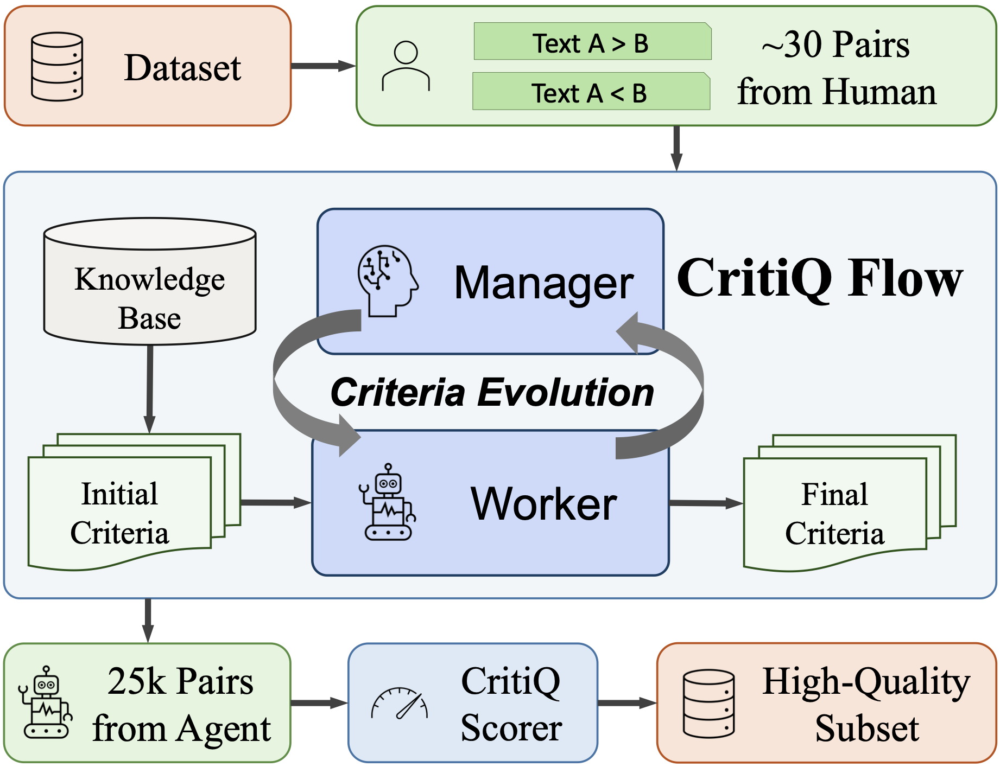
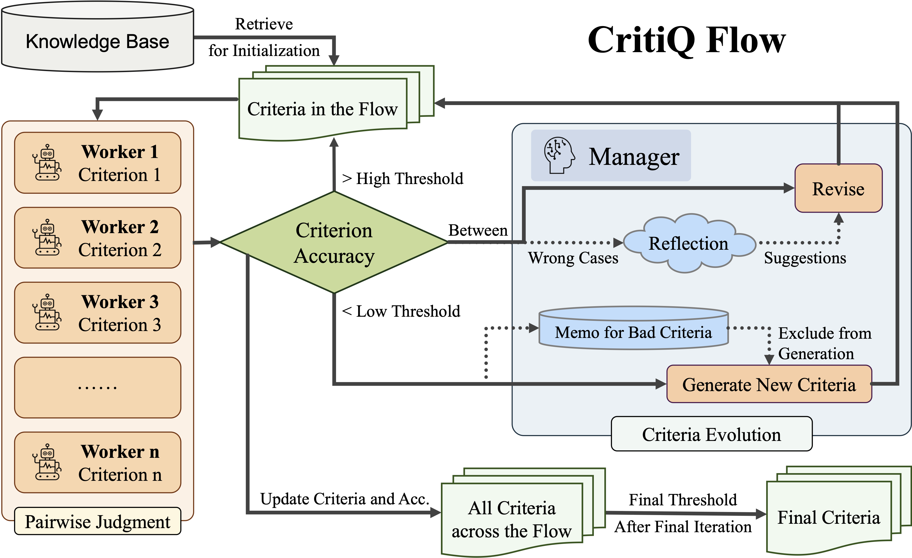

# CritiQ: Mining Data Quality Criteria from Human Preferences

[](https://github.com/KYLN24/CritiQ) [](https://arxiv.org/abs/2502.19279) [](https://huggingface.co/papers/2502.19279) [](https://aclanthology.org/2025.acl-long.792)

## Updates

- **2025-05-16**: 🎉 Our paper has been accepted to the main conference of **ACL 2025**.
- **2025-03-07**: 🛠️ We release the Python implementation of *CritiQ* on GitHub.
- **2025-02-26**: 📝 We published the preprint [*CritiQ: Mining Data Quality Criteria from Human Preferences*](https://arxiv.org/abs/2502.19279) on arXiv.

## Introduction



Language models require high‑quality data, yet common selection methods (heuristics, perplexity, classifiers, prompt engineering) are costly, expert‑heavy, and can introduce bias. CritiQ automatically learns interpretable quality criteria from ~30 human preference pairs and uses them to select data efficiently. CritiQ Flow evolves criteria with a manager agent and makes pairwise judgments with worker agents, optionally boosted by a knowledge base distilled from prior work. We then train a CritiQ Scorer to assign quality scores for scalable selection. Across code, math, and logic, CritiQ attains high accuracy on human‑annotated tests and improves downstream performance when continuing to train Llama 3.1 versus uniform sampling. Ablations confirm the benefits of the knowledge base and reflection, and we analyze criteria evolution and the effect of majority voting.

## Quick Start

### Installation

```bash
git clone https://github.com/KYLN24/CritiQ
cd CritiQ
pip install -e ".[vllm,train]"
```
### Usage

#### (Optional) Prepare the Knowledge Base

We do not release the knowledge base for *CritiQ Flow* due to the license issue of the source data. You can prepare you own knowledge base following the instructions in the paper.

The format of the knowledge base should be a JSON file with the following structure:

```json
[
    {
        "name": "Criterion 1",
        "description": "Description of criterion 1"
    },
    {
        "name": "Criterion 2",
        "description": "Description of criterion 2"
    }
]
```

Alternatively, CritiQ can be used without the knowledge base. In this case, the LLMs will generate the criteria from several examples.

#### Prepare Data

The preference data should be in one of these formats:

**Pair Data Format** (for preference comparison):
```json
[{"A": "text1", "B": "text2", "answer": "A"}]
```

**Zero-One Data Format** (for binary classification):
```json
[{"text": "sample text", "label": 1}]
```

#### Run CritiQ Flow



See `demo.py` for a complete example. Key steps:
1. Configure your model settings and API keys
2. Load your dataset 
3. Initialize `Workflow` with desired parameters
4. Call `workflow.get_init_criteria()` to generate initial criteria
5. Call `workflow.optimize()` to iteratively improve criteria quality

#### Agent Annotation

```sh
python -m critiq.scripts.annotation --help
# Configure dataset path, model settings, and criteria for annotation
```

#### Train CritiQ Scorer

```sh
set -e

# Training
torchrun --nproc-per-node=8 -m critiq.scripts.train_reward \
         --model=/path/to/your/base/model \
         --job_name=your_job_name \
         --output_dir=/path/to/output/dir \
         --data=/path/to/annotated/data.jsonl \
         --batch_size=4 \
         --eval_batch_size=4 \
         --max_length=32768 \
         --eval_steps=50 \
         --epochs=3 \
         --lr=2e-5 \
         --accum=4 \
         --zero_stage=2 \
         --gradient_checkpointing \
         --warmup_ratio=0.2 \
         --use_qwen2_rm

# Evaluation
torchrun --nproc-per-node=8 -m critiq.scripts.train_reward \
         --model=/path/to/trained/model \
         --data=/path/to/eval/data.jsonl \
         --eval_batch_size=8 \
         --max_length=32768 \
         --only_eval \
         --use_qwen2_rm
```

#### Score the Dataset

```sh
# Using regular inference
python -m critiq.scripts.reward_predict \
       --model_path=/path/to/trained/model \
       --data=/path/to/dataset.jsonl \
       --output_dir=/path/to/output/dir

# Using VLLM for faster inference (recommended for large datasets)
CUDA_VISIBLE_DEVICES=0 python -m critiq.scripts.reward_predict_vllm \
       --model_path=/path/to/trained/model \
       --data=/path/to/dataset.jsonl \
       --output_dir=/path/to/output/dir \
       --text_field=content \
       --vllm_max_model_len=32768 \
       --vllm_tensor_parallel_size=1 \
       --max_data_chars=20000 \
       --vllm_port=8000
```

#### Perform Sampling

Use the scored results to sample high-quality data based on the learned criteria. For efficient temperature-based sampling with Gumbel distribution, refer to: https://github.com/princeton-nlp/QuRating/blob/main/data_tools/select_subset.py

## Citation

If you find our work helpful, please consider citing it in your publications:

```bibtex
@misc{guo2025critiqminingdataquality,
      title={CritiQ: Mining Data Quality Criteria from Human Preferences}, 
      author={Honglin Guo and Kai Lv and Qipeng Guo and Tianyi Liang and Zhiheng Xi and Demin Song and Qiuyinzhe Zhang and Yu Sun and Kai Chen and Xipeng Qiu and Tao Gui},
      year={2025},
      eprint={2502.19279},
      archivePrefix={arXiv},
      primaryClass={cs.CL},
      url={https://arxiv.org/abs/2502.19279}, 
}
```
