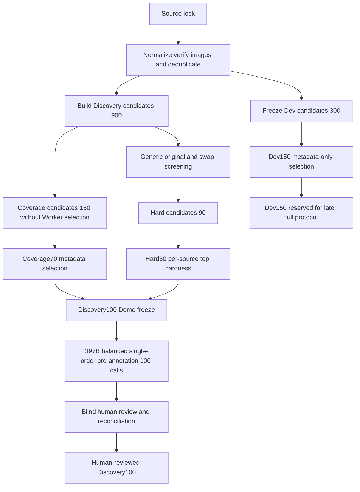

# Discovery-v2：面向结构化 Rubric 演化的多模态偏好数据构建

## 1. 研究背景：为什么要重新构建 Discovery 数据

本项目希望从少量多模态偏好经验中，自动发现并改进一组可解释的自然语言准则（Rubric）。一条偏好样本包含一张图像、一个问题、两个候选回答，以及人工认为更好的回答：

```text
image + question + answer A + answer B + preferred answer (A/B)
```

此前使用的 Discovery90 主要来自视觉事实性幻觉场景。它非常适合发现“物体是否存在”“数量是否正确”“回答是否凭空补充视觉细节”等准则，因此推动了 Visual Grounding 与 Factuality 子树的演化；但它也带来明显的数据分布偏置：

- 视觉事实性样本占主导，多步推理、知识问答、开放式生成和指令遵循不足；
- 创造性、清晰性等偏好维度很少获得与其职责真正匹配的错误经验；
- 大量样本同时适用于多个事实性准则，容易演化出语义重叠的 children；
- 只在同一窄分布上选择准则，可能提高 heldout 幻觉数据表现，却不能保证迁移到 VL-RewardBench 的 `General` 与 `Reasoning` 类别。

因此，Discovery-v2 不是简单地“增加样本数”，而是重新设计演化经验的组成。目标是让数据同时回答三个问题：

1. **分布覆盖**：视觉事实性之外，是否覆盖了推理、知识、开放生成和指令遵循？
2. **有效错误经验**：数据中是否保留了足够多的 Worker 错误与位置不稳定样本，供后续算子学习？
3. **独立泛化**：Discovery 上接受的修改能否在未参与演化的数据上保持收益？

## 2. 总体设计：Coverage70、Hard30 与 Dev150

最终数据由一个统一的 `Discovery100` 和独立的 `D_dev150` 构成。`Discovery100` 内部再按选样目的分为 Coverage Core 与 Hard Core，但两者进入演化后地位相同，不是两套评价协议。

| 子集 | 数量 | 主要作用 | 是否参与演化 |
|---|---:|---|---|
| Coverage Core | 70 | 保证领域、来源、任务和回答形态的覆盖 | 是 |
| Hard Core | 30 | 提供与当前 Rubric 无关的 Worker 错误和位置不稳定经验 | 是 |
| `D_dev` | 150 | 每个 epoch 后的独立泛化诊断 | 否 |

### 2.1 Coverage Core：先保证数据“看得广”

Coverage Core 不根据任何 Worker 是否答错来选样。它只关注数据本身是否可靠、多样和均衡，避免小规模 Discovery 再次被视觉幻觉或某个大来源支配。

| 领域 | Coverage 数量 | 主要覆盖内容 |
|---|---:|---|
| 视觉感知与事实性 | 24 | 物体、属性、数量、OCR、空间关系、视觉幻觉 |
| 多模态推理与知识 | 23 | 数学、图表、知识、多步推导、视觉证据与推理链一致性 |
| 通用偏好与指令遵循 | 23 | 任务完成度、约束遵循、表达质量、开放式偏好 |
| **合计** | **70** |  |

### 2.2 Hard Core：再保证数据“有东西可学”

如果 100 条都只按覆盖随机选择，可能多数偏好差异过于明显，Qwen3-VL-8B-Instruct 很少犯错，后续 Create、Split 和 Refine 就缺少有效失败经验。Hard Core 因此保留 30 条通用偏好 Worker 判断错误或 A/B 交换不稳定的样本，三个领域各 10 条。

Hard Core 的困难性不能由当前五个 roots 定义。它使用不含 root、criterion、children 或 Global Rubric 的通用偏好提示词，只综合判断视觉事实、推理、指令遵循和整体回答质量。这样未来无论继续使用五个 roots，还是先通过 Create 算子从数据中发现新的初始 criteria，Discovery100 都不会预先绑定某一种 Rubric 结构。

### 2.3 为什么取消单独的 `D_boundary`

先前方案单独构造 25 条、并按照当前五个 roots 标注 applicable/non-applicable 边界。这会让数据选择依赖一个未来可能被 Create 替换的 Rubric 初始化方案，也把“改善数据分布”过早扩展成“训练特定路由边界”。

新版不再设置 `D_boundary` 配额，也不要求 `applicable_root_ids`。视觉证据不足、多维偏好冲突或近似 tie 仍可作为样本的自然元数据记录，但不决定固定数量，更不引用当前 root 名称。边界学习应在 criteria 创建后，由后续 Gate、Refine 或专门的边界优化实验处理。

### 2.4 `D_dev`：判断演化是否只记住了 Discovery

`D_dev` 有 150 条，三个领域各 50 条，并在任何困难样本筛选前按 seed 冻结。它不能生成 ErrorSignature、不能进入 Manager 上下文，也不能用于早停、接受候选或选择 checkpoint。

`D_dev` 比单个 Core 更大，是因为它承担稳定诊断，而不是向 Manager 提供更多可记忆经验。它用于回答：

- discovery ACC 上升是否同时改善 dev ACC；
- 哪个领域开始退化；
- Coverage 的变化来自合理 abstain，还是过度输出 `None`；
- corrected 与 harmed 是否只集中在某一来源。

## 3. 为什么选择这六个数据集

单一数据集通常只覆盖一种偏好：RLHF-V 强调幻觉修正，MMPR 强调推理正确性，VisionArena 更接近真实用户的开放偏好。Discovery-v2 因此采用“每个领域至少两个 source family”的设计，让同一个领域内部也存在不同的数据生成机制，降低对单一标注流程的依赖。

### 3.1 数据源总览

| 数据源 | 分配领域 | 数据特点 | 在 Discovery-v2 中的作用 | 论文/发表状态 |
|---|---|---|---|---|
| RLHF-V | visual | 人工对幻觉片段进行细粒度纠正，偏好信号密集 | 保留高质量视觉事实性与幻觉案例 | *RLHF-V*, CVPR 2024 |
| MM-RLHF | visual | 约 120K 人工细粒度偏好对，覆盖一般、多选、长答与安全 | 扩展 RLHF-V 之外的视觉任务和回答形态 | *MM-RLHF*, ICML 2025 |
| ViLReward-73K | reasoning | 73K 级视觉语言过程奖励数据，同题包含不同质量推理过程 | 构造高分/低分 reasoning process 偏好对 | *ViLBench*, EMNLP 2025 Main |
| MMPR-v1.2 | reasoning | 大规模多模态推理偏好数据，包含 chosen/rejected | 覆盖数学、图表、知识和复杂推理 | MMPR/MPO 为 arXiv 技术工作；v1.2 同时用于 InternVL3.5 报告 |
| VisionArena-Battle | general | 真实用户对两个匿名 VLM 的在线投票，问题开放且风格多样 | 引入真实用户偏好、开放生成和自然指令 | *VisionArena*, CVPR 2025 |
| MMIF-23K v2 DPO | general | 含文本与视觉约束的多模态指令遵循偏好对 | 强化格式、约束、任务完成度等通用偏好 | *MM-IFEngine*, ICCV 2025 |

### 3.2 RLHF-V：高密度视觉幻觉纠错

RLHF-V 的核心不是简单比较两个完全独立回答，而是让人工直接纠正回答中的幻觉片段，再将原回答与纠正回答构成偏好。论文报告使用约 1.4K 细粒度标注数据显著降低幻觉，说明小规模但高密度的人类纠错具有很强的监督价值。

选择它的原因是：本研究同样希望从少量错误经验中发现可复用规则，RLHF-V 的 preferred/rejected 差异通常集中在具体视觉事实上，非常适合生成 ErrorSignature。它的局限也很明确——数据天然偏向视觉可信度，因此新版 Discovery100 只保留 17 条 RLHF-V（Coverage Core 12 条、Hard Core 5 条），避免重新回到 Discovery90 的分布。

本项目读取官方 Hugging Face 数据集 `openbmb/RLHF-V-Dataset` 的 `RLHF-V-Dataset.parquet`，从 `text.question/chosen/rejected` 恢复偏好对。

### 3.3 MM-RLHF：更广的人工多模态偏好

MM-RLHF 关注的不只是幻觉，而是多模态模型与人类偏好的系统性对齐。论文发布于 ICML 2025，数据包含约 120K 细粒度人工比较对，并覆盖多种任务形态与安全维度。

它与 RLHF-V 互补：前者提供更广的视觉任务和回答长度，后者提供更集中的幻觉纠正。Discovery-v2 使用 `dpo_pairs.jsonl`，并根据图像路径前缀按需从 `short.zip`、`long.zip`、`mcq.zip`、`safety.zip` 恢复图像；视频归档不在单图 v1 协议中使用。

### 3.4 ViLReward-73K：从最终答案扩展到推理过程

ViLReward-73K 来自 ViLBench/ViLPRM 工作，论文发表于 EMNLP 2025 Main。其数据不是天然的 A/B pair，而是同一图像与问题下的多个 reasoning process 及数值 reward。它使 Discovery-v2 能看到“最终答案可能相近，但推理链质量不同”的案例。

适配器按归一化后的 `image + question` 分组，选择 value 最高与最低的 process 构成偏好对；只有两者 reward gap 至少为 `0.25` 才保留。这样构造的 gold 来自原数据的过程价值排序，而不是由本项目 Worker 重新打标。该来源最终规范化数量较少，原因正是同题分组、最小差值和图片可恢复性共同收紧了候选范围。

### 3.5 MMPR-v1.2：大规模多模态推理偏好

MMPR 由 Mixed Preference Optimization 工作提出，用自动化流程生成多模态 reasoning preference。MMPR-v1.2 是后续扩充版本，被 InternVL3.5 用于偏好优化，强调数据多样性和复杂推理能力。

这里需要区分“数据版本”和“论文版本”：原始 MMPR/MPO 工作目前以 arXiv 技术论文公开；本项目实际锁定的是 Hugging Face 的 **MMPR-v1.2**，不是最初 MMPR。官方数据页与后续说明对 headline 样本规模存在不同统计口径，因此本项目不依赖网页上的规模数字，而是锁定具体 annotation/image 文件和 commit SHA。

本项目读取 `annotations.zip` 中的 question/chosen/rejected，并将 `images.zip_aa`、`images.zip_ab`、`images.zip_ac` 合并为一个 multipart ZIP 后按引用恢复单张图像。

### 3.6 VisionArena-Battle：真实用户而非合成 judge 的偏好

VisionArena 发表于 CVPR 2025，收集真实用户与 VLM 的线上交互。其中 VisionArena-Battle 包含约 30K 场匿名双模型对战及用户偏好票，覆盖开放问答、描述、OCR、幽默、创作、实体识别和图表理解等真实请求。

选择它是为了补偿其他来源中过强的“训练集任务模板”和模型生成偏好。它也有明显噪声：用户投票可能受长度、Markdown 和表达风格影响，多轮、多图、多语言与 tie 也不符合当前 loader。v1 因此只保留 English、single-image、single-turn、明确 `model_a/model_b` winner 的记录。

VisionArena 的 Parquet 内嵌图片、单 shard 体积大。为避免在 Windows 上将全量 Arrow 表载入内存，当前实现按 31 个锁定 shard 流式扫描，并用固定 seed 的 reservoir sampling 保留最多 1,200 条原始记录，最多扫描 4,800 条后停止。它是**受控抽样来源**，不是完整下载并规范化全部 30K battle。

### 3.7 MMIF-23K v2：视觉条件下的复杂指令遵循

MM-IFEngine 发表于 ICCV 2025，关注多模态模型能否同时理解视觉内容并严格满足输出约束。其 MM-IFDPO-23K 为偏好优化提供 chosen/rejected，覆盖格式、长度、内容组织以及与图像相关的约束。

这类数据对清晰性、完整性、创造性等非事实性偏好维度很重要：一个回答即使视觉事实正确，也可能没有遵守用户要求。项目明确使用 v2 文件 `v2/dpo/mmif_23k_4o_qwen2_5.json`；官方说明 v2 主要由 GPT-4o 标注。图像从 `allava.tar`、`cc3m.zip`、`diversity.zip` 和 `multiui.zip` 恢复。

## 4. 实际收集了哪些版本和文件

配置中的 `revision=main` 只用于首次解析；`discovery-v2-source-lock` 会立即将其解析为不可变 commit SHA，并记录目标文件的 Git blob/LFS SHA-256、大小、license 与 gated 状态。后续 ingest 只能使用该 lock，不会随着远端 `main` 更新而静默改变。

| 来源 | Hugging Face repo | 锁定 commit | 本次读取的标注文件 | 图片来源 | License/协议 |
|---|---|---|---|---|---|
| RLHF-V | `openbmb/RLHF-V-Dataset` | `1d8e9804b59e9da64ad7b1e17d505869ab9b2ad3` | `RLHF-V-Dataset.parquet` | Parquet 内嵌 | CC BY-NC 4.0 |
| MM-RLHF | `yifanzhang114/MM-RLHF` | `29cfeea5929979d12b42a8f30201e03c188408a6` | `dpo_pairs.jsonl` | `short/long/mcq/safety.zip` | MIT |
| ViLReward-73K | `UCSC-VLAA/ViLReward-73K` | `4ea6a9380da80f8a6b022f1ac38f4edf58ec0f91` | `vilreward_73k_train.json` | `images.zip` | MIT |
| MMPR-v1.2 | `OpenGVLab/MMPR-v1.2` | `d062d72e08d35cc2d736c4481163fa0bdaebf4c1` | `annotations.zip` | `images.zip_aa/ab/ac` | MIT |
| VisionArena-Battle | `lmarena-ai/VisionArena-Battle` | `a41d58f15caa3e2d9685774153d2bc815b943d96` | 31 个 `train-*.parquet` shard 流式读取 | Parquet 内嵌 | VisionArena data agreement |
| MMIF-23K | `ChrisDing1105/MMIF-23k` | `d7997b72999195680664e850d75d3fe3e96eaf49` | `v2/dpo/mmif_23k_4o_qwen2_5.json` | 4 个 image archive | Apache 2.0 |

完整 blob、LFS hash 和文件大小记录在 `source_lock.json`。这张表用于人类阅读，复现时应以 lock 文件而不是文档中的短表为准。

## 5. 从六种 schema 到统一偏好对

六个数据集的记录格式并不相同，因此不能直接拼接。适配器先统一为内部 schema：

```json
{
  "sample_id": "...",
  "image_path": "...",
  "question": "...",
  "A": "...",
  "B": "...",
  "answer": "A",
  "source": "...",
  "source_family": "...",
  "domain": "visual | reasoning | general"
}
```

转换规则如下：

- RLHF-V：`chosen → A`，`rejected → B`，gold 为 A；
- MM-RLHF、MMPR、MMIF：读取其 chosen/rejected 或等价字段，gold 为 A；
- VisionArena：保留模型 A/B 原顺序，并将匿名用户 winner 转为 gold；
- ViLReward：同图同题分组，最高 value process 为 A，最低 value process 为 B。

这一步保留 source gold，但 source gold 不是最终标签。后续 397B 双顺序预标与人工盲审可以纠正错误标签，最终产物统一标记为 `label_origin=human_reviewed`。

## 6. 清洗、图片验证与去重

### 6.1 基础质量过滤

每条候选必须同时满足：

- 问题、A、B、二元 gold 与单张图像均存在；
- 图像字节不少于 64 bytes，并能被 Pillow 完整 decode/verify；
- A/B 各不超过 16,000 字符；
- 较长回答与较短回答的字符长度比不超过 8；
- A/B token Jaccard 小于 0.96，避免几乎相同的回答对；
- VisionArena 额外满足 English、single-image、single-turn 和 non-tie。

图片并不沿用来源目录中的易变路径。验证成功后按原始字节计算 SHA-256，保存为：

```text
image_store/<sha前两位>/<完整sha>.<suffix>
```

相同图片只保存一份，后续所有 JSONL 都引用这个 content-addressed path。

### 6.2 排除 VL-RewardBench 重叠

由于最终要在 VL-RewardBench 上评估，ingest 会先从本地 benchmark checkout 构建排除索引。这里只读取 sample ID、图片、问题与回答文本来生成指纹，**不读取 gold，也不根据 benchmark 结果选样**。

候选若与 VL-RewardBench 具有相同 sample ID、image SHA、同一 image+question 组合或 unordered A/B pair SHA，就在进入 Discovery/Dev 之前排除。仅 question 文本相同不视为 benchmark 泄漏，因为诸如 “Describe this image” 的通用问题可以出现在不同图像上。finalize 时还会对最终 250 条（Discovery100 + Dev150）再检查一次，防止中间处理绕过隔离。

### 6.3 全局去重与跨 split 隔离

剩余记录按照 source family、source 和 source sample ID 确定性排序，再依次去重：

1. 相同 source/sample ID；
2. 相同 image+question 组合；
3. 相同无序 A/B pair SHA；
4. 同一 image+question 组内回答对 token Jaccard ≥ 0.92 的近重复。

同一归一化问题可以对应不同图像，因此不再做全局 question-only 删除。Dev 与 Discovery 的候选分配另行执行 group holdout：Dev 冻结后，Discovery 不得共享 Dev 的 image、question、source/sample ID 或 pair。这样既保留视觉变化，又避免两个 split 共享同一问题组。

## 7. Coverage70 + Hard30 的选样与人工标注

### 7.1 先冻结 Dev，再处理 Discovery

全局去重后，使用 seed=42 在每个领域内按 source family 均衡地先抽取 100 条 Dev 候选，再从剩余样本以 source-family round-robin 构建 300 条 Discovery 候选。最终形成：

| 领域 | Discovery 候选 | Dev 候选 |
|---|---:|---:|
| visual | 300 | 100 |
| reasoning | 300 | 100 |
| general | 300 | 100 |
| **合计** | **900** | **300** |

六个来源在候选池中完全均衡：每个来源贡献 150 条 Discovery 候选和 50 条 Dev 候选。Dev 在 Worker screening 前冻结，因此 `dev_selection_model_calls=0`，现有 300 条 Dev candidates 可以继续复用。

最终 `D_dev150` 从这 300 条候选中按每个来源 25 条确定性抽取，即每个领域 50 条。选择只使用 source subdomain、问题长度、回答长度、图像分辨率等数据属性做分层，并在层内按 seed=42 hash 排序；不得读取 Generic Worker、旧 five-root Worker 或 397B 的判断。先冻结每个来源的候选顺序，再进行 397B 预标和人工复核；若记录因缺图、标签不明确或无法形成二元偏好被人工拒绝，只能按该来源预先冻结的候补顺序递补，不能根据模型是否答错挑选替代样本。

### 7.2 Coverage 候选：只看数据属性，不看模型输赢

Coverage selector 从每个来源确定性抽取 25 条，共**得到 150 条候选**。每个来源内部按 source subdomain、问题长度、回答平均长度和 A/B 长度比例进行 round-robin，同一分层内用 seed=42 hash 排序。

这一 selector 必须在代码层面禁止读取：

- five-root M1 prediction 与 root votes；
- RootConflict 或当前 Rubric 的 Coverage/ACC；
- Generic Worker 是否判断正确；
- 任何 criterion、node 或 routing 信息。

397B 与人工复核完成后，再按 task type 和 preference dimensions 补充多样性，最终每个来源选择 11 或 12 条，组成 Coverage Core 70。

### 7.3 Generic screening：只为 Hard Core 提供困难度

900 条 Discovery 候选使用一个与 Rubric 无关的通用偏好提示词运行 original 和 A/B swap，共 `900 × 2 = 1,800` 次判断。提示词只要求综合图像、问题、事实正确性、推理、指令遵循与回答质量选择 A/B/None，不提供 roots、criteria、children 或 Global Rubric。

设 $v_o$ 为原顺序输出，$v_s^{-1}$ 为 swap 输出映射回原顺序后的结果，$y$ 为 gold。困难度定义为：

$$
H_{\mathrm{generic}}(x)
=\mathbf 1[v_o\ne y]
+\mathbf 1[v_s^{-1}\ne y]
+\mathbf 1[v_o\ne v_s^{-1}].
$$

分数范围为 0–3，分别反映两个顺序中的错误次数和位置不一致。`None/abstain` 对明确 A/B gold 属于未正确判断；解析或网络失败是技术失败，必须重试，不能作为困难证据。

每个来源先按困难度选择 15 条，构成 90 条 Hard candidates。人工若纠正 source gold，必须用最终 human gold 重算困难度。最终每个来源保留 5 条，并要求 \(H_{\mathrm{generic}}^{\mathrm{human}}\ge1\)，组成 Hard Core 30。

对应实现分为两个可恢复 stage：`discovery-v2-generic-screen-smoke` 先从六个来源轮询抽取 20 条，执行 40 个双顺序判断；通过后，`discovery-v2-generic-screen` 才处理全部 900 条。正式阶段使用 `vllm-8000 + vllm-8001` available-slot pool、全局并发 40、temperature=0.5、`max_tokens=2048`、seed=42。每个顺序最多尝试 5 次；成功结果按请求身份缓存，技术失败不会得到困难分，重新运行同一 stage 时只会重试尚未成功的顺序。

这里的 90 条仍是**人工核验候选池**，不是最终 Hard30。选择时先排除 Coverage candidates150，再在每个来源内部按 $H_{\mathrm{generic}}$ 降序和 seed=42 稳定 hash 排序，固定取 15 条，不允许来源间借配额。

### 7.4 Discovery100 的精确配额

| 领域 | 来源 | Coverage | Hard | 最终数量 |
|---|---|---:|---:|---:|
| visual | RLHF-V | 12 | 5 | 17 |
| visual | MM-RLHF | 12 | 5 | 17 |
| reasoning | ViLReward-73K | 11 | 5 | 16 |
| reasoning | MMPR-v1.2 | 12 | 5 | 17 |
| general | VisionArena-Battle | 11 | 5 | 16 |
| general | MMIF-23K | 12 | 5 | 17 |
| **合计** |  | **70** | **30** | **100** |

Hard 与 Coverage 最终样本必须互斥。推荐先冻结 Hard30，再从 Coverage candidates 中排除相同 sample IDs 后补齐 Coverage70。某一来源的首批 Hard candidates 不足 5 条时，只从该来源未使用候选中追加，不向其他来源借配额。

### 7.5 397B 双顺序预标与通用元数据

Coverage150、Hard90，以及已经通过纯元数据规则冻结的 Dev150 交给 Qwen3.5-397B-A17B 做 original/swap 双顺序预标。对 Dev 的调用只服务于标签核验和人工审阅，发生在样本身份与候补顺序冻结之后，因此不属于筛选，也不能改变 `dev_selection_model_calls=0`。预标输出不引用任何已有 Rubric，而描述样本本身：

```json
{
  "answer": "A",
  "confidence": 4,
  "preference_rationale": "A correctly uses the visible values and reaches the supported conclusion.",
  "visual_evidence": ["The chart bar for the requested category is visibly higher."],
  "task_type": "reasoning",
  "preference_dimensions": ["factual_correctness", "reasoning_validity"],
  "evidence_type": "mixed",
  "candidate_a_issues": [],
  "candidate_b_issues": ["The intermediate comparison reverses the two chart values."],
  "ambiguity_flags": []
}
```

`answer` 允许 `A/B/uncertain`；其中 `uncertain` 只是诊断状态，不能成为最终 gold。两个顺序映射回原顺序后，只有一致的 A/B 才形成 `suggested_answer`，其余情况进入 reconciliation，不自动淘汰。397B 的作用是帮助人工理解和组织样本，而不是替代最终 human gold。

实现冻结 390 个互斥样本：Coverage150、Hard90、Dev150；每条运行 original 与 swap，因此共有 780 个逻辑判断。Smoke 精确覆盖六来源 × 三池各一条，即 18 条、36 个判断。请求使用 Qwen3.5-397B-A17B、temperature=0.2、`max_tokens=4096`、thinking budget=2048、API retry=3、结构化输出最多尝试 5 次。服务端虽然声明 30 并发容量，但实测突发 30 个 397B 多模态请求会触发 50508 busy，因此 runner 使用不影响请求语义和缓存身份的并发安全上限 5。成功顺序按完整请求身份缓存；正式阶段会复用 smoke 的 36 个成功判断，正常情况下最多新增 744 次请求。同一 stage 重跑只补尚未解析成功的顺序。

模型输入严格只有图像、问题、A 和 B；source、source gold、Generic Worker、pool role、roots 与 Rubric 均由 frozen manifest 明确标记为不可见。正式阶段即使存在少量技术失败也会处理完整任务清单并写为 `incomplete`，不会把失败样本静默删除；补齐前 report 和人工队列不会生成。

### 7.6 人工盲审与 reconciliation

第一遍盲审只展示图像、问题和 A/B，隐藏 source gold、397B 结论、Generic Worker、旧 five-root screening，以及样本来自 Coverage 还是 Hard pool。人工填写最终 A/B、置信度、偏好理由、视觉证据、task type、preference dimensions、evidence type、主要错误类型和 ambiguity flags。

以下情况进入第二遍 reconciliation：

- human 与 source gold 不同；
- human 与 397B 建议不同；
- 397B original/swap 不一致；
- Generic Worker 两个顺序不一致；
- human 标记视觉证据不足、近似 tie 或标签可疑。

最终只接受完成全量人工复核、置信度至少为 3、理由非空且争议已 reconciliation 的记录。finalize 再确定性调整 A/B，使 Discovery100 与 Dev150 的 gold 位置分别约为 50/50。

### 7.7 已完成的 five-root screening 只保留为诊断

此前已对 900 条候选完成 `900 × 5 roots × 2 orders = 9,000` 次 Prompt-v2 判断。该结果衡量的是当前五-root Rubric 的 M1 wrong、swap inconsistency 和 root conflict，因此不再参与 Coverage70 或 Hard30 选择，也不能决定人工队列顺序。

这些输出仍有研究价值：Discovery100 冻结后，可以离线报告旧五-root M1 在新分布上的初始 ACC、领域错误率和投票冲突。旧 `discovery_screened_ranked.jsonl` 应保留为只读 diagnostic，而不是新版 adjudication 的输入。

## 8. 当前数据分析

当前已完成 source lock、ingest、候选池冻结、旧版 five-root full screening和 criterion-agnostic Generic screening；397B 预标已完成离线 freeze，在线双顺序推理与人工复核尚未运行。因此以下数字描述的是**候选池与筛选诊断**，不是最终 Discovery100 的领域表现。

### 8.1 六个来源实际规范化数量

| 来源 | 规范化并通过单源质量过滤 | 占 23,515 的比例 |
|---|---:|---:|
| RLHF-V | 5,535 | 23.5% |
| MM-RLHF | 4,013 | 17.1% |
| ViLReward-73K | 632 | 2.7% |
| MMPR-v1.2 | 5,108 | 21.7% |
| VisionArena-Battle | 382 | 1.6% |
| MMIF-23K v2 | 7,845 | 33.4% |
| **合计** | **23,515** | **100%** |

这些数字不是六个公开数据集的完整规模，而是受 `raw_rows_per_source=8,000`、VisionArena reservoir、适配规则、配对规则、图片恢复和质量过滤共同影响后的候选量。特别是 ViLReward 的 632 是分组构成的 pair 数，不是原始 process 行数；VisionArena 的 382 来自受控 reservoir，不代表全量 battle 的有效率。

原始候选分布明显不均衡：MMIF、RLHF-V 和 MMPR 较多，ViLReward 与 VisionArena 较少。若直接随机抽样，最终数据仍会被大来源主导。当前的每来源 150/50 round-robin 候选池正是为了解决这个问题。

### 8.2 单源清洗排除

共记录 8,061 次单源拒绝，主要原因如下：

| 原因 | 数量 | 占单源拒绝比例 | 解释 |
|---|---:|---:|---|
| 图片无法恢复或 decode | 3,859 | 47.9% | 主要来自 MMPR 和 MM-RLHF 的路径/归档匹配失败 |
| A/B 长度比例 > 8 | 2,262 | 28.1% | 防止仅凭长短就能判断偏好 |
| MM-RLHF schema 不完整 | 891 | 11.1% | 缺图片、问题、pair 或 gold 所需字段 |
| VisionArena 非英文 | 467 | 5.8% | v1 只保留 English |
| A/B 近相同 | 251 | 3.1% | token Jaccard ≥ 0.96 |
| VisionArena tie/unknown | 229 | 2.8% | v1 只接受明确 A/B gold |
| VisionArena 非 single-turn | 99 | 1.2% | 当前 Worker schema 不支持多轮 |
| 其他 | 3 | <0.1% | 极长/截断回答与个别 schema 异常 |

图片失败接近一半，说明“标注文件存在”不等于“样本可复现”。这也是为什么本项目没有只保存远端路径，而是在 ingest 阶段就验证图像并建立本地 content-addressed store。

### 8.3 benchmark 排除和全局去重

单源过滤后有 23,515 条。修正 benchmark schema 后，VL-RewardBench 的 `query/response` 指纹能够正确读取；按 sample ID、image、image+question 和 unordered pair 检查，当前 900 条 Discovery candidates 与 300 条 Dev candidates 均无精确 benchmark 重叠。仅共享通用 question 文本的记录不被当作泄漏。

内部去重后剩余 20,710 条，共减少 2,805 条：

| 去重键 | 排除数量 |
|---|---:|
| source/sample ID | 829 |
| image+question SHA | 1,840 |
| unordered pair SHA | 136 |

与旧规则相比，保留同问题不同图像的样本使候选池增加 5,211 条。该变化不是放宽 benchmark 隔离，而是把“通用问题重复”和“同一多模态样本重复”区分开来。

### 8.4 候选池平衡与隔离

最终候选池已经实现：

- Discovery：三个领域各 300，每个来源各 150；
- Dev：三个领域各 100，每个来源各 50；
- Discovery 与 Dev 在 image SHA、question SHA、source sample ID 和 unordered pair SHA 上重叠均为 0；
- Dev 在 Worker screening 前冻结，`dev_selection_model_calls=0`。

新版离线 selector 已从这两个池中进一步冻结 Dev150 和 Coverage candidates150：六个来源分别贡献 25 条，因此两个集合都保持 visual/reasoning/general 各 50 条。selector 只读取 source、subdomain、问题长度、回答平均长度、A/B 长度比例及稳定 hash；代码会拒绝包含 `worker_screen`、M1、root votes、hardness 或 adjudication 等模型字段的输入。两个输出在 sample ID、image SHA、question SHA、source/sample ID 和 unordered pair SHA 上重叠均为 0，且 `selection_model_calls=0`。

Coverage150 与 Dev150 是不读取模型结果的候选池；Generic screening 也已经从其余 Discovery candidates 中冻结了互斥的 Hard90。为了先用较低成本验证完整数据闭环，当前从 Coverage150 和 Hard90 中进一步冻结了 Coverage70 + Hard30 的 Discovery100 Demo；Dev150 暂不送入397B。

### 8.5 Screening smoke

Smoke 从六个来源中至少各取一条，共 20 条；每条对五个 roots 运行 original 与 swap，共 200 个判断。结果为：

```json
{
  "sample_count": 20,
  "original_valid_rate": 1.0,
  "swapped_valid_rate": 1.0
}
```

这证明六个 adapter、图像路径、Prompt v2、A/B swap、`A/B/abstain` 解析与缓存恢复可以连通。它不证明标签正确，也不代表最终数据难度；这些需要完整 screening 和人工审阅后分析。

### 8.6 已完成的 five-root full screening

900 条候选的 9,000 次局部判断已经完成，original 与 swapped valid rate 均为 1.0。旧 selector 从中选择了 300 条，领域各 100、来源各约 49–51 条；每个领域恰好包含 33 条 five-root M1 wrong。

这一结果表面上很均衡，但其平衡是旧 `source family × error signature` 轮询产生的，而且 300 条中有 93 条旧 hardness 为 0。它说明旧结果适合诊断当前五-root Rubric，却不能代表 criterion-agnostic 的困难样本集合。新版保留全部缓存和诊断报告，但不会将这 300 条直接送入 adjudication。

### 8.7 Generic screening 与 Discovery100 Demo

Generic screening 已完成900条、1,800个 original/swap 判断，解析率为100%。原顺序准确率为70.89%，swap 映射回原顺序后的准确率为73.11%，位置一致率为70.78%。在排除 Coverage150 后，每个来源按 Generic hardness 选择15条，得到互斥的 Hard90，其中84条 hardness=2、6条 hardness=3。

考虑到完整 Coverage150 + Hard90 + Dev150 需要780次397B判断，第一版先冻结成本更低的 Discovery100 Demo：

| 领域 | 来源 | Coverage | Hard | 合计 |
|---|---|---:|---:|---:|
| visual | RLHF-V | 12 | 5 | 17 |
| visual | MM-RLHF | 12 | 5 | 17 |
| reasoning | ViLReward-73K | 11 | 5 | 16 |
| reasoning | MMPR-v1.2 | 12 | 5 | 17 |
| general | VisionArena-Battle | 11 | 5 | 16 |
| general | MMIF-23K | 12 | 5 | 17 |
| **合计** |  | **70** | **30** | **100** |

Coverage70 继续使用纯元数据分层顺序；Hard30 在每个来源的 Hard15 中按 hardness 取前5条，相同分数用 seed=42 hash 打破平局。最终 Hard30 包含24条 hardness=2 和6条 hardness=3。三个领域数量为34/33/33，六来源数量为17/17/16/17/16/17，Coverage 与 Hard 无重叠。该 selector 不读取397B结果；但 Hardness 本身是 Generic Worker 相对 source gold 的错误与位置不一致，因此 Hard30 属于主动困难样本，而不是完全模型无关的均匀样本。

Demo 的397B预标进一步采用**每条只判断一个顺序**：seed=42仅根据 sample ID 将100条确定性分为50条original和50条swapped，不读取source gold。当前调度后，模型实际看到的source gold位置由原始A=91/B=9改善为A=59/B=41。这里不为了追求表面上的50/50而读取gold反向安排顺序；最终human-reviewed数据仍会在finalize时调整成50/50。单顺序不再用第二次397B调用估计swap一致性，后者已经由前置Generic双顺序筛选提供。

因此Demo只需要100次397B判断，约为完整780次方案的12.8%。Smoke使用六来源×Coverage/Hard各一条，共12条、12次判断；成功缓存进入正式阶段，因此最多新增88次请求。相同图像、问题、顺序、prompt和decoding的既有成功结果仍可复用，因为单/双顺序只属于实验调度，不改变单次模型调用语义。

首轮预标暴露了两条不适合作为Discovery数据的MM-RLHF记录：一条为问题和回答均出现mojibake的窄幅中文文字截图，另一条为信息量过低的22像素高线段示意图。二者在人工质量审核后分别由同来源、同领域、同Coverage/Hard槽位的CLEVR物体计数题和真实图像斑马计数题替换；替换不读取397B判断结果，并继承原槽位的展示顺序。因此v3与v2共有98条且这98条的顺序完全不变，只需为两条新增记录生成397B判断。当前冻结候选集为 `discovery100_demo_single_order_v3/frozen_discovery100.jsonl`；只有完成397B预标、100条人工盲审和reconciliation后，才会生成human-reviewed的最终 `final/discovery_100.jsonl`。

## 9. 当前结论与仍需完成的分析

当前结果支持三个阶段性判断：

1. **多源构建是必要的。** 原始来源数量和标注机制差异很大，若不做领域/source 配额，少数大数据集会主导 Discovery。
2. **图片可恢复性是核心质量门槛。** 3,859 条候选在这一阶段失败，提前物化和验证图片比在实验运行时才发现缺图更可靠。
3. **多模态组合键比 question-only 去重更合理。** 当前规则以 image+question、unordered pair 和 source/sample ID 为核心，既实现了 Discovery/Dev 与 VL-RewardBench 的强隔离，也保留了“相同通用问题、不同图像”的有效样本。
4. **数据筛选不能预设未来 Rubric。** 已完成的 five-root screening 准确描述了当前系统的困难样本，但若未来使用 Create 初始化 criteria，它不能再作为 Discovery100 的选样依据。

Generic screening 与新版 finalize 后，报告还应增加：

- 三领域和各 subdomain 的最终数量；
- 每个来源的保留率与人工纠正率；
- Coverage70 的 task type、preference dimensions 与回答形态分布；
- Hard30 的 human-gold generic hardness 分布；
- 397B original/swap 分歧率；
- human/source/397B 一致性与 reconciliation 原因；
- 问题长度、回答长度比、gold A/B 位置与图片分辨率分布；
- 旧 five-root M1 wrong、swap inconsistency 与 root conflict 的 post-hoc 分布；
- 最终 Discovery、Dev、VL-RewardBench 的精确与近重复审计。

## 10. 复现入口与产物

主体流程如下；工程命令放在这里是为了复现，而不是作为数据设计本身的解释。



已经完成且可以只读复用的入口：

```powershell
conda activate critiq
$python = (Get-Command python).Source
$module = "experiments.evolving_structured_rubrics.run_rubric_evolution"
$config = "experiments/evolving_structured_rubrics/configs/rubric_evolution_phase5.example.json"
$output = "output/evolving_structured_rubrics/rubric_evolution_phase5"

& $python -m $module --config $config --output-dir $output discovery-v2-source-lock
& $python -m $module --config $config --output-dir $output discovery-v2-ingest
& $python -m $module --config $config --output-dir $output discovery-v2-screen-smoke
& $python -m $module --config $config --output-dir $output discovery-v2-screen
& $python -m $module --config $config --output-dir $output discovery-v2-selection-freeze
```

其中 `discovery-v2-screen` 是旧 five-root diagnostic；它的缓存和报告继续保留，但 `discovery-v2-selection-freeze` 与 Generic screening 都不读取其预测或 hardness。新版 Generic screening 已实现，运行入口为：

```powershell
Invoke-RestMethod "http://10.102.137.255:8000/v1/models" | Out-Null
Invoke-RestMethod "http://10.102.138.0:8000/v1/models" | Out-Null

& $python -m $module --config $config --output-dir $output discovery-v2-generic-screen-smoke
& $python -m $module --config $config --output-dir $output discovery-v2-generic-screen
```

不要继续运行旧版 `discovery-v2-adjudicate`，因为它仍会读取旧 `discovery_screened_ranked.jsonl`。新版 397B 预标使用独立 stages 与 `adjudication_v2/` 目录：

```text
discovery-v2-adjudication-freeze
→ discovery-v2-adjudication-smoke
→ discovery-v2-adjudication-run
→ discovery-v2-adjudication-report
→ discovery-v2-review-v2-export
```

`review-v2-export` 首次生成 390 条盲审队列，并用 seed=42 确定性地把恰好 195 条显示为交换顺序。第一遍只展示图像、问题和显示后的 A/B；再次运行该 stage 时，已经填写的人工结果会保留，并只把 human/source/397B 存在分歧的条目写入 reconciliation queue。最终 Coverage70、Hard30 与 Dev150 的 finalize 将在全量人工复核后另行实现。

当前低成本 Discovery100 Demo 使用以下独立入口；它不读取或覆盖390条完整双顺序协议：

```text
discovery-v2-demo-freeze
→ discovery-v2-demo-smoke
→ discovery-v2-demo-adjudicate
→ discovery-v2-demo-report
→ discovery-v2-demo-review-export
→ discovery-v2-demo-finalize
```

`demo-finalize` 只接受100条全部完成的人工审核。当 human 纠正 source gold、human 与397B单顺序建议不一致，或397B给出 `uncertain`/低置信度时，必须完成 reconciliation。若存在 reject，stage 会明确暂停并要求确定性候补，不会用少于100条的数据伪装完成。最终输出会确定性调整 A/B 位置，使 gold 恰好为50/50。

关键产物：

```text
output/evolving_structured_rubrics/rubric_evolution_phase5/discovery_data_v2/
├── source_lock.json
├── ingest_report.json
├── ingest/source_shards/*.jsonl
├── ingest/source_shards/*.meta.json
├── image_store/
├── candidates/discovery_candidates.jsonl
├── candidates/dev_candidates.jsonl
├── screen/                         # 已完成的 five-root diagnostic
├── selection_v2/
│   ├── dev_150.jsonl
│   ├── coverage_candidates_150.jsonl
│   ├── selection_manifest.json
│   ├── selection_report.json
│   ├── generic_screen/
│   │   ├── frozen_manifest.json
│   │   ├── smoke_report.json
│   │   ├── generic_screen_full/judgments.jsonl
│   │   └── report.json
│   └── hard_candidates_90.jsonl
├── adjudication_v2/
│   ├── frozen_manifest.json
│   ├── frozen_inputs.jsonl
│   ├── smoke/
│   ├── full/
│   ├── records.jsonl
│   ├── report.json
│   ├── cache/orders/
│   └── review_v2/
├── discovery100_demo_single_order_v3/
│   ├── frozen_manifest.json
│   ├── frozen_discovery100.jsonl
│   ├── smoke/
│   ├── full/
│   ├── preadjudicated_discovery100.jsonl
│   ├── review/
│   └── final/discovery_100.jsonl
├── review/
└── final/
    ├── coverage_core_70.jsonl
    ├── hard_core_30.jsonl
    ├── discovery_100.jsonl
    ├── dev_150.jsonl
    ├── dataset_manifest.json
    └── DATASET_CARD.md
```

原始归档、Hugging Face cache、图片 store、模型缓存和人工队列不提交 Git；代码、配置模板、测试、紧凑 manifest/report 与本文档可以提交。

## 参考资料

1. Yu et al. [RLHF-V: Towards Trustworthy MLLMs via Behavior Alignment from Fine-grained Correctional Human Feedback](https://openaccess.thecvf.com/content/CVPR2024/html/Yu_RLHF-V_Towards_Trustworthy_MLLMs_via_Behavior_Alignment_from_Fine-grained_Correctional_CVPR_2024_paper.html), CVPR 2024. [Dataset](https://huggingface.co/datasets/openbmb/RLHF-V-Dataset).
2. Zhang et al. [MM-RLHF: The Next Step Forward in Multimodal LLM Alignment](https://proceedings.mlr.press/v267/zhang25cs.html), ICML 2025. [Dataset](https://huggingface.co/datasets/yifanzhang114/MM-RLHF).
3. Tu et al. [ViLBench: A Suite for Vision-Language Process Reward Modeling](https://ucsc-vlaa.github.io/ViLBench/), EMNLP 2025 Main. [ViLReward-73K](https://huggingface.co/datasets/UCSC-VLAA/ViLReward-73K).
4. Wang et al. [Enhancing the Reasoning Ability of Multimodal Large Language Models via Mixed Preference Optimization](https://arxiv.org/abs/2411.10442), arXiv preprint. [MMPR-v1.2](https://huggingface.co/datasets/OpenGVLab/MMPR-v1.2).
5. Chou et al. [VisionArena: 230k Real World User-VLM Conversations with Preference Labels](https://openaccess.thecvf.com/content/CVPR2025/html/Chou_VisionArena_230k_Real_World_User-VLM_Conversations_with_Preference_Labels_CVPR_2025_paper.html), CVPR 2025. [VisionArena-Battle](https://huggingface.co/datasets/lmarena-ai/VisionArena-Battle).
6. Ding et al. [MM-IFEngine: Towards Multimodal Instruction Following](https://openaccess.thecvf.com/content/ICCV2025/html/Ding_MM-IFEngine_Towards_Multimodal_Instruction_Following_ICCV_2025_paper.html), ICCV 2025. [MMIF-23K](https://huggingface.co/datasets/ChrisDing1105/MMIF-23k).
