# Evolving Structured Rubrics Implementation Plan

> 状态：Phase 0–4 基础设施完成，下一阶段进入 Rubric evolution loop
>
> 更新日期：2026-08-03
>
> 当前分支：`research/evolving-structured-rubrics`
>
> 对应 Idea：[Evolving Structured Rubrics from Multimodal Preferences.md](Evolving%20Structured%20Rubrics%20from%20Multimodal%20Preferences.md)

---

## 1. 目标与当前正式路线

本项目研究如何让自然语言评价准则从扁平列表逐步演化为 Structured Rubric Forest。Forest 可以包含多个 roots、共享 parent 和多个 children，并通过条件边决定每个样本实际执行的路径。

当前正式执行路线为：

```text
Multimodal Preference Pair
    ↓
Root Router（仅 M2）
    ↓
StructuredRubric 中选中的 roots
    ↓
Pairwise Vote Worker ──→ A / B / abstain，唯一聚合投票来源
Gate State Worker    ──→ applicable/status，仅控制 status-dependent edges
    ↓
DualCascadeExecutor
    ↓
Flat 或 Hierarchical Aggregation
    ↓
A / B / Tie + Dual Trace v2
```

Phase 0–4 已完成表示、执行、缓存、重放和实验验证。下一阶段的目标是利用 Pairwise、Gate、Router 和 cascade trace 形成的反馈，演化 criteria 文本和 Rubric 结构。

### 1.1 核心主张

- **结构化执行**：在共享相同 Pairwise outputs 的条件下，比较 routing 和 hierarchical aggregation 是否改善准确率或效率。
- **结构演化**：后续每个 Rubric edit 必须通过完整 cascade 的修改前后对照决定接受或回退，不能只看单节点指标。
- **可归因实验**：模型输出、路由、结构和聚合的影响必须分开，accuracy 只从 offline shared-output replay 计算。

### 1.2 兼容边界

早期 Structured Worker v1 将 applicability、A/B status、pair preference 和 evidence 放在同一次生成中，造成 criteria 执行语义漂移。其 `NodeJudgement`、`StructuredCascadeExecutor` 和 Trace v1 只保留用于历史 artifact replay，不再作为正式实验或后续 evolution loop 的输入。

---

## 2. Phase 0：冻结共享结构语义

### 2.1 Vote 与失败语义

正式聚合只读取 Pairwise Worker 的本地投票：

```text
Vote.A
Vote.B
Vote.ABSTAIN
```

模型明确输出 None/U 才属于有效 abstain。Parse failure、非法 answer 和模型 abstain 必须保留不同 provenance；parse failure 不得被解释为 nondecisive。

### 2.2 Forest 不变量

- Forest 至少包含一个 root；
- 每个 node 最多一个 parent，第一版不支持 DAG；
- 一个 parent 可以有多个 children；
- 多个 children 可以同时激活；
- 每个 node 只属于一棵 root subtree；
- 环、悬空边、重复 node/criterion 和多 parent 明确失败；
- 多前提依赖暂存于 lineage，不强行构造伪链。

### 2.3 EdgeCondition

| Condition | 正式判断来源 | 匹配规则 |
|---|---|---|
| `ALWAYS` | 无 | 直接进入 child |
| `PARENT_NONDECISIVE` | Pairwise output | parse 成功且模型明确 abstain |
| `PARENT_BOTH_PASS` | Gate output | Gate valid、applicable=yes，且 A/B 都 pass |
| `PARENT_BOTH_FAIL` | Gate output | Gate valid、applicable=yes，且 A/B 都 fail |

Gate parse/consistency invalid 或 `applicable!=yes` 时，只阻止依赖 Gate status 的 outgoing edges。它不会覆盖 Pairwise vote，也不会把当前节点重新标注为 abstain。

### 2.4 Traversal 与聚合

- All-nodes traversal 忽略 edge conditions，执行全部 nodes；
- Conditional traversal 先执行 parent，再根据上表决定 eligible children；
- 同一共享 parent 每个样本最多执行一次；
- 每个 eligible child subtree 向上最多返回一票；
- child votes 有唯一多数时采用多数，否则回退 parent vote；
- 每棵 selected root subtree 最多贡献一票；
- selected roots 最终采用 uniform aggregation；无唯一多数返回 Tie。

Root Router 输出 invalid、空选择、重复或未知 root 时，可追踪地回退 all roots。Historical weighting 仅保留为非正式消融工具，不属于当前 core 方法。

### 2.5 完成状态

- [x] Vote、EdgeCondition、TraversalPolicy 和 aggregation 语义冻结
- [x] 多 roots、多 children、共享 prefix 和 subtree 一票语义冻结
- [x] Root Router invalid fallback 语义冻结
- [x] 纯语义单元测试覆盖关键真值表与失败类型

---

## 3. Phase 1：实现 Pairwise/Gate 双通道 Worker

### 3.1 Pairwise Vote Worker

Pairwise Worker 逐字复用 exp4 的判断 prompt 语义，并保存：

```json
{
  "thought": "...",
  "answer": "A | B | None"
}
```

- `answer` 映射为 A/B/abstain，是 aggregation 的唯一权威 vote；
- `thought` 随 artifact 保存，供后续 Manager reflection 使用；
- schema/字段错误触发重试；
- JSON 可解析但 answer token 非法时保留旧 evaluator 行为：answer invalid、投 abstain，但不伪装成 parse failure；
- P05（temperature=0.5）是主配置，P00（temperature=0）是解码消融。

### 3.2 Gate State Worker

Gate Worker 只输出：

```json
{
  "applicable": "yes | no | uncertain",
  "status_a": "pass | fail | uncertain",
  "status_b": "pass | fail | uncertain"
}
```

Gate 不输出 preference 或 evidence，也不参与 aggregation。`applicable!=yes` 时两个 status 必须为 uncertain。Gate 固定 temperature=0，只为具有 `PARENT_BOTH_PASS/FAIL` outgoing edges 的 parent 生成稀疏 artifact。

### 3.3 Artifact 与 cache

- `PairwisePredictionOutput` 覆盖全部 sample×criterion，并保存 flat answers；
- `GatePredictionOutput` 只覆盖 status-dependent parent criteria；
- artifact 保存 sample fingerprint、criterion 原文、request identity 和协议版本；
- Pairwise/Gate 使用独立 cache namespace；
- cache key 对 A/B 顺序、图片内容、criterion 文本、prompt、backend 和 decoding config 敏感；
- corruption 明确失败或进入 quarantine，不静默当作普通 miss。

### 3.4 完成状态

- [x] Pairwise/Gate parser、retry、artifact 和 cache 已实现
- [x] Pairwise parser 保存 `thought` 并区分 abstain/invalid/parse failure
- [x] Gate consistency 独立于 Pairwise preference
- [x] 原 CritiQ-V evaluator 行为未被破坏

---

## 4. Phase 2：实现 Rubric Tree/Forest

### 4.1 数据结构

```text
RubricCriterionSnapshot
RubricNode
RubricEdge(parent_id, child_id, EdgeCondition)
StructuredRubric(nodes, edges, root_ids)
```

Rubric、nodes、edges、examples 和 lineage 均为递归不可变对象。`node_id` 与 `criterion.name` 相互独立，但二者都必须在 Forest 内全局唯一。

### 4.2 校验与复现

- 构造时自动校验 Forest 不变量；
- children 按 child ID、roots 按声明顺序稳定遍历；
- JSON loader 严格校验字段、schema/semantics version 和 canonical SHA-256；
- hash 覆盖 criterion、score、topology、metadata、版本和 root 顺序；
- 不支持旧 Rubric schema 的静默迁移。

正式 offline backends 执行以下兼容检查：

- Pairwise artifact 必须与 Rubric 的全部 criterion name/description 完全一致；
- Gate artifact 中的稀疏 criteria 必须与对应 Rubric nodes 完全一致；
- Router artifact 必须匹配 sample fingerprint、ordered roots 和 Rubric hash；
- offline replay 不创建 Agent，也不访问网络。

### 4.3 完成状态

- [x] 单 parent、多 children、多 roots 的不可变 Forest 已实现
- [x] 查询顺序、序列化和 canonical hash 可复现
- [x] Pairwise/Gate/Router artifact 与 Rubric 的离线匹配已实现

---

## 5. Phase 3：实现 Root Router 与 Dual Cascade Executor

### 5.1 五种执行系统

| Variant | Roots | Traversal | Aggregation | Gate | Router |
|---|---|---|---|---|---|
| B1 Flat | all | all nodes | flat | no | no |
| H1 Hierarchical-only | all | all nodes | hierarchical | no | no |
| G1 Gating-only | all | conditional | flat | status edges only | no |
| M1 All-roots Cascade | all | conditional | hierarchical | status edges only | no |
| M2 Routed-roots Cascade | selected/fallback | conditional | hierarchical | status edges only | yes |

同一温度下，五个系统必须共享同一 Pairwise artifact。G1/M1/M2 额外共享同一 Gate artifact；只有 M2 读取 Root Router artifact。

### 5.2 执行流程

1. M2 联合路由 roots；其他系统直接使用 all roots；
2. 对每个实际访问的 node 请求或读取一次 Pairwise vote；
3. Conditional traversal 仅在 node 存在 status-dependent outgoing edges 时读取 Gate；
4. 根据 EdgeCondition 执行全部 eligible children；
5. Flat 模式聚合所有 visited local votes；
6. Hierarchical 模式递归聚合 child subtrees，再聚合 selected roots。

被 edge 跳过的 child 和未选择的 root 不产生 Pairwise/Gate 调用或 cache lookup。并发可以跨 samples 和 siblings，但每个样本内部仍遵守 parent→child 依赖。

### 5.3 Root Router

Root Router 一次联合选择一个或多个 roots，不判断 A/B preference。Valid selection 按 Rubric root 顺序规范化；invalid decision 回退 all roots并保留原因。Router request、artifact 和 cache identity 覆盖 ordered root descriptions 与 Rubric hash。

### 5.4 Dual Trace v2

每个 trace 分开记录：

- Pairwise output、vote、metrics 和 cache provenance；
- 可选 Gate output、metrics 和 edge condition source；
- Router output、resolved roots 和 fallback reason；
- visited/avoided nodes、edge matched/skipped、subtree/root votes；
- Pairwise、Gate、Router 的真实 API attempts、tokens 和 latency。

Replay 必须从保存的 outputs 重建 traversal、aggregation 和成本汇总；结构、edge、vote、selected roots 或 metrics 被篡改时明确失败。

### 5.5 完成状态

- [x] `DualCascadeExecutor` 和 Dual Trace v2 已实现
- [x] 五种系统语义、共享 prefix 和 Gate sparse calling 已测试
- [x] offline replay、online lazy execution、cache 和成本 telemetry 已验证
- [x] Root Router 多选与 fallback 已验证

---

## 6. Phase 4：使用已有 Criteria 运行静态 Cascade

### 6.1 冻结输入与结构

Phase 4 使用 exp4 最终 17 条 criteria 原文和 heldout-500 工程评估集。heldout-500 已被用于多轮工程诊断，不再解释为 unseen test。

正式结构为 `strict_v0`：

```text
17 nodes / 15 roots / 2 edges

multimodal_alignment
├── PARENT_BOTH_PASS → visual_coherence
└── PARENT_BOTH_PASS → semantic_specificity
```

`projected_v0` 仅是早期多前提投影诊断结构，由 factory 保留以复现历史，不参与当前正式结果。

### 6.2 Shared-output 实验流程

唯一正式入口为：

```powershell
python -m experiments.evolving_structured_rubrics.run_shared_output_pool --help
```

执行阶段：

```text
freeze
→ endpoint-check
→ pairwise-p05 / pairwise-p00
→ gate
→ router
→ reserve-p05（三次独立运行）
→ offline
→ report
```

- endpoint-check 验证两个 vLLM endpoints 的身份、协议和语义一致性，不读取 gold；
- P05/P00 分别生成 heldout-500 全节点 Pairwise artifacts；
- Gate t0 和 Router t0 各生成一份 heldout-500 + reserve-50 的 eval550 artifact；
- reserve-50 的 P05 重复三次，用于估计随机方差；
- 只有 offline stage 读取 gold 并计算 accuracy；
- B1 必须逐样本等于 Pairwise artifact 的 flat answers。

### 6.3 最终结果

| Pairwise | B1 | H1 | G1 | M1 | M2 |
|---|---:|---:|---:|---:|---:|
| P05 | 0.688 | **0.692** | 0.690 | **0.692** | 0.674 |
| P00 | **0.682** | 0.680 | 0.678 | 0.674 | 0.664 |

P05 的 B1 恢复到接近 exp4 的 0.696，说明 Pairwise/Gate 解耦解决了主要 Worker 语义漂移。H1/M1 仅比 B1 高 0.4 percentage point，尚不能证明手工静态 Forest 有稳定收益；M2 低于 M1/B1，说明当前 Root Router 会遗漏有用 roots。

reserve-50 的三次 P05 运行显示不同系统 accuracy 的样本标准差约为 0.012–0.040，小幅单次增益需要结合重复实验或置信区间解释。

最终结论：

```text
PASS_BASELINE_RECOVERY
REVISE_CASCADE
REVISE_ROOT_ROUTER
```

旧 Structured Worker 曾使 B1 从 0.696 降至 0.606，这一失败结果只用于解释双通道架构的来源；详细实验身份、结果和 artifact hash 见 [Shared-output 实验总结](experiment-results/shared_output_pool_v1_summary.md)。

### 6.4 Phase 4 完成状态

- [x] 两 endpoint equivalence check 通过
- [x] P05/P00 Pairwise、Gate t0、Router t0 artifacts 完成
- [x] B1/H1/G1/M1/M2 shared-output replay 完成
- [x] reserve-50 三次 P05 随机方差完成
- [x] 完整 artifacts 已移到仓库外，Git 只保留精简结果与 hash
- [x] 当前基础设施足以为 Rubric evolution 提供反馈

---

## 7. Phase 0–4 Core 完成标准

- [x] 原 CritiQ-V evaluator 行为未被破坏
- [x] Pairwise vote 与 Gate state 完全解耦
- [x] Forest 支持单 parent、多 children、多 roots 和共享 prefix
- [x] 多个 eligible children 可以同时执行
- [x] 每棵 selected root subtree 最多贡献一票
- [x] Root Router valid 时只进入 selected roots，invalid 时回退 all roots
- [x] Pairwise/Gate/Router artifacts 可严格保存、加载和重放
- [x] Dual Trace v2 可重建 traversal、aggregation 和成本
- [x] skipped child 和 unselected root 不产生模型请求
- [x] 同温度五系统严格共享 Pairwise outputs
- [x] Pairwise P05 baseline recovery 达到门槛
- [x] 静态 Cascade 和 Root Router 的当前问题已被量化
- [x] 自动演化算子尚未实现，符合阶段边界

当前稳定模块：

```text
critiq/structured/                    # Rubric、Router、Executor、Trace、Cache
critiq/dual_evaluator.py              # Pairwise/Gate 多模态 evaluator
critiq/dual_worker_prompts.py         # 双通道 prompts
experiments/evolving_structured_rubrics/
└── run_shared_output_pool.py         # 唯一正式实验入口
```

---

## 8. Phase 5：Evolution Core 与 Init Baseline

Phase 5 先建立可审计的 `propose → apply → refresh → evaluate → accept/reject` 语义层，不实现真实演化算子。Rubric 为不可变对象；reject 时继续使用 `R_before`，不执行危险的逆向 rollback。

### 8.1 数据边界

```text
discovery_train_90_pair.jsonl
  → 生成全节点 Pairwise P05 artifact
  → 提取反馈、生成/筛选候选、决定接受或拒绝

heldout_validation_500_pair.jsonl
  → 只评估 Init Rubric 和最终 Evolved Rubric
  → 中间 operator 与 evolution rounds 禁止读取
```

当前 discovery-90 是探索集，允许方法对其适配；heldout-500 的中间访问由 CLI stage 和 manifest 阻止。以后增加 reserve-100 后，再将 candidate acceptance 从 discovery-90 移到 reserve-100。

### 8.2 Multi-Crit Init Rubric

初始 Rubric 使用 [Multi-Crit(CVPR2026)](https://arxiv.org/abs/2511.21662) 为 Open-ended Generation 人工定义的五条准则原文。当前 RLHF-V discovery 数据主要是视觉问答、详细描述和图像内容解释，因此第一版不混入 Verifiable Reasoning 的另一套五条准则。

```text
Completeness and Coverage
  Address the full scope of the task in the user’s query, covering all major
  elements specified in the prompt as well as relevant visual aspects and
  contextual cues.

Visual Grounding and Details
  Reference observable elements in the image such as objects, spatial
  relationships, colors, or text, and bases its description or analysis on
  these details.

Factuality / No Hallucination
  Avoid visual or factual errors, ensuring all details and claims are presented
  in the image or reasonably supported by the prompt.

Creativity and Expressiveness
  Demonstrates imagination and originality when appropriate, or precise and
  knowledgeable articulation for analytical tasks, while remaining
  contextually appropriate.

Clarity and Coherence
  Communicates ideas clearly and logically, with fluent language,
  well-organized structure, and smooth flow of information.
```

结构固定为 `5 nodes / 5 roots / 0 edges`，score 均为 `1.0`，examples 初始为空，lineage 保存论文、任务类型、原始顺序和初始化版本。由于每棵 root 都是单节点 subtree，Init Rubric 的 B1 与 M1 必须逐样本完全一致。

### 8.3 Feedback 与 Gap

节点统计只读取 discovery-90 的 all-node Pairwise artifact：

```text
support       = valid decisive A/B 数
accuracy      = decisive votes 中与 gold 一致的比例
coverage      = support / 90
wrong         = valid decisive 但与 gold 不一致
abstain       = valid None/U
answer_invalid / parse_invalid 分开统计
```

Gap 定义为：对样本 `s`，当前所有 node 都没有产生与 gold 相同的有效 decisive vote。必须区分：

- `rubric_gap`：all-node outputs 中没有正确 decisive vote；
- `cascade_failure`：M1 final 为 wrong/Tie；
- `aggregation_conflict`：存在正确 decisive node，但 M1 final 仍为 wrong/Tie。

旧版 Fitness 的长度与 coverage 惩罚仅保留为历史诊断。当前 Split 的硬接受标准不再使用加权 Fitness，而是在父准则固定适用域上直接比较 parent 与完整 children 集合的 Specialized Accuracy。长度交给后续 `define` 算子优化；coverage 过低由生存条件中的最小支持数处理。

父准则的固定适用域定义为其产生有效 decisive A/B 的样本集合：

$$
\mathcal S(c_p)=\{x:c_p(x)\in\{A,B\}\}.
$$

对每个 $x\in\mathcal S(c_p)$，children 先投票，`None` 不参与。A/B 不平票时采用 children 多数结果；平票或全部输出 `None` 时回退父准则：

$$
\hat y_{\mathrm{spec}}(x)=
\begin{cases}
A,&N_A(x)>N_B(x),\\
B,&N_B(x)>N_A(x),\\
c_p(x),&N_A(x)=N_B(x).
\end{cases}
$$

parent 与 specialized 必须使用同一个分母 $|\mathcal S(c_p)|$：

$$
\operatorname{Acc}_{\mathrm{parent}}
=
\frac{\sum_{x\in\mathcal S(c_p)}\mathbf 1[c_p(x)=y(x)]}
{|\mathcal S(c_p)|},
$$

$$
\operatorname{Acc}_{\mathrm{spec}}
=
\frac{\sum_{x\in\mathcal S(c_p)}\mathbf 1[\hat y_{\mathrm{spec}}(x)=y(x)]}
{|\mathcal S(c_p)|}.
$$

children 是一次共同生成的完整拆分方案，不逐个筛除。接受条件为

$$
\boxed{\operatorname{Acc}_{\mathrm{spec}}\ge\operatorname{Acc}_{\mathrm{parent}}}.
$$

每个 child 的 support、accuracy、coverage、cluster accuracy、非目标激活和 leave-one-out 影响继续记录，但只用于诊断与后续 `define`；全部 discovery 样本上的 M1 ACC、Coverage 也不参与 Split 的硬接受判定。

### 8.4 Patch 与 ArtifactRefreshPlan

Evolution Core 提供版本化 candidate、patch、diff、feedback、refresh plan 和 decision。Patch 在应用前校验 base Rubric hash，应用后复用 Phase 2 Forest validation。

Artifact 影响规则：

| 修改 | Pairwise | Gate | Router |
|---|---|---|---|
| 修改 description | 刷新该 node | 若为 status parent 则刷新 | 若为 root 则标记 stale |
| 新增 child | 生成 child | `ALWAYS` 不需要 Gate | 不变 |
| 新增 root | 生成 root | 无 status edge则不需要 | 标记 stale |
| 只修改 edge | 复用 | 新增 status edge 时补齐 | roots 不变则复用 |
| 删除 node | 删除对应输出 | 删除无用输出 | root 集合变化时标记 stale |

未受影响 Pairwise outputs 必须逐项复用，避免把采样差异解释为 Rubric edit 的收益。

### 8.5 阈值校准与阶段门槛

Phase 5 已完成一次 Init baseline。discovery-90 的 M1 accuracy/coverage 为 `0.6556/0.9667`，heldout-500 的 Init 结果为 `0.6500/0.9720`，B1 与 M1 逐样本一致；五个 roots 的 coverage 均超过 `0.91`，节点 accuracy 位于 `0.5632–0.6966`。discovery-90 中有 15 个 rubric gaps、31 个 cascade failures，其中16个属于 aggregation conflicts。

基于该分布，第一版触发与结构阈值冻结为：

```text
tau_acc         = 0.55
tau_split       = 0.70
tau_cov_high    = 0.80
tau_refine      = 0.80
N_min_support   = 15
N_min_wrong     = 15
N_min_cluster   = 5
max_children    = 5
```

这些数值只产生 operator 候选，不直接决定接受。Split 的统计候选需满足 `accuracy < 0.70`、`coverage > 0.80`、`support >= 15`、`wrong >= 15`；Refine 候选需满足 `0.55 < accuracy < 0.80`、`coverage <= 0.80`、`support >= 15`。Pairwise Worker 在第一轮继续使用 P05（`temperature=0.5`）。

接受规则按 operator 区分。Refine 与 Create 继续使用 discovery-90 M1 结果门槛；Split 仅比较同一父准则区域上的局部准确率：

$$
\operatorname{Acc}_{\mathrm{spec}}\ge\operatorname{Acc}_{\mathrm{parent}}.
$$

条件成立时保留 parent，并整体接纳本次共同生成的 children；条件不成立时丢弃整组 children，Rubric 保持不变。完整 M1 accuracy、全局 coverage、corrected/harmed、child correction/harm、sibling conflict 和 final-valid rate 继续报告，但不参与 Split 硬接受判定。Rubric/Artifact 合法、数据隔离和 trace replay 仍是工程有效性前提。P05 每个候选只运行一次，不设置重复确认。

trigger、operator-specific acceptance 和单次 P05 execution 共同写入版本化配置及 frozen manifest。Refine/Create 以 discovery-90 M1 为接受依据；Split 以 $\mathcal S(c_p)$ 上的 Specialized Accuracy 为接受依据，完整 M1 仅作为诊断。

---

## 9. Phase 6：逐个实现 Refine、Split、Create

每个算子必须单独实现、真实运行、review 和提交；一轮不能同时接受多个不可归因的修改。

### 9.1 Refine

- 根据 node 的 wrong、abstain、Pairwise thought 和代表多模态样本，让 CritiQ-V Manager 先反思再生成两个 description 候选；
- node ID、criterion name、root 顺序和 topology 不变；
- 只刷新目标 node Pairwise outputs；
- discovery-90 完整 M1 before/after 是唯一接受依据。

### 9.2 Split

触发候选为低 accuracy、高 coverage、具有足够 decisive wrong 且错误能形成至少两个有效语义 cluster 的 parent。

```text
decisive wrong samples
  → 397B 多模态 ErrorSignature
  → 397B Manager 对 signatures 做 2–5 个语义 clusters
  → 397B Manager 为每个有效 cluster 生成一个更窄的 child criterion
  → children 多数投票，平票或全 None 时回退 parent
  → 在固定 parent scope 上比较 Specialized Accuracy 与 Parent Accuracy
```

ErrorSignature 保存 task pattern、visual focus、candidate difference、parent failure 和 suggested subdomain。Cluster 必须引用完整且互斥的 sample IDs，每个 cluster 至少包含5条样本，并说明共同判断失败而不是共同图片主题；每条 wrong sample 必须进入一个 cluster 或显式进入 unclustered。由于 Split 保留 parent，不要求有效 clusters 覆盖固定比例的 wrong samples。

三个 Manager 阶段统一使用 `Qwen/Qwen3.5-397B-A17B`，并分别冻结 backend pool、输入模态和 request identity。ErrorSignature 阶段发送图片并生成稳定的视觉错误签名；语义聚类与 child generation 使用文本输入。child generation 读取代表样本的 question/A/B/gold 与 signatures，但不发送图片；Pairwise Worker 及其 P05 设置保持不变。聚类采用一次完整 partition 输出（temperature=0.2），不做事后 repair、自动合并或小簇降级；child generation 使用 temperature=0.7。freeze 阶段会硬检查三个 Manager profile 的模型集合恰好为 `{Qwen/Qwen3.5-397B-A17B}`，防止实验身份漂移。

Split 保留 parent，children 数量严格等于有效 cluster 数量，不设置目标数量：有效 cluster 少于2个则不触发 Split，存在2–5个则分别生成2–5个 children。`max_children=5` 只是结构上限，不允许为了达到上限强行拆分；超出上限的模式进入 unclustered。每个 child 包含 criterion name、description、1–3个对应 cluster 的代表 examples，以及 cluster lineage；examples 只供 Manager、lineage 和审计，Pairwise Worker 不读取 examples。第一版所有新 edges 固定为 `ALWAYS`，不同时优化 Gate/Child Router。无论 children 数量多少，整棵 root subtree 仍最多贡献一票。

Split 竞争时不再对 child Fitness 求算术平均。完整 children 集合先按 A/B 多数产生 specialized vote；`None` 不参与，children 平票或全部 `None` 时回退 parent vote。Parent Accuracy 与 Specialized Accuracy 都只在 freeze 时确定的父准则区域 $\mathcal{S}(c_p)$ 上计算，且使用相同分母。若 `specialized_accuracy >= parent_accuracy`，保留 parent 并整体接纳 children；否则整体回退。不能因为某个 child 较弱而单独删除它，较弱 child 留给后续 `define` 优化。

每次 Split 都写入版本化 history；失败项完整保存 parent、Error Signatures、聚类、children、局部 parent/specialized 指标、父区域逐样本预测、corrected/harmed IDs、结构化失败原因，以及 397B Manager 生成的自然语言失败归因。归因需要指出聚类混杂、child 太宽泛、视觉事实错误、偏好方向写反、children 重复或无关场景激活等具体问题，并给出下一次应避免的做法。同一 parent 下一次 Split 时，语义聚类和 child generation 都读取这些历史；历史只用于避免重复失败方案，不覆盖当前数据上的竞争结果。

首个单算子验证对象固定为 `visual_grounding_and_details`。它在 discovery-90 上的 accuracy/coverage/support/wrong 为 `0.6966/0.9889/89/27`，满足触发条件，并且已有实验观察表明视觉 grounding 错误可以形成多个可解释子域。具体 children 仍必须从这27条真实 wrong samples 的 ErrorSignatures 中归纳，不能预先硬编码类别。

旧 Specialize v1 与既有 8B-signature / 397B-signature 实验结果继续保留为历史基线。当前代码已实现 Split v2 的局部 Specialized Accuracy 接受逻辑、失败归因与历史复用，并统一三个 Manager 阶段为 397B。真实运行仍按 freeze → signatures → cluster review → child proposal → evaluate → report 分阶段进行；在新的 discovery-90 Split v2 实验完成前，不将本项标记为端到端通过。

### 9.3 Create

- 从正式 `rubric_gap` 样本中提取 gap signatures 并聚类；
- 为最佳 cluster 生成两个独立 root 候选；
- 检查与现有 nodes 的 vote agreement，避免明显重复；
- 只增加 root，不修改已有 node，也不创建 child；
- M1 接受阶段只补 Pairwise，Router 标记 stale，最终 M2 诊断前再刷新。

Merge、Drop、删除 parent 的 Split 消融、Child Router、DAG、example-conditioned Worker 和 learned EdgeCondition 均不属于第一版 Phase 6。

---

## 10. Phase 7：接入完整 Evolution Workflow

只有 Refine、Split、Create 分别通过后，才根据三者的触发频率、合法率、接受率、收益、失败模式和调用成本冻结调度顺序。

```text
加载当前 Rubric 与 discovery-90 artifacts
  → 提取 feedback
  → 检测已冻结 trigger
  → 生成候选并局部刷新 artifacts
  → discovery-90 完整 M1 before/after
  → 每轮最多接受一个 edit
  → 原子保存 checkpoint
  → 收敛后仅对最终 Rubric 运行一次 heldout-500
```

最终报告比较 Init Rubric 与 Evolved Rubric。B1/H1/G1/M1/M2 可在 discovery-90 上诊断；heldout-500 只允许 `init-baseline` 和 `final-evaluation` 两个阶段读取。

当前 R007 将 `split-signature-qwen35-heldout-visual` 视为一次性 `final-evaluation`：运行前冻结 parent-only、全部 children 与 discovery 预选的 spatial+direct 三个 Visual 版本，四个新 children 仅通过 8001 推理；报告生成后禁止依据 heldout 选择、改写或调参。

### 10.1 R007：Visual Grounding Split heldout-500 结果

本实验评估由 Qwen/Qwen3.5-397B-A17B Manager 生成的完整 Visual Grounding children 集合能否泛化到 heldout-500。ErrorSignature、语义聚类和 child generation 三个 Manager 阶段统一使用 Qwen/Qwen3.5-397B-A17B；Pairwise Worker 固定为 Qwen3-VL-8B-Instruct、P05（temperature=0.5），所有 heldout 推理仅路由到 8001。四个冻结的 children 为 `visual_factuality_verification`、`spatial_geometric_grounding_accuracy`、`direct_answer_visual_accuracy` 和 `fine_grained_attribute_verification`。

这里的 **Parent only** 特指只保留父准则 `visual_grounding_and_details`，并将它作为唯一 root 独立执行；不挂载任何 children，也不参与原始 M1 中其他四个 root 的投票。父准则输出 A/B 时直接作为该版本的最终判断，输出 abstain 时最终记为 Tie。因而 Parent only 与“全部四个 children”版本的核心差异仅在于：后者在同一个父准则下挂载四个 children，先聚合 children 的多数票，children 平票或全部 abstain 时再回退父准则。

#### 全部 heldout-500 结果

| 版本 | 正确数 | Accuracy | Coverage | Covered Accuracy |
|---|---:|---:|---:|---:|
| Parent only（仅 `visual_grounding_and_details`） | 313 / 500 | 0.626 | 0.940 | 0.6660 |
| 全部四个 children + parent fallback | **352 / 500** | **0.704** | **0.976** | **0.7213** |
| Discovery 预选 Spatial + Direct | 327 / 500 | 0.654 | 0.966 | 0.6770 |
| 原始完整 M1 | 325 / 500 | 0.650 | 0.972 | 0.6687 |

完整 children 集合相对 Parent only 提升 `+7.8` percentage points，相对原始完整 M1 提升 `+5.4` percentage points。配对比较如下：

| 配对比较 | Corrected | Harmed | Net corrected | McNemar exact p |
|---|---:|---:|---:|---:|
| Parent → 全部 children | 66 | 27 | +39 | **0.0000647** |
| Parent → Spatial + Direct | 45 | 31 | +14 | 0.1354 |
| 原始完整 M1 → 全部 children | 72 | 45 | +27 | **0.0159** |
| 原始完整 M1 → Spatial + Direct | 50 | 48 | +2 | 0.9196 |

完整四-child 集合的提升具有统计显著性；discovery-90 预选的 Spatial + Direct 子集没有产生显著提升，说明四个 children 的互补作用不能由 discovery 上的局部筛选稳定替代。

#### 父准则固定覆盖区域上的 Specialized Accuracy

heldout-500 中，父准则 `visual_grounding_and_details` 在 470 个样本上产生有效 A/B，因此 Split 的正式竞争区域固定为：

$$
\mathcal{S}(c_p)=\{x\mid c_p(x)\in\{A,B\}\},\qquad |\mathcal{S}(c_p)|=470.
$$

在该区域内，children 先进行多数投票；children 平票或全部 abstain 时回退父准则。统一分母后的结果如下：

| 版本 | 正确数（父区域） | Specialized Accuracy | 相对 Parent | Corrected / Harmed | McNemar exact p |
|---|---:|---:|---:|---:|---:|
| Parent only | 313 / 470 | 0.6660 | — | — | — |
| 全部四个 children + parent fallback | **340 / 470** | **0.7234** | **+5.74 pp** | 54 / 27 | **0.0036** |
| Spatial + Direct + parent fallback | 319 / 470 | 0.6787 | +1.28 pp | 37 / 31 | 0.5446 |

完整 children 集合满足修正后的 Split 接受条件：

$$
\operatorname{Acc}_{\mathrm{spec}}(c_p,\mathcal{C};\mathcal{S}(c_p))
\ge
\operatorname{Acc}_{\mathrm{parent}}(c_p;\mathcal{S}(c_p)),
$$

因此应当整体保留。旧实现使用 child Fitness 算术平均并加入长度、coverage 惩罚，曾将该候选判为 reject；heldout 结果说明旧规则对本次有效 Split 产生了 false negative，并为“Split 只以局部 Specialized Accuracy 作为优化目标”的修正提供了直接证据。

父准则区域外还有 30 个样本。完整 children 对其中 18 个样本给出有效判断并正确 12 个（covered accuracy `0.6667`）。该覆盖扩张只作为诊断，不进入 Split 的局部接受条件。

#### Child 质量与适用性诊断

| Child | 父区域 Support | 父区域 Coverage | 覆盖内 Accuracy |
|---|---:|---:|---:|
| Visual factuality | 418 | 0.889 | 0.7225 |
| Spatial grounding | 289 | 0.615 | 0.6990 |
| Direct answer | 368 | 0.783 | **0.7283** |
| Fine-grained attributes | 423 | 0.900 | 0.6927 |

| 激活与冲突指标（父区域） | 数量 | 比例 |
|---|---:|---:|
| 至少两个 children 投票 | 433 / 470 | 92.1% |
| 四个 children 全部投票 | 210 / 470 | 44.7% |
| Sibling A/B 冲突 | 137 / 470 | 29.1% |

当前 children 更接近多个高度重叠的视觉评审器，而不是边界清晰、互斥的语义子区域；Pairwise Worker 对 `Applicable only when` 的执行仍然偏宽。该问题不在 Split 阶段通过删除较弱 child 解决，而交由后续 `define` 算子收紧描述和适用性。重叠也产生了有效 ensemble 收益：在 137 个 sibling 冲突样本上，Parent Accuracy 为 `0.526`，完整 children 子树为 `0.642`。

#### 结论与边界

> 在 heldout-500 上，由 397B Manager 生成的完整 Visual Grounding children 集合，将父准则固定覆盖区域的准确率从 66.60% 提高到 72.34%（`+5.74 pp`，McNemar exact `p=0.0036`），满足修正后的 Split 接受条件，应整体保留。

需要保留以下结论边界：

- `all_children=0.704` 是“Visual 子树作为唯一 root”的独立结果，不等价于“将 children 接入完整 M1 后”的系统结果；
- 结果说明视觉子树具有较强判别能力，但尚不能单独证明“先判断 Visual Grounding、再执行其他 roots”的层级因果机制；
- children 仍有适用范围过宽和输出偏向 B 的风险，需要在新开发集上由 `define` 与位置交换诊断继续验证；
- heldout-500 已作为一次性 final evaluation 使用，不得再依据该报告选择、删除或改写 children；后续完整 M1 集成实验必须使用新的验证划分。

实验 artifact：`output/evolving_structured_rubrics/rubric_evolution_phase5/phase6_split_signature_qwen35_397b/heldout_visual_only/report.json`。


## 10.2 Root、Split-only 多 Epoch 演化实验

Commit：`29b7523 feat: add multi-epoch split evolution`

```mermaid
flowchart TD
    base["冻结基础实验<br/>rubric_evolution_phase5<br/>5个初始Root + discovery-90"]
    endpoint["Pairwise Worker<br/>Qwen3-VL-8B · P05<br/>仅使用8001 · 并发20"]
    manager["Split Manager<br/>Qwen3.5-397B-A17B"]
    freeze["split-evolution-freeze<br/>冻结rubric、预测、数据hash、阈值与API身份"]
    trigger{"逐个检查未锁定Root<br/>ACC < 0.70 且 Coverage > 0.80?"}
    ineligible["not_eligible<br/>本轮不执行Split"]
    signatures["ErrorSignature<br/>仅处理parent decisive-wrong样本<br/>多模态输入 · 同一Root最多并发8"]
    reuse{"Parent预测及错误ID未变化?"}
    cached["复用身份匹配的Error Signatures"]
    generated["397B生成新的Error Signatures"]
    history["读取该Root以前的失败历史<br/>聚类、children、指标、corrected/harmed、自然语言归因"]
    cluster["397B语义聚类<br/>串行1 · 每轮必须重新生成"]
    children["397B生成完整children集合<br/>Root内顺序生成并读取sibling context<br/>不同Root之间最多并发2"]
    pairwise["8001评估全部children × discovery-90<br/>None不投票"]
    specialize["固定parent覆盖区域上的Specialized预测<br/>children多数决<br/>平票或全None回退parent"]
    compare{"Specialized ACC ≥ Parent ACC?"}
    accept["接受完整children集合<br/>保留parent用于回退<br/>Root标记accepted_locked"]
    attribution["397B生成自然语言失败归因<br/>rejection的必要收尾阶段"]
    attr_ok{"归因成功且schema有效?"}
    paused["网络失败：paused<br/>不提交历史、不增加attempt<br/>恢复后继续同一归因"]
    invalid["连续schema-invalid：attribution_invalid<br/>不伪装成rejection<br/>不进入下一轮历史"]
    reject["提交competition_rejected<br/>保存完整结构化历史与自然语言归因<br/>Root标记retryable或exhausted"]
    sync["Epoch同步提交<br/>合并全部accepted patches<br/>重新生成rubric、M1与feedback"]
    epoch{"已完成至少3轮<br/>且没有retryable Root?"}
    maxepoch{"已达到第5轮?"}
    retry["下一Epoch<br/>只调度未锁定且可重试Root"]
    report["split-evolution-report<br/>Discovery演化轨迹与局部/全局指标"]
    treatment{"至少有一个accepted Split?"}
    noheldout["no_treatment<br/>禁止访问heldout"]
    heldout["冻结最终rubric hash后<br/>一次性heldout-500评估<br/>仅为accepted children请求8001"]
    final["最终报告<br/>Init vs Final M1<br/>各Root局部泛化、McNemar、成本与节点增长"]

    base --> freeze
    endpoint -. "评估配置" .-> freeze
    manager -. "Manager配置" .-> freeze
    freeze --> trigger
    trigger -- "否" --> ineligible --> sync
    trigger -- "是" --> reuse
    reuse -- "是" --> cached --> history
    reuse -- "否" --> generated --> history
    generated --> signatures
    cached --> signatures
    signatures --> cluster
    history --> cluster
    cluster --> children --> pairwise --> specialize --> compare
    compare -- "是" --> accept --> sync
    compare -- "否" --> attribution --> attr_ok
    attr_ok -- "网络失败" --> paused
    attr_ok -- "schema无效" --> invalid
    attr_ok -- "成功" --> reject --> sync
    sync --> epoch
    epoch -- "是" --> report
    epoch -- "否" --> maxepoch
    maxepoch -- "否" --> retry --> trigger
    maxepoch -- "是" --> report
    report --> treatment
    treatment -- "否" --> noheldout
    treatment -- "是" --> heldout --> final

    classDef input fill:#ECFDF5,stroke:#10B981,color:#111827,stroke-width:2px;
    classDef manager fill:#EEF2FF,stroke:#4F46E5,color:#111827,stroke-width:2px;
    classDef worker fill:#EFF6FF,stroke:#2563EB,color:#111827,stroke-width:2px;
    classDef decision fill:#FFF7ED,stroke:#EA580C,color:#111827,stroke-width:2px;
    classDef success fill:#F0FDF4,stroke:#16A34A,color:#111827,stroke-width:2px;
    classDef failure fill:#FEF2F2,stroke:#DC2626,color:#111827,stroke-width:2px;
    classDef output fill:#FAF5FF,stroke:#7C3AED,color:#111827,stroke-width:2px;

    class base,freeze input;
    class manager,signatures,generated,cluster,children,history,attribution manager;
    class endpoint,pairwise,specialize worker;
    class trigger,reuse,compare,attr_ok,epoch,maxepoch,treatment decision;
    class accept,reject,sync,retry,heldout success;
    class paused,invalid,noheldout failure;
    class report,final,cached,ineligible output;
```



```shell
$ErrorActionPreference = "Stop"

$python = "C:\Users\wenqx\miniconda3\envs\critiq\python.exe"
$module = "experiments.evolving_structured_rubrics.run_rubric_evolution"
$config = "experiments/evolving_structured_rubrics/configs/local/rubric_evolution_phase5_8001.json"
$output = "output/evolving_structured_rubrics/rubric_evolution_phase5"

function Invoke-EvolutionStage {
    param([string]$Stage)

    Write-Host ""
    Write-Host "===== $Stage =====" -ForegroundColor Cyan

    & $python -m $module `
        --config $config `
        --output-dir $output `
        $Stage

    if ($LASTEXITCODE -ne 0) {
        throw "$Stage failed with exit code $LASTEXITCODE"
    }
}

# 确认本地 Pairwise API 的8001端口可用
Invoke-RestMethod "http://localhost:8001/v1/models" | Out-Null
Write-Host "Pairwise API 8001 is ready." -ForegroundColor Green

# 冻结五个初始 roots、discovery-90、触发条件和实验协议
Invoke-EvolutionStage "split-evolution-freeze"

# 五-root、Split-only、多 Epoch 演化
# 最少3轮、最多5轮；成功 root 锁定，失败 root 带归因历史重试
Invoke-EvolutionStage "split-evolution-run"

# 汇总 discovery-90 演化结果
Invoke-EvolutionStage "split-evolution-report"

# 仅在存在 accepted children 时访问一次 heldout-500
Invoke-EvolutionStage "split-evolution-heldout"

# 生成 discovery + heldout 最终报告
Invoke-EvolutionStage "split-evolution-final-report"

```

### 本次实验结果（`phase6_split_only_evolution_v2`）

实验完成 5 个 epoch、14 次 Split attempt：4/5 个 roots 接受完整 children 集合，`completeness_and_coverage` 连续 5 次局部竞争失败后保持 parent-only；最终 rubric 从 5 个节点增长至 19 个节点（新增 14 个 children）。

| Root | 最终状态 | 接受轮次 | children 数 | discovery 局部 Parent → Specialized ACC |
|---|---|---:|---:|---:|
| Completeness | exhausted | — | 0 | 67.07% → 62.20%（最终失败） |
| Visual Grounding | accepted | 5 | 2 | 69.66% → 69.66% |
| Factuality | accepted | 1 | 5 | 60.24% → 61.45% |
| Creativity | accepted | 1 | 3 | 62.79% → 65.12% |
| Clarity | accepted | 2 | 4 | 56.32% → 64.37% |

| 系统 | discovery-90 ACC / Coverage | heldout-500 ACC / Coverage |
|---|---:|---:|
| 初始五-root M1 | 65.56% / 96.67% | 65.00% / 97.20% |
| 最终等权五-root M1 | 65.56% / 100.00% | 69.40% / 99.40% |
| 最终重加权 M1（Visual Grounding=0.40；其余各=0.15） | — | **70.20% / 99.60%** |

最终等权模型在 heldout-500 上增加 22 个净正确样本（corrected=52，harmed=30，exact McNemar `p=0.0198`）。Visual Grounding 父准则加其 children 单独投票也达到 69.40% ACC；将其权重提升至 0.40 后，冻结预测的后验重聚合达到 351/500（70.20%，较等权 +0.8 pp）。这说明该数据划分可能主要受视觉事实 grounding 驱动。

需要严格区分：discovery 的全局 ACC 未提升，说明当前证据支持 Split 改善 heldout 泛化与覆盖，但尚不足以证明多轮局部优化稳定提升 discovery 全局 M1。

实验产物：[最终报告](../output/evolving_structured_rubrics/rubric_evolution_phase5/phase6_split_only_evolution_v2/final_report.md)、[discovery 报告](../output/evolving_structured_rubrics/rubric_evolution_phase5/phase6_split_only_evolution_v2/final/discovery_report.json)、[heldout 报告](../output/evolving_structured_rubrics/rubric_evolution_phase5/phase6_split_only_evolution_v2/heldout500/report.json)。


---

## 10.3 Manager Global-Rubric Memory Ablation

```
e2051b4 feat: freeze split v1 with global rubric memory
```

验证唯一核心假设：

> 在 Split-only 演化中，给 clustering 与 child-generation Manager 提供每个 epoch 最新的完整 Rubric，能否提高最终五-root 等权 M1 ACC。Control 为 10.2 节的 `phase6_split_only_evolution_v2`，Treatment 为 `phase6_split_only_evolution_global_memory_v1`；两者复用完全相同的 ErrorSignatures，Split 触发、竞争、投票和接受条件保持不变。

```shell
$ErrorActionPreference = "Stop"

$python = (Get-Command python).Source
$module = "experiments.evolving_structured_rubrics.run_rubric_evolution"
$config = "experiments/evolving_structured_rubrics/configs/local/rubric_evolution_phase5_8001.json"
$output = "output/evolving_structured_rubrics/rubric_evolution_phase5"

function Invoke-MemoryStage([string]$stage) {
    Write-Host "`n===== $stage =====" -ForegroundColor Cyan

    & $python -m $module `
        --config $config `
        --output-dir $output `
        $stage

    if ($LASTEXITCODE -ne 0) {
        throw "$stage failed with exit code $LASTEXITCODE"
    }
}

# 先运行冻结和单-root smoke：
Invoke-MemoryStage "split-memory-freeze"
Invoke-MemoryStage "split-memory-smoke"

# 确认 smoke 正常后，运行完整的 5-root、3–5 epoch 演化：
Invoke-MemoryStage "split-memory-run"
Invoke-MemoryStage "split-memory-report"

# 最后运行 heldout-500 和最终 Control–Treatment 对照报告：
Invoke-MemoryStage "split-memory-heldout"
Invoke-MemoryStage "split-memory-final-report"

```

### 本次实验结果（`phase6_split_only_evolution_global_memory_v1`）

实验完成 5 个 epoch、17 次 Split attempt。4/5 个 roots 接受完整 children 集合，`visual_grounding_and_details` 在 5 次失败后保持 parent-only；最终 rubric 从 5 个节点增长至 17 个节点（新增 12 个 children）。Treatment 全程只读复用 Control v2 的 157 条 ErrorSignatures，没有重新生成签名；Rubric memory 按 epoch 从 5 个节点更新到 10、15 个节点，并在最终形成 17 个节点，符合“本轮同步提交、下一轮可见”的冻结协议。

| Root | 最终状态 | 接受轮次 | children 数 | discovery 局部 Parent → Specialized ACC | heldout parent-scope Parent → Specialized ACC |
|---|---|---:|---:|---:|---:|
| Completeness | accepted | 5 | 2 | 67.07% → 69.51% | 65.09% → **72.41%** |
| Visual Grounding | exhausted | — | 0 | 69.66% → 62.92%（最终失败） | 保持 parent-only |
| Factuality | accepted | 1 | 5 | 60.24% → **69.88%** | 66.24% → **70.70%** |
| Creativity | accepted | 3 | 3 | 62.79% → 63.95% | 62.12% → **69.45%** |
| Clarity | accepted | 3 | 2 | 56.32% → 59.77% | 60.21% → **66.88%** |

所有在 discovery-90 上被接受的 subtrees 均在 heldout parent scope 上保持正向增益，说明局部 `Specialized ACC >= Parent ACC` 竞争能够筛出具有泛化价值的 children。失败历史也在自然轨迹中发挥了作用：Completeness 的 children 数量从 4 条逐步收缩到 2 条，局部 delta 从负值改善为 +2.44 pp，并在第 5 轮成功接受。

| 系统 | discovery-90 ACC / Coverage | heldout-500 ACC / Coverage | heldout 正确数 | Final children / nodes |
|---|---:|---:|---:|---:|
| 初始五-root M1 | 65.56% / 96.67% | 65.00% / 97.20% | 325 | 0 / 5 |
| Control v2（无全局 memory, 10.2实验） | 65.56% / 100.00% | 69.40% / 99.40% | 347 | 14 / 19 |
| Global-Rubric Memory | 63.33% / 100.00% | **70.00% / 98.60%** | **350** | **12 / 17** |

Treatment 相对初始五-root 在 heldout-500 上提升 5.0 pp，增加 25 个净正确样本（corrected=44，harmed=19，exact McNemar `p=0.00223`）。相对 Control v2，Treatment 进一步增加 3 个正确样本（+0.6 pp），同时用更小的 rubric 获得最高等权 M1 ACC。两者的 lexical near-duplicate pairs 从 14 对减少到 7 对；考虑 children 总数后的重复率由 15.4% 降至 10.6%，说明全局 Rubric 上下文能够帮助 Manager 感知已有准则边界，减少冗余生成。

该对照只有单条演化轨迹，Treatment 与 Control 的直接配对差异为 corrected=30、harmed=27（McNemar `p=0.791`），且 heldout-500 已被前序实验使用，因此不把 memory 的 +0.6 pp 作为独立研究贡献。这里采用更务实的结论：Global-Rubric Memory 在没有修改 Split 核心机制的情况下取得了数值最优 ACC、减少了最终节点和近重复准则，并为后续 Manager 提供了完整的当前 Rubric 状态，适合作为默认基础设施。

**后续默认设置**：除专门研究 Manager memory 的消融实验外，后续 Split、Define 及其他 Manager 算子均启用 `global_rubric_v1`，向 Manager 提供每个 epoch 起始时最新的 roots、nodes、edges、criterion name 和 description；不提供 examples、预测、gold、ACC 或 heldout 信息。同一 epoch 内尚未提交的 candidates 仍不可见，accepted children 从下一 epoch 开始进入全局 memory。

**Split v1 冻结结论**：当前触发条件、ErrorSignature/聚类/children 生成流程、固定 parent scope 上的 Specialized Accuracy 竞争、整组接受与 parent 回退、失败归因历史以及 `global_rubric_v1` memory contract 共同构成冻结的 Split v1。后续算子直接复用该协议；若需要修改上述语义，必须提升协议版本并使用新的实验目录，不得覆盖本节结果。

实验产物：[最终报告](../output/evolving_structured_rubrics/rubric_evolution_phase5/phase6_split_only_evolution_global_memory_v1/final_report.md)、[discovery 报告](../output/evolving_structured_rubrics/rubric_evolution_phase5/phase6_split_only_evolution_global_memory_v1/final/discovery_report.json)、[heldout 报告](../output/evolving_structured_rubrics/rubric_evolution_phase5/phase6_split_only_evolution_global_memory_v1/heldout500/report.json)。


---

## 11. 后续候选

- **Merge / Drop**：在前三个算子稳定后再处理节点重挂接和历史生存状态；
- **删除 parent 的 Split 消融**：与正式的“保留 parent 并挂载 children”Split 分开；
- **Child Router**：替代固定 EdgeCondition 选择 children，但不得改变 Pairwise 权威 vote；
- **DAG / learned edge / examples 进入 Worker**：分别作为后续独立扩展，不与第一版演化闭环混合。

---

## 12. Review Checklist

- [x] 正式聚合 vote 只来自 Pairwise Worker
- [x] Gate 只控制 status-dependent edges，不覆盖 Pairwise vote
- [x] 第一版采用单 parent Forest，多前提依赖保存在 lineage
- [x] discovery-90 用于反馈、筛选和接受；heldout-500 只用于 Init/Final
- [x] Init Rubric 使用 Multi-Crit Open-ended 五条原文，结构为 5 roots / 0 edges
- [x] Gap 从 all-node Pairwise artifact 计算，不受 traversal 隐藏节点影响
- [x] Split 使用 ErrorSignature → Cluster → Child，并保留 parent
- [x] 第一版 Split edges 全部使用 `ALWAYS`
- [x] Split children examples 不进入 Pairwise Worker
- [x] Split 使用固定 parent scope 上的 Specialized Accuracy，children 平票/全 None 回退 parent
- [x] Refine、Split、Create 单独通过后才组合 workflow
- [x] Phase 5 Init baseline 与 feedback report 完成
- [x] 根据 Phase 5 实测分布冻结 trigger 与结构阈值
- [x] 冻结精简的 candidate acceptance 与单次 P05 execution 规则
- [x] Split 竞争成功时整体接纳 children，失败时完整回退并记录结构化历史与自然语言归因
- [ ] 三个单算子分别完成端到端验证
- [ ] Phase 7 调度顺序完成 review 并冻结
