# Evolving Structured Rubrics Implementation Plan

> 状态：Phase 0–4 基础设施完成，下一阶段进入 Rubric evolution loop
>
> 更新日期：2026-08-03
>
> 当前分支：`research/evolving-structured-rubrics`
>
> 对应 Idea：[Evolving Structured Rubrics from Multimodal Preferences.md](Evolving%20Structured%20Rubrics%20from%20Multimodal%20Preferences.md)

---

## 1. 目标与当前正式路线

本项目研究如何让自然语言评价准则从扁平列表逐步演化为 Structured Rubric Forest。Forest 可以包含多个 roots、共享 parent 和多个 children，并通过条件边决定每个样本实际执行的路径。

当前正式执行路线为：

```text
Multimodal Preference Pair
    ↓
Root Router（仅 M2）
    ↓
StructuredRubric 中选中的 roots
    ↓
Pairwise Vote Worker ──→ A / B / abstain，唯一聚合投票来源
Gate State Worker    ──→ applicable/status，仅控制 status-dependent edges
    ↓
DualCascadeExecutor
    ↓
Flat 或 Hierarchical Aggregation
    ↓
A / B / Tie + Dual Trace v2
```

Phase 0–4 已完成表示、执行、缓存、重放和实验验证。下一阶段的目标是利用 Pairwise、Gate、Router 和 cascade trace 形成的反馈，演化 criteria 文本和 Rubric 结构。

### 1.1 核心主张

- **结构化执行**：在共享相同 Pairwise outputs 的条件下，比较 routing 和 hierarchical aggregation 是否改善准确率或效率。
- **结构演化**：后续每个 Rubric edit 必须通过完整 cascade 的修改前后对照决定接受或回退，不能只看单节点指标。
- **可归因实验**：模型输出、路由、结构和聚合的影响必须分开，accuracy 只从 offline shared-output replay 计算。

### 1.2 兼容边界

早期 Structured Worker v1 将 applicability、A/B status、pair preference 和 evidence 放在同一次生成中，造成 criteria 执行语义漂移。其 `NodeJudgement`、`StructuredCascadeExecutor` 和 Trace v1 只保留用于历史 artifact replay，不再作为正式实验或后续 evolution loop 的输入。

---

## 2. Phase 0：冻结共享结构语义

### 2.1 Vote 与失败语义

正式聚合只读取 Pairwise Worker 的本地投票：

```text
Vote.A
Vote.B
Vote.ABSTAIN
```

模型明确输出 None/U 才属于有效 abstain。Parse failure、非法 answer 和模型 abstain 必须保留不同 provenance；parse failure 不得被解释为 nondecisive。

### 2.2 Forest 不变量

- Forest 至少包含一个 root；
- 每个 node 最多一个 parent，第一版不支持 DAG；
- 一个 parent 可以有多个 children；
- 多个 children 可以同时激活；
- 每个 node 只属于一棵 root subtree；
- 环、悬空边、重复 node/criterion 和多 parent 明确失败；
- 多前提依赖暂存于 lineage，不强行构造伪链。

### 2.3 EdgeCondition

| Condition | 正式判断来源 | 匹配规则 |
|---|---|---|
| `ALWAYS` | 无 | 直接进入 child |
| `PARENT_NONDECISIVE` | Pairwise output | parse 成功且模型明确 abstain |
| `PARENT_BOTH_PASS` | Gate output | Gate valid、applicable=yes，且 A/B 都 pass |
| `PARENT_BOTH_FAIL` | Gate output | Gate valid、applicable=yes，且 A/B 都 fail |

Gate parse/consistency invalid 或 `applicable!=yes` 时，只阻止依赖 Gate status 的 outgoing edges。它不会覆盖 Pairwise vote，也不会把当前节点重新标注为 abstain。

### 2.4 Traversal 与聚合

- All-nodes traversal 忽略 edge conditions，执行全部 nodes；
- Conditional traversal 先执行 parent，再根据上表决定 eligible children；
- 同一共享 parent 每个样本最多执行一次；
- 每个 eligible child subtree 向上最多返回一票；
- child votes 有唯一多数时采用多数，否则回退 parent vote；
- 每棵 selected root subtree 最多贡献一票；
- selected roots 最终采用 uniform aggregation；无唯一多数返回 Tie。

Root Router 输出 invalid、空选择、重复或未知 root 时，可追踪地回退 all roots。Historical weighting 仅保留为非正式消融工具，不属于当前 core 方法。

### 2.5 完成状态

- [x] Vote、EdgeCondition、TraversalPolicy 和 aggregation 语义冻结
- [x] 多 roots、多 children、共享 prefix 和 subtree 一票语义冻结
- [x] Root Router invalid fallback 语义冻结
- [x] 纯语义单元测试覆盖关键真值表与失败类型

---

## 3. Phase 1：实现 Pairwise/Gate 双通道 Worker

### 3.1 Pairwise Vote Worker

Pairwise Worker 逐字复用 exp4 的判断 prompt 语义，并保存：

```json
{
  "thought": "...",
  "answer": "A | B | None"
}
```

- `answer` 映射为 A/B/abstain，是 aggregation 的唯一权威 vote；
- `thought` 随 artifact 保存，供后续 Manager reflection 使用；
- schema/字段错误触发重试；
- JSON 可解析但 answer token 非法时保留旧 evaluator 行为：answer invalid、投 abstain，但不伪装成 parse failure；
- P05（temperature=0.5）是主配置，P00（temperature=0）是解码消融。

### 3.2 Gate State Worker

Gate Worker 只输出：

```json
{
  "applicable": "yes | no | uncertain",
  "status_a": "pass | fail | uncertain",
  "status_b": "pass | fail | uncertain"
}
```

Gate 不输出 preference 或 evidence，也不参与 aggregation。`applicable!=yes` 时两个 status 必须为 uncertain。Gate 固定 temperature=0，只为具有 `PARENT_BOTH_PASS/FAIL` outgoing edges 的 parent 生成稀疏 artifact。

### 3.3 Artifact 与 cache

- `PairwisePredictionOutput` 覆盖全部 sample×criterion，并保存 flat answers；
- `GatePredictionOutput` 只覆盖 status-dependent parent criteria；
- artifact 保存 sample fingerprint、criterion 原文、request identity 和协议版本；
- Pairwise/Gate 使用独立 cache namespace；
- cache key 对 A/B 顺序、图片内容、criterion 文本、prompt、backend 和 decoding config 敏感；
- corruption 明确失败或进入 quarantine，不静默当作普通 miss。

### 3.4 完成状态

- [x] Pairwise/Gate parser、retry、artifact 和 cache 已实现
- [x] Pairwise parser 保存 `thought` 并区分 abstain/invalid/parse failure
- [x] Gate consistency 独立于 Pairwise preference
- [x] 原 CritiQ-V evaluator 行为未被破坏

---

## 4. Phase 2：实现 Rubric Tree/Forest

### 4.1 数据结构

```text
RubricCriterionSnapshot
RubricNode
RubricEdge(parent_id, child_id, EdgeCondition)
StructuredRubric(nodes, edges, root_ids)
```

Rubric、nodes、edges、examples 和 lineage 均为递归不可变对象。`node_id` 与 `criterion.name` 相互独立，但二者都必须在 Forest 内全局唯一。

### 4.2 校验与复现

- 构造时自动校验 Forest 不变量；
- children 按 child ID、roots 按声明顺序稳定遍历；
- JSON loader 严格校验字段、schema/semantics version 和 canonical SHA-256；
- hash 覆盖 criterion、score、topology、metadata、版本和 root 顺序；
- 不支持旧 Rubric schema 的静默迁移。

正式 offline backends 执行以下兼容检查：

- Pairwise artifact 必须与 Rubric 的全部 criterion name/description 完全一致；
- Gate artifact 中的稀疏 criteria 必须与对应 Rubric nodes 完全一致；
- Router artifact 必须匹配 sample fingerprint、ordered roots 和 Rubric hash；
- offline replay 不创建 Agent，也不访问网络。

### 4.3 完成状态

- [x] 单 parent、多 children、多 roots 的不可变 Forest 已实现
- [x] 查询顺序、序列化和 canonical hash 可复现
- [x] Pairwise/Gate/Router artifact 与 Rubric 的离线匹配已实现

---

## 5. Phase 3：实现 Root Router 与 Dual Cascade Executor

### 5.1 五种执行系统

| Variant | Roots | Traversal | Aggregation | Gate | Router |
|---|---|---|---|---|---|
| B1 Flat | all | all nodes | flat | no | no |
| H1 Hierarchical-only | all | all nodes | hierarchical | no | no |
| G1 Gating-only | all | conditional | flat | status edges only | no |
| M1 All-roots Cascade | all | conditional | hierarchical | status edges only | no |
| M2 Routed-roots Cascade | selected/fallback | conditional | hierarchical | status edges only | yes |

同一温度下，五个系统必须共享同一 Pairwise artifact。G1/M1/M2 额外共享同一 Gate artifact；只有 M2 读取 Root Router artifact。

### 5.2 执行流程

1. M2 联合路由 roots；其他系统直接使用 all roots；
2. 对每个实际访问的 node 请求或读取一次 Pairwise vote；
3. Conditional traversal 仅在 node 存在 status-dependent outgoing edges 时读取 Gate；
4. 根据 EdgeCondition 执行全部 eligible children；
5. Flat 模式聚合所有 visited local votes；
6. Hierarchical 模式递归聚合 child subtrees，再聚合 selected roots。

被 edge 跳过的 child 和未选择的 root 不产生 Pairwise/Gate 调用或 cache lookup。并发可以跨 samples 和 siblings，但每个样本内部仍遵守 parent→child 依赖。

### 5.3 Root Router

Root Router 一次联合选择一个或多个 roots，不判断 A/B preference。Valid selection 按 Rubric root 顺序规范化；invalid decision 回退 all roots并保留原因。Router request、artifact 和 cache identity 覆盖 ordered root descriptions 与 Rubric hash。

### 5.4 Dual Trace v2

每个 trace 分开记录：

- Pairwise output、vote、metrics 和 cache provenance；
- 可选 Gate output、metrics 和 edge condition source；
- Router output、resolved roots 和 fallback reason；
- visited/avoided nodes、edge matched/skipped、subtree/root votes；
- Pairwise、Gate、Router 的真实 API attempts、tokens 和 latency。

Replay 必须从保存的 outputs 重建 traversal、aggregation 和成本汇总；结构、edge、vote、selected roots 或 metrics 被篡改时明确失败。

### 5.5 完成状态

- [x] `DualCascadeExecutor` 和 Dual Trace v2 已实现
- [x] 五种系统语义、共享 prefix 和 Gate sparse calling 已测试
- [x] offline replay、online lazy execution、cache 和成本 telemetry 已验证
- [x] Root Router 多选与 fallback 已验证

---

## 6. Phase 4：使用已有 Criteria 运行静态 Cascade

### 6.1 冻结输入与结构

Phase 4 使用 exp4 最终 17 条 criteria 原文和 heldout-500 工程评估集。heldout-500 已被用于多轮工程诊断，不再解释为 unseen test。

正式结构为 `strict_v0`：

```text
17 nodes / 15 roots / 2 edges

multimodal_alignment
├── PARENT_BOTH_PASS → visual_coherence
└── PARENT_BOTH_PASS → semantic_specificity
```

`projected_v0` 仅是早期多前提投影诊断结构，由 factory 保留以复现历史，不参与当前正式结果。

### 6.2 Shared-output 实验流程

唯一正式入口为：

```powershell
python -m experiments.evolving_structured_rubrics.run_shared_output_pool --help
```

执行阶段：

```text
freeze
→ endpoint-check
→ pairwise-p05 / pairwise-p00
→ gate
→ router
→ reserve-p05（三次独立运行）
→ offline
→ report
```

- endpoint-check 验证两个 vLLM endpoints 的身份、协议和语义一致性，不读取 gold；
- P05/P00 分别生成 heldout-500 全节点 Pairwise artifacts；
- Gate t0 和 Router t0 各生成一份 heldout-500 + reserve-50 的 eval550 artifact；
- reserve-50 的 P05 重复三次，用于估计随机方差；
- 只有 offline stage 读取 gold 并计算 accuracy；
- B1 必须逐样本等于 Pairwise artifact 的 flat answers。

### 6.3 最终结果

| Pairwise | B1 | H1 | G1 | M1 | M2 |
|---|---:|---:|---:|---:|---:|
| P05 | 0.688 | **0.692** | 0.690 | **0.692** | 0.674 |
| P00 | **0.682** | 0.680 | 0.678 | 0.674 | 0.664 |

P05 的 B1 恢复到接近 exp4 的 0.696，说明 Pairwise/Gate 解耦解决了主要 Worker 语义漂移。H1/M1 仅比 B1 高 0.4 percentage point，尚不能证明手工静态 Forest 有稳定收益；M2 低于 M1/B1，说明当前 Root Router 会遗漏有用 roots。

reserve-50 的三次 P05 运行显示不同系统 accuracy 的样本标准差约为 0.012–0.040，小幅单次增益需要结合重复实验或置信区间解释。

最终结论：

```text
PASS_BASELINE_RECOVERY
REVISE_CASCADE
REVISE_ROOT_ROUTER
```

旧 Structured Worker 曾使 B1 从 0.696 降至 0.606，这一失败结果只用于解释双通道架构的来源；详细实验身份、结果和 artifact hash 见 [Shared-output 实验总结](experiment-results/shared_output_pool_v1_summary.md)。

### 6.4 Phase 4 完成状态

- [x] 两 endpoint equivalence check 通过
- [x] P05/P00 Pairwise、Gate t0、Router t0 artifacts 完成
- [x] B1/H1/G1/M1/M2 shared-output replay 完成
- [x] reserve-50 三次 P05 随机方差完成
- [x] 完整 artifacts 已移到仓库外，Git 只保留精简结果与 hash
- [x] 当前基础设施足以为 Rubric evolution 提供反馈

---

## 7. Phase 0–4 Core 完成标准

- [x] 原 CritiQ-V evaluator 行为未被破坏
- [x] Pairwise vote 与 Gate state 完全解耦
- [x] Forest 支持单 parent、多 children、多 roots 和共享 prefix
- [x] 多个 eligible children 可以同时执行
- [x] 每棵 selected root subtree 最多贡献一票
- [x] Root Router valid 时只进入 selected roots，invalid 时回退 all roots
- [x] Pairwise/Gate/Router artifacts 可严格保存、加载和重放
- [x] Dual Trace v2 可重建 traversal、aggregation 和成本
- [x] skipped child 和 unselected root 不产生模型请求
- [x] 同温度五系统严格共享 Pairwise outputs
- [x] Pairwise P05 baseline recovery 达到门槛
- [x] 静态 Cascade 和 Root Router 的当前问题已被量化
- [x] 自动演化算子尚未实现，符合阶段边界

当前稳定模块：

```text
critiq/structured/                    # Rubric、Router、Executor、Trace、Cache
critiq/dual_evaluator.py              # Pairwise/Gate 多模态 evaluator
critiq/dual_worker_prompts.py         # 双通道 prompts
experiments/evolving_structured_rubrics/
└── run_shared_output_pool.py         # 唯一正式实验入口
```

---

## 8. Phase 5：Evolution Core 与 Init Baseline

Phase 5 先建立可审计的 `propose → apply → refresh → evaluate → accept/reject` 语义层，不实现真实演化算子。Rubric 为不可变对象；reject 时继续使用 `R_before`，不执行危险的逆向 rollback。

### 8.1 数据边界

```text
discovery_train_90_pair.jsonl
  → 生成全节点 Pairwise P05 artifact
  → 提取反馈、生成/筛选候选、决定接受或拒绝

heldout_validation_500_pair.jsonl
  → 只评估 Init Rubric 和最终 Evolved Rubric
  → 中间 operator 与 evolution rounds 禁止读取
```

当前 discovery-90 是探索集，允许方法对其适配；heldout-500 的中间访问由 CLI stage 和 manifest 阻止。以后增加 reserve-100 后，再将 candidate acceptance 从 discovery-90 移到 reserve-100。

### 8.2 Multi-Crit Init Rubric

初始 Rubric 使用 [Multi-Crit(CVPR2026)](https://arxiv.org/abs/2511.21662) 为 Open-ended Generation 人工定义的五条准则原文。当前 RLHF-V discovery 数据主要是视觉问答、详细描述和图像内容解释，因此第一版不混入 Verifiable Reasoning 的另一套五条准则。

```text
Completeness and Coverage
  Address the full scope of the task in the user’s query, covering all major
  elements specified in the prompt as well as relevant visual aspects and
  contextual cues.

Visual Grounding and Details
  Reference observable elements in the image such as objects, spatial
  relationships, colors, or text, and bases its description or analysis on
  these details.

Factuality / No Hallucination
  Avoid visual or factual errors, ensuring all details and claims are presented
  in the image or reasonably supported by the prompt.

Creativity and Expressiveness
  Demonstrates imagination and originality when appropriate, or precise and
  knowledgeable articulation for analytical tasks, while remaining
  contextually appropriate.

Clarity and Coherence
  Communicates ideas clearly and logically, with fluent language,
  well-organized structure, and smooth flow of information.
```

结构固定为 `5 nodes / 5 roots / 0 edges`，score 均为 `1.0`，examples 初始为空，lineage 保存论文、任务类型、原始顺序和初始化版本。由于每棵 root 都是单节点 subtree，Init Rubric 的 B1 与 M1 必须逐样本完全一致。

### 8.3 Feedback 与 Gap

节点统计只读取 discovery-90 的 all-node Pairwise artifact：

```text
support       = valid decisive A/B 数
accuracy      = decisive votes 中与 gold 一致的比例
coverage      = support / 90
wrong         = valid decisive 但与 gold 不一致
abstain       = valid None/U
answer_invalid / parse_invalid 分开统计
```

Gap 定义为：对样本 `s`，当前所有 node 都没有产生与 gold 相同的有效 decisive vote。必须区分：

- `rubric_gap`：all-node outputs 中没有正确 decisive vote；
- `cascade_failure`：M1 final 为 wrong/Tie；
- `aggregation_conflict`：存在正确 decisive node，但 M1 final 仍为 wrong/Tie。

旧版 Fitness 的长度与 coverage 惩罚仅保留为历史诊断。当前 Split 的硬接受标准不再使用加权 Fitness，而是在父准则固定适用域上直接比较 parent 与完整 children 集合的 Specialized Accuracy。长度交给后续 `Refine` 算子优化；coverage 过低由生存条件中的最小支持数处理。

父准则的固定适用域定义为其产生有效 decisive A/B 的样本集合：

$$
\mathcal S(c_p)=\{x:c_p(x)\in\{A,B\}\}.
$$

对每个 $x\in\mathcal S(c_p)$，children 先投票，`None` 不参与。A/B 不平票时采用 children 多数结果；平票或全部输出 `None` 时回退父准则：

$$
\hat y_{\mathrm{spec}}(x)=
\begin{cases}
A,&N_A(x)>N_B(x),\\
B,&N_B(x)>N_A(x),\\
c_p(x),&N_A(x)=N_B(x).
\end{cases}
$$

parent 与 specialized 必须使用同一个分母 $|\mathcal S(c_p)|$：

$$
\operatorname{Acc}_{\mathrm{parent}}
=
\frac{\sum_{x\in\mathcal S(c_p)}\mathbf 1[c_p(x)=y(x)]}
{|\mathcal S(c_p)|},
$$

$$
\operatorname{Acc}_{\mathrm{spec}}
=
\frac{\sum_{x\in\mathcal S(c_p)}\mathbf 1[\hat y_{\mathrm{spec}}(x)=y(x)]}
{|\mathcal S(c_p)|}.
$$

children 是一次共同生成的完整拆分方案，不逐个筛除。接受条件为

$$
\boxed{\operatorname{Acc}_{\mathrm{spec}}\ge\operatorname{Acc}_{\mathrm{parent}}}.
$$

每个 child 的 support、accuracy、coverage、cluster accuracy、非目标激活和 leave-one-out 影响继续记录，但只用于诊断与后续 `Refine`；全部 discovery 样本上的 M1 ACC、Coverage 也不参与 Split 的硬接受判定。

### 8.4 Patch 与 ArtifactRefreshPlan

Evolution Core 提供版本化 candidate、patch、diff、feedback、refresh plan 和 decision。Patch 在应用前校验 base Rubric hash，应用后复用 Phase 2 Forest validation。

Artifact 影响规则：

| 修改 | Pairwise | Gate | Router |
|---|---|---|---|
| 修改 description | 刷新该 node | 若为 status parent 则刷新 | 若为 root 则标记 stale |
| 新增 child | 生成 child | `ALWAYS` 不需要 Gate | 不变 |
| 新增 root | 生成 root | 无 status edge则不需要 | 标记 stale |
| 只修改 edge | 复用 | 新增 status edge 时补齐 | roots 不变则复用 |
| 删除 node | 删除对应输出 | 删除无用输出 | root 集合变化时标记 stale |

未受影响 Pairwise outputs 必须逐项复用，避免把采样差异解释为 Rubric edit 的收益。

### 8.5 阈值校准与阶段门槛

Phase 5 已完成一次 Init baseline。discovery-90 的 M1 accuracy/coverage 为 `0.6556/0.9667`，heldout-500 的 Init 结果为 `0.6500/0.9720`，B1 与 M1 逐样本一致；五个 roots 的 coverage 均超过 `0.91`，节点 accuracy 位于 `0.5632–0.6966`。discovery-90 中有 15 个 rubric gaps、31 个 cascade failures，其中16个属于 aggregation conflicts。

基于该分布，第一版触发与结构阈值冻结为：

```text
tau_acc         = 0.55
tau_split       = 0.70
tau_cov_high    = 0.80
tau_refine      = 0.80
N_min_support   = 15
N_min_wrong     = 15
N_min_cluster   = 5
max_children    = 5
```

这些数值只产生 operator 候选，不直接决定接受。Split 的统计候选需满足 `accuracy < 0.70`、`coverage > 0.80`、`support >= 15`、`wrong >= 15`；Refine 候选需满足 `0.55 < accuracy < 0.80`、`coverage <= 0.80`、`support >= 15`。Pairwise Worker 在第一轮继续使用 P05（`temperature=0.5`）。

接受规则按 operator 区分。Refine 使用同一 node 改写前后的 selective accuracy 自竞争，Create 暂保留 discovery-90 M1 结果门槛；Split 仅比较同一父准则区域上的局部准确率：

$$
\operatorname{Acc}_{\mathrm{spec}}\ge\operatorname{Acc}_{\mathrm{parent}}.
$$

条件成立时保留 parent，并整体接纳本次共同生成的 children；条件不成立时丢弃整组 children，Rubric 保持不变。完整 M1 accuracy、全局 coverage、corrected/harmed、child correction/harm、sibling conflict 和 final-valid rate 继续报告，但不参与 Split 硬接受判定。Rubric/Artifact 合法、数据隔离和 trace replay 仍是工程有效性前提。P05 每个候选只运行一次，不设置重复确认。

trigger、operator-specific acceptance 和单次 P05 execution 共同写入版本化配置及 frozen manifest。Refine 在 old/new 各自 A/B 支持集上比较 node accuracy，要求严格提升且新 support 不低于15；Split 以 $\mathcal S(c_p)$ 上的 Specialized Accuracy 为接受依据。Refine 的 subtree/M1 与 Split 的完整 M1 均只作诊断。

---

## 9. Phase 6：逐个实现 Refine、Split、Create

每个算子必须单独实现、真实运行、review 和提交；一轮不能同时接受多个不可归因的修改。

### 9.1 Refine

- 自动触发条件为 `0.55 < accuracy < 0.80`、`coverage <= 0.80`、`support >= 15`；forced smoke 只能绕过触发器，不能绕过 schema、provenance 或竞争。
- 397B Manager 根据全部 decisive-wrong、最多6条 correct/abstain 边界样本、固定的3/2/1多模态代表样本、历史失败归因和 epoch-start `global_rubric_v1` memory 生成一个 description 候选。
- node ID、criterion name、score、parent、edges、root 顺序和 topology 不变；description 必须包含 `Criterion focus`、`Applicable only when`、`Not applicable when`、`Decision rule` 四段且不超过1800字符。
- Pairwise Worker 只读取新 description；只刷新目标 node 的 discovery-90 outputs，其余节点预测逐项复用。
- old/new criterion 分别在自己的有效 A/B 支持集上计算 selective accuracy。仅当 `Acc(new) > Acc(old)` 且 `support(new) >= 15` 时接受；平局拒绝。subtree、完整 M1、coverage、overlap/conflict 只作诊断。
- 有效候选被拒绝后，必须先完成397B自然语言失败归因才能写入历史；transport failure 暂停并可恢复，连续 schema-invalid 不得伪装成完整失败历史。
- 第一项实验固定为 `verified_existence_over_hallucinated_volume` 的 forced smoke，输出到 `phase7_refine_operator_v1/`；只有 discovery 严格提升且 heldout-500 未明显反向退化，才允许启动 `phase7_split_refine_evolution_v1/`。

### 9.2 Split

触发候选为低 accuracy、高 coverage、具有足够 decisive wrong 且错误能形成至少两个有效语义 cluster 的 parent。

```text
decisive wrong samples
  → 397B 多模态 ErrorSignature
  → 397B Manager 对 signatures 做 2–5 个语义 clusters
  → 397B Manager 为每个有效 cluster 生成一个更窄的 child criterion
  → children 多数投票，平票或全 None 时回退 parent
  → 在固定 parent scope 上比较 Specialized Accuracy 与 Parent Accuracy
```

ErrorSignature 保存 task pattern、visual focus、candidate difference、parent failure 和 suggested subdomain。Cluster 必须引用完整且互斥的 sample IDs，每个 cluster 至少包含5条样本，并说明共同判断失败而不是共同图片主题；每条 wrong sample 必须进入一个 cluster 或显式进入 unclustered。由于 Split 保留 parent，不要求有效 clusters 覆盖固定比例的 wrong samples。

三个 Manager 阶段统一使用 `Qwen/Qwen3.5-397B-A17B`，并分别冻结 backend pool、输入模态和 request identity。ErrorSignature 阶段发送图片并生成稳定的视觉错误签名；语义聚类与 child generation 使用文本输入。child generation 读取代表样本的 question/A/B/gold 与 signatures，但不发送图片；Pairwise Worker 及其 P05 设置保持不变。聚类采用一次完整 partition 输出（temperature=0.2），不做事后 repair、自动合并或小簇降级；child generation 使用 temperature=0.7。freeze 阶段会硬检查三个 Manager profile 的模型集合恰好为 `{Qwen/Qwen3.5-397B-A17B}`，防止实验身份漂移。

Split 保留 parent，children 数量严格等于有效 cluster 数量，不设置目标数量：有效 cluster 少于2个则不触发 Split，存在2–5个则分别生成2–5个 children。`max_children=5` 只是结构上限，不允许为了达到上限强行拆分；超出上限的模式进入 unclustered。每个 child 包含 criterion name、description、1–3个对应 cluster 的代表 examples，以及 cluster lineage；examples 只供 Manager、lineage 和审计，Pairwise Worker 不读取 examples。第一版所有新 edges 固定为 `ALWAYS`，不同时优化 Gate/Child Router。无论 children 数量多少，整棵 root subtree 仍最多贡献一票。

Split 竞争时不再对 child Fitness 求算术平均。完整 children 集合先按 A/B 多数产生 specialized vote；`None` 不参与，children 平票或全部 `None` 时回退 parent vote。Parent Accuracy 与 Specialized Accuracy 都只在 freeze 时确定的父准则区域 $\mathcal{S}(c_p)$ 上计算，且使用相同分母。若 `specialized_accuracy >= parent_accuracy`，保留 parent 并整体接纳 children；否则整体回退。不能因为某个 child 较弱而单独删除它，较弱 child 留给后续 `Refine` 优化。

每次 Split 都写入版本化 history；失败项完整保存 parent、Error Signatures、聚类、children、局部 parent/specialized 指标、父区域逐样本预测、corrected/harmed IDs、结构化失败原因，以及 397B Manager 生成的自然语言失败归因。归因需要指出聚类混杂、child 太宽泛、视觉事实错误、偏好方向写反、children 重复或无关场景激活等具体问题，并给出下一次应避免的做法。同一 parent 下一次 Split 时，语义聚类和 child generation 都读取这些历史；历史只用于避免重复失败方案，不覆盖当前数据上的竞争结果。

首个单算子验证对象固定为 `visual_grounding_and_details`。它在 discovery-90 上的 accuracy/coverage/support/wrong 为 `0.6966/0.9889/89/27`，满足触发条件，并且已有实验观察表明视觉 grounding 错误可以形成多个可解释子域。具体 children 仍必须从这27条真实 wrong samples 的 ErrorSignatures 中归纳，不能预先硬编码类别。

旧 Specialize v1 与既有 8B-signature / 397B-signature 实验结果继续保留为历史基线。当前代码已实现 Split v2 的局部 Specialized Accuracy 接受逻辑、失败归因与历史复用，并统一三个 Manager 阶段为 397B。真实运行仍按 freeze → signatures → cluster review → child proposal → evaluate → report 分阶段进行；在新的 discovery-90 Split v2 实验完成前，不将本项标记为端到端通过。

### 9.3 Create

- 从正式 `rubric_gap` 样本中提取 gap signatures 并聚类；
- 为最佳 cluster 生成两个独立 root 候选；
- 检查与现有 nodes 的 vote agreement，避免明显重复；
- 只增加 root，不修改已有 node，也不创建 child；
- M1 接受阶段只补 Pairwise，Router 标记 stale，最终 M2 诊断前再刷新。

Merge、Drop、删除 parent 的 Split 消融、Child Router、DAG、example-conditioned Worker 和 learned EdgeCondition 均不属于第一版 Phase 6。

---

## 10. Phase 7：接入完整 Evolution Workflow

只有 Refine、Split、Create 分别通过后，才根据三者的触发频率、合法率、接受率、收益、失败模式和调用成本冻结调度顺序。

```text
加载当前 Rubric 与 discovery-90 artifacts
  → 提取 feedback
  → 检测已冻结 trigger
  → 生成候选并局部刷新 artifacts
  → discovery-90 完整 M1 before/after
  → 每轮最多接受一个 edit
  → 原子保存 checkpoint
  → 收敛后仅对最终 Rubric 运行一次 heldout-500
```

最终报告比较 Init Rubric 与 Evolved Rubric。B1/H1/G1/M1/M2 可在 discovery-90 上诊断；heldout-500 只允许 `init-baseline` 和 `final-evaluation` 两个阶段读取。

当前 R007 将 `split-signature-qwen35-heldout-visual` 视为一次性 `final-evaluation`：运行前冻结 parent-only、全部 children 与 discovery 预选的 spatial+direct 三个 Visual 版本，四个新 children 仅通过 8001 推理；报告生成后禁止依据 heldout 选择、改写或调参。

### 10.1 R007：Visual Grounding Split heldout-500 结果

本实验评估由 Qwen/Qwen3.5-397B-A17B Manager 生成的完整 Visual Grounding children 集合能否泛化到 heldout-500。ErrorSignature、语义聚类和 child generation 三个 Manager 阶段统一使用 Qwen/Qwen3.5-397B-A17B；Pairwise Worker 固定为 Qwen3-VL-8B-Instruct、P05（temperature=0.5），所有 heldout 推理仅路由到 8001。四个冻结的 children 为 `visual_factuality_verification`、`spatial_geometric_grounding_accuracy`、`direct_answer_visual_accuracy` 和 `fine_grained_attribute_verification`。

这里的 **Parent only** 特指只保留父准则 `visual_grounding_and_details`，并将它作为唯一 root 独立执行；不挂载任何 children，也不参与原始 M1 中其他四个 root 的投票。父准则输出 A/B 时直接作为该版本的最终判断，输出 abstain 时最终记为 Tie。因而 Parent only 与“全部四个 children”版本的核心差异仅在于：后者在同一个父准则下挂载四个 children，先聚合 children 的多数票，children 平票或全部 abstain 时再回退父准则。

#### 全部 heldout-500 结果

| 版本 | 正确数 | Accuracy | Coverage | Covered Accuracy |
|---|---:|---:|---:|---:|
| Parent only（仅 `visual_grounding_and_details`） | 313 / 500 | 0.626 | 0.940 | 0.6660 |
| 全部四个 children + parent fallback | **352 / 500** | **0.704** | **0.976** | **0.7213** |
| Discovery 预选 Spatial + Direct | 327 / 500 | 0.654 | 0.966 | 0.6770 |
| 原始完整 M1 | 325 / 500 | 0.650 | 0.972 | 0.6687 |

完整 children 集合相对 Parent only 提升 `+7.8` percentage points，相对原始完整 M1 提升 `+5.4` percentage points。配对比较如下：

| 配对比较 | Corrected | Harmed | Net corrected | McNemar exact p |
|---|---:|---:|---:|---:|
| Parent → 全部 children | 66 | 27 | +39 | **0.0000647** |
| Parent → Spatial + Direct | 45 | 31 | +14 | 0.1354 |
| 原始完整 M1 → 全部 children | 72 | 45 | +27 | **0.0159** |
| 原始完整 M1 → Spatial + Direct | 50 | 48 | +2 | 0.9196 |

完整四-child 集合的提升具有统计显著性；discovery-90 预选的 Spatial + Direct 子集没有产生显著提升，说明四个 children 的互补作用不能由 discovery 上的局部筛选稳定替代。

#### 父准则固定覆盖区域上的 Specialized Accuracy

heldout-500 中，父准则 `visual_grounding_and_details` 在 470 个样本上产生有效 A/B，因此 Split 的正式竞争区域固定为：

$$
\mathcal{S}(c_p)=\{x\mid c_p(x)\in\{A,B\}\},\qquad |\mathcal{S}(c_p)|=470.
$$

在该区域内，children 先进行多数投票；children 平票或全部 abstain 时回退父准则。统一分母后的结果如下：

| 版本 | 正确数（父区域） | Specialized Accuracy | 相对 Parent | Corrected / Harmed | McNemar exact p |
|---|---:|---:|---:|---:|---:|
| Parent only | 313 / 470 | 0.6660 | — | — | — |
| 全部四个 children + parent fallback | **340 / 470** | **0.7234** | **+5.74 pp** | 54 / 27 | **0.0036** |
| Spatial + Direct + parent fallback | 319 / 470 | 0.6787 | +1.28 pp | 37 / 31 | 0.5446 |

完整 children 集合满足修正后的 Split 接受条件：

$$
\operatorname{Acc}_{\mathrm{spec}}(c_p,\mathcal{C};\mathcal{S}(c_p))
\ge
\operatorname{Acc}_{\mathrm{parent}}(c_p;\mathcal{S}(c_p)),
$$

因此应当整体保留。旧实现使用 child Fitness 算术平均并加入长度、coverage 惩罚，曾将该候选判为 reject；heldout 结果说明旧规则对本次有效 Split 产生了 false negative，并为“Split 只以局部 Specialized Accuracy 作为优化目标”的修正提供了直接证据。

父准则区域外还有 30 个样本。完整 children 对其中 18 个样本给出有效判断并正确 12 个（covered accuracy `0.6667`）。该覆盖扩张只作为诊断，不进入 Split 的局部接受条件。

#### Child 质量与适用性诊断

| Child | 父区域 Support | 父区域 Coverage | 覆盖内 Accuracy |
|---|---:|---:|---:|
| Visual factuality | 418 | 0.889 | 0.7225 |
| Spatial grounding | 289 | 0.615 | 0.6990 |
| Direct answer | 368 | 0.783 | **0.7283** |
| Fine-grained attributes | 423 | 0.900 | 0.6927 |

| 激活与冲突指标（父区域） | 数量 | 比例 |
|---|---:|---:|
| 至少两个 children 投票 | 433 / 470 | 92.1% |
| 四个 children 全部投票 | 210 / 470 | 44.7% |
| Sibling A/B 冲突 | 137 / 470 | 29.1% |

当前 children 更接近多个高度重叠的视觉评审器，而不是边界清晰、互斥的语义子区域；Pairwise Worker 对 `Applicable only when` 的执行仍然偏宽。该问题不在 Split 阶段通过删除较弱 child 解决，而交由后续 `Refine` 算子收紧描述和适用性。重叠也产生了有效 ensemble 收益：在 137 个 sibling 冲突样本上，Parent Accuracy 为 `0.526`，完整 children 子树为 `0.642`。

#### 结论与边界

> 在 heldout-500 上，由 397B Manager 生成的完整 Visual Grounding children 集合，将父准则固定覆盖区域的准确率从 66.60% 提高到 72.34%（`+5.74 pp`，McNemar exact `p=0.0036`），满足修正后的 Split 接受条件，应整体保留。

需要保留以下结论边界：

- `all_children=0.704` 是“Visual 子树作为唯一 root”的独立结果，不等价于“将 children 接入完整 M1 后”的系统结果；
- 结果说明视觉子树具有较强判别能力，但尚不能单独证明“先判断 Visual Grounding、再执行其他 roots”的层级因果机制；
- children 仍有适用范围过宽和输出偏向 B 的风险，需要在新开发集上由 `Refine` 与位置交换诊断继续验证；
- heldout-500 已作为一次性 final evaluation 使用，不得再依据该报告选择、删除或改写 children；后续完整 M1 集成实验必须使用新的验证划分。

实验 artifact：`output/evolving_structured_rubrics/rubric_evolution_phase5/phase6_split_signature_qwen35_397b/heldout_visual_only/report.json`。


## 10.2 Root、Split-only 多 Epoch 演化实验

Commit：`29b7523 feat: add multi-epoch split evolution`

```mermaid
flowchart TD
    base["冻结基础实验<br/>rubric_evolution_phase5<br/>5个初始Root + discovery-90"]
    endpoint["Pairwise Worker<br/>Qwen3-VL-8B · P05<br/>仅使用8001 · 并发20"]
    manager["Split Manager<br/>Qwen3.5-397B-A17B"]
    freeze["split-evolution-freeze<br/>冻结rubric、预测、数据hash、阈值与API身份"]
    trigger{"逐个检查未锁定Root<br/>ACC < 0.70 且 Coverage > 0.80?"}
    ineligible["not_eligible<br/>本轮不执行Split"]
    signatures["ErrorSignature<br/>仅处理parent decisive-wrong样本<br/>多模态输入 · 同一Root最多并发8"]
    reuse{"Parent预测及错误ID未变化?"}
    cached["复用身份匹配的Error Signatures"]
    generated["397B生成新的Error Signatures"]
    history["读取该Root以前的失败历史<br/>聚类、children、指标、corrected/harmed、自然语言归因"]
    cluster["397B语义聚类<br/>串行1 · 每轮必须重新生成"]
    children["397B生成完整children集合<br/>Root内顺序生成并读取sibling context<br/>不同Root之间最多并发2"]
    pairwise["8001评估全部children × discovery-90<br/>None不投票"]
    specialize["固定parent覆盖区域上的Specialized预测<br/>children多数决<br/>平票或全None回退parent"]
    compare{"Specialized ACC ≥ Parent ACC?"}
    accept["接受完整children集合<br/>保留parent用于回退<br/>Root标记accepted_locked"]
    attribution["397B生成自然语言失败归因<br/>rejection的必要收尾阶段"]
    attr_ok{"归因成功且schema有效?"}
    paused["网络失败：paused<br/>不提交历史、不增加attempt<br/>恢复后继续同一归因"]
    invalid["连续schema-invalid：attribution_invalid<br/>不伪装成rejection<br/>不进入下一轮历史"]
    reject["提交competition_rejected<br/>保存完整结构化历史与自然语言归因<br/>Root标记retryable或exhausted"]
    sync["Epoch同步提交<br/>合并全部accepted patches<br/>重新生成rubric、M1与feedback"]
    epoch{"已完成至少3轮<br/>且没有retryable Root?"}
    maxepoch{"已达到第5轮?"}
    retry["下一Epoch<br/>只调度未锁定且可重试Root"]
    report["split-evolution-report<br/>Discovery演化轨迹与局部/全局指标"]
    treatment{"至少有一个accepted Split?"}
    noheldout["no_treatment<br/>禁止访问heldout"]
    heldout["冻结最终rubric hash后<br/>一次性heldout-500评估<br/>仅为accepted children请求8001"]
    final["最终报告<br/>Init vs Final M1<br/>各Root局部泛化、McNemar、成本与节点增长"]

    base --> freeze
    endpoint -. "评估配置" .-> freeze
    manager -. "Manager配置" .-> freeze
    freeze --> trigger
    trigger -- "否" --> ineligible --> sync
    trigger -- "是" --> reuse
    reuse -- "是" --> cached --> history
    reuse -- "否" --> generated --> history
    generated --> signatures
    cached --> signatures
    signatures --> cluster
    history --> cluster
    cluster --> children --> pairwise --> specialize --> compare
    compare -- "是" --> accept --> sync
    compare -- "否" --> attribution --> attr_ok
    attr_ok -- "网络失败" --> paused
    attr_ok -- "schema无效" --> invalid
    attr_ok -- "成功" --> reject --> sync
    sync --> epoch
    epoch -- "是" --> report
    epoch -- "否" --> maxepoch
    maxepoch -- "否" --> retry --> trigger
    maxepoch -- "是" --> report
    report --> treatment
    treatment -- "否" --> noheldout
    treatment -- "是" --> heldout --> final

    classDef input fill:#ECFDF5,stroke:#10B981,color:#111827,stroke-width:2px;
    classDef manager fill:#EEF2FF,stroke:#4F46E5,color:#111827,stroke-width:2px;
    classDef worker fill:#EFF6FF,stroke:#2563EB,color:#111827,stroke-width:2px;
    classDef decision fill:#FFF7ED,stroke:#EA580C,color:#111827,stroke-width:2px;
    classDef success fill:#F0FDF4,stroke:#16A34A,color:#111827,stroke-width:2px;
    classDef failure fill:#FEF2F2,stroke:#DC2626,color:#111827,stroke-width:2px;
    classDef output fill:#FAF5FF,stroke:#7C3AED,color:#111827,stroke-width:2px;

    class base,freeze input;
    class manager,signatures,generated,cluster,children,history,attribution manager;
    class endpoint,pairwise,specialize worker;
    class trigger,reuse,compare,attr_ok,epoch,maxepoch,treatment decision;
    class accept,reject,sync,retry,heldout success;
    class paused,invalid,noheldout failure;
    class report,final,cached,ineligible output;
```



```shell
$ErrorActionPreference = "Stop"

$python = "C:\Users\wenqx\miniconda3\envs\critiq\python.exe"
$module = "experiments.evolving_structured_rubrics.run_rubric_evolution"
$config = "experiments/evolving_structured_rubrics/configs/local/rubric_evolution_phase5_8001.json"
$output = "output/evolving_structured_rubrics/rubric_evolution_phase5"

function Invoke-EvolutionStage {
    param([string]$Stage)

    Write-Host ""
    Write-Host "===== $Stage =====" -ForegroundColor Cyan

    & $python -m $module `
        --config $config `
        --output-dir $output `
        $Stage

    if ($LASTEXITCODE -ne 0) {
        throw "$Stage failed with exit code $LASTEXITCODE"
    }
}

# 确认本地 Pairwise API 的8001端口可用
Invoke-RestMethod "http://localhost:8001/v1/models" | Out-Null
Write-Host "Pairwise API 8001 is ready." -ForegroundColor Green

# 冻结五个初始 roots、discovery-90、触发条件和实验协议
Invoke-EvolutionStage "split-evolution-freeze"

# 五-root、Split-only、多 Epoch 演化
# 最少3轮、最多5轮；成功 root 锁定，失败 root 带归因历史重试
Invoke-EvolutionStage "split-evolution-run"

# 汇总 discovery-90 演化结果
Invoke-EvolutionStage "split-evolution-report"

# 仅在存在 accepted children 时访问一次 heldout-500
Invoke-EvolutionStage "split-evolution-heldout"

# 生成 discovery + heldout 最终报告
Invoke-EvolutionStage "split-evolution-final-report"

```

### 本次实验结果（`phase6_split_only_evolution_v2`）

实验完成 5 个 epoch、14 次 Split attempt：4/5 个 roots 接受完整 children 集合，`completeness_and_coverage` 连续 5 次局部竞争失败后保持 parent-only；最终 rubric 从 5 个节点增长至 19 个节点（新增 14 个 children）。

| Root | 最终状态 | 接受轮次 | children 数 | discovery 局部 Parent → Specialized ACC |
|---|---|---:|---:|---:|
| Completeness | exhausted | — | 0 | 67.07% → 62.20%（最终失败） |
| Visual Grounding | accepted | 5 | 2 | 69.66% → 69.66% |
| Factuality | accepted | 1 | 5 | 60.24% → 61.45% |
| Creativity | accepted | 1 | 3 | 62.79% → 65.12% |
| Clarity | accepted | 2 | 4 | 56.32% → 64.37% |

| 系统 | discovery-90 ACC / Coverage | heldout-500 ACC / Coverage |
|---|---:|---:|
| 初始五-root M1 | 65.56% / 96.67% | 65.00% / 97.20% |
| 最终等权五-root M1 | 65.56% / 100.00% | 69.40% / 99.40% |
| 最终重加权 M1（Visual Grounding=0.40；其余各=0.15） | — | **70.20% / 99.60%** |

最终等权模型在 heldout-500 上增加 22 个净正确样本（corrected=52，harmed=30，exact McNemar `p=0.0198`）。Visual Grounding 父准则加其 children 单独投票也达到 69.40% ACC；将其权重提升至 0.40 后，冻结预测的后验重聚合达到 351/500（70.20%，较等权 +0.8 pp）。这说明该数据划分可能主要受视觉事实 grounding 驱动。

需要严格区分：discovery 的全局 ACC 未提升，说明当前证据支持 Split 改善 heldout 泛化与覆盖，但尚不足以证明多轮局部优化稳定提升 discovery 全局 M1。

实验产物：[最终报告](../output/evolving_structured_rubrics/rubric_evolution_phase5/phase6_split_only_evolution_v2/final_report.md)、[discovery 报告](../output/evolving_structured_rubrics/rubric_evolution_phase5/phase6_split_only_evolution_v2/final/discovery_report.json)、[heldout 报告](../output/evolving_structured_rubrics/rubric_evolution_phase5/phase6_split_only_evolution_v2/heldout500/report.json)。


---

## 10.3 Manager Global-Rubric Memory Ablation

```
e2051b4 feat: freeze split v1 with global rubric memory
```

验证唯一核心假设：

> 在 Split-only 演化中，给 clustering 与 child-generation Manager 提供每个 epoch 最新的完整 Rubric，能否提高最终五-root 等权 M1 ACC。Control 为 10.2 节的 `phase6_split_only_evolution_v2`，Treatment 为 `phase6_split_only_evolution_global_memory_v1`；两者复用完全相同的 ErrorSignatures，Split 触发、竞争、投票和接受条件保持不变。

```shell
$ErrorActionPreference = "Stop"

$python = (Get-Command python).Source
$module = "experiments.evolving_structured_rubrics.run_rubric_evolution"
$config = "experiments/evolving_structured_rubrics/configs/local/rubric_evolution_phase5_8001.json"
$output = "output/evolving_structured_rubrics/rubric_evolution_phase5"

function Invoke-MemoryStage([string]$stage) {
    Write-Host "`n===== $stage =====" -ForegroundColor Cyan

    & $python -m $module `
        --config $config `
        --output-dir $output `
        $stage

    if ($LASTEXITCODE -ne 0) {
        throw "$stage failed with exit code $LASTEXITCODE"
    }
}

# 先运行冻结和单-root smoke：
Invoke-MemoryStage "split-memory-freeze"
Invoke-MemoryStage "split-memory-smoke"

# 确认 smoke 正常后，运行完整的 5-root、3–5 epoch 演化：
Invoke-MemoryStage "split-memory-run"
Invoke-MemoryStage "split-memory-report"

# 最后运行 heldout-500 和最终 Control–Treatment 对照报告：
Invoke-MemoryStage "split-memory-heldout"
Invoke-MemoryStage "split-memory-final-report"

```

### 本次实验结果（`phase6_split_only_evolution_global_memory_v1`）

实验完成 5 个 epoch、17 次 Split attempt。4/5 个 roots 接受完整 children 集合，`visual_grounding_and_details` 在 5 次失败后保持 parent-only；最终 rubric 从 5 个节点增长至 17 个节点（新增 12 个 children）。Treatment 全程只读复用 Control v2 的 157 条 ErrorSignatures，没有重新生成签名；Rubric memory 按 epoch 从 5 个节点更新到 10、15 个节点，并在最终形成 17 个节点，符合“本轮同步提交、下一轮可见”的冻结协议。

| Root | 最终状态 | 接受轮次 | children 数 | discovery 局部 Parent → Specialized ACC | heldout parent-scope Parent → Specialized ACC |
|---|---|---:|---:|---:|---:|
| Completeness | accepted | 5 | 2 | 67.07% → 69.51% | 65.09% → **72.41%** |
| Visual Grounding | exhausted | — | 0 | 69.66% → 62.92%（最终失败） | 保持 parent-only |
| Factuality | accepted | 1 | 5 | 60.24% → **69.88%** | 66.24% → **70.70%** |
| Creativity | accepted | 3 | 3 | 62.79% → 63.95% | 62.12% → **69.45%** |
| Clarity | accepted | 3 | 2 | 56.32% → 59.77% | 60.21% → **66.88%** |

所有在 discovery-90 上被接受的 subtrees 均在 heldout parent scope 上保持正向增益，说明局部 `Specialized ACC >= Parent ACC` 竞争能够筛出具有泛化价值的 children。失败历史也在自然轨迹中发挥了作用：Completeness 的 children 数量从 4 条逐步收缩到 2 条，局部 delta 从负值改善为 +2.44 pp，并在第 5 轮成功接受。

| 系统 | discovery-90 ACC / Coverage | heldout-500 ACC / Coverage | heldout 正确数 | Final children / nodes |
|---|---:|---:|---:|---:|
| 初始五-root M1 | 65.56% / 96.67% | 65.00% / 97.20% | 325 | 0 / 5 |
| Control v2（无全局 memory, 10.2实验） | 65.56% / 100.00% | 69.40% / 99.40% | 347 | 14 / 19 |
| Global-Rubric Memory | 63.33% / 100.00% | **70.00% / 98.60%** | **350** | **12 / 17** |

Treatment 相对初始五-root 在 heldout-500 上提升 5.0 pp，增加 25 个净正确样本（corrected=44，harmed=19，exact McNemar `p=0.00223`）。相对 Control v2，Treatment 进一步增加 3 个正确样本（+0.6 pp），同时用更小的 rubric 获得最高等权 M1 ACC。两者的 lexical near-duplicate pairs 从 14 对减少到 7 对；考虑 children 总数后的重复率由 15.4% 降至 10.6%，说明全局 Rubric 上下文能够帮助 Manager 感知已有准则边界，减少冗余生成。

该对照只有单条演化轨迹，Treatment 与 Control 的直接配对差异为 corrected=30、harmed=27（McNemar `p=0.791`），且 heldout-500 已被前序实验使用，因此不把 memory 的 +0.6 pp 作为独立研究贡献。这里采用更务实的结论：Global-Rubric Memory 在没有修改 Split 核心机制的情况下取得了数值最优 ACC、减少了最终节点和近重复准则，并为后续 Manager 提供了完整的当前 Rubric 状态，适合作为默认基础设施。

**后续默认设置**：除专门研究 Manager memory 的消融实验外，后续 Split、Refine 及其他 Manager 算子均启用 `global_rubric_v1`，向 Manager 提供每个 epoch 起始时最新的 roots、nodes、edges、criterion name 和 description；不提供 examples、预测、gold、ACC 或 heldout 信息。同一 epoch 内尚未提交的 candidates 仍不可见，accepted children 从下一 epoch 开始进入全局 memory。

**Split v1 冻结结论**：当前触发条件、ErrorSignature/聚类/children 生成流程、固定 parent scope 上的 Specialized Accuracy 竞争、整组接受与 parent 回退、失败归因历史以及 `global_rubric_v1` memory contract 共同构成冻结的 Split v1。后续算子直接复用该协议；若需要修改上述语义，必须提升协议版本并使用新的实验目录，不得覆盖本节结果。

实验产物：[最终报告](../output/evolving_structured_rubrics/rubric_evolution_phase5/phase6_split_only_evolution_global_memory_v1/final_report.md)、[discovery 报告](../output/evolving_structured_rubrics/rubric_evolution_phase5/phase6_split_only_evolution_global_memory_v1/final/discovery_report.json)、[heldout 报告](../output/evolving_structured_rubrics/rubric_evolution_phase5/phase6_split_only_evolution_global_memory_v1/heldout500/report.json)。


---

## 10.4 Refine v1 算子实现与实验

```shell
conda activate critiq

$python = (Get-Command python).Source
$module = "experiments.evolving_structured_rubrics.run_rubric_evolution"
$config = "experiments/evolving_structured_rubrics/configs/local/rubric_evolution_phase5_8001.json"
$output = "output/evolving_structured_rubrics/rubric_evolution_phase5"

function Invoke-RefineStage {
    param([string]$Stage)

    Write-Host "`n===== $Stage =====" -ForegroundColor Cyan

    & $python -m $module `
        --config $config `
        --output-dir $output `
        $Stage

    if ($LASTEXITCODE -ne 0) {
        throw "$Stage failed with exit code $LASTEXITCODE"
    }
}

# smoke
# 冻结 source rubric、目标节点、Global Memory 和请求身份
Invoke-RefineStage "refine-freeze"

# 生成一个新 description，并执行 discovery-90 self-competition
Invoke-RefineStage "refine-smoke"

# 对同一个候选执行 heldout-500 diagnostic
Invoke-RefineStage "refine-smoke-heldout"

# 汇总 discovery 与 heldout，生成 go/no-go 结论
Invoke-RefineStage "refine-smoke-report"

$reportPath = Join-Path $output "phase7_refine_operator_v1/report.json"
$report = Get-Content -Raw -Encoding UTF8 $reportPath | ConvertFrom-Json

$report | ConvertTo-Json -Depth 20
Write-Host "`nGo/No-Go: $($report.go_no_go)" -ForegroundColor Yellow

# ---- 完整 Split+Refine 演化： ----
Invoke-RefineStage "split-refine-freeze"
Invoke-RefineStage "split-refine-run"
Invoke-RefineStage "split-refine-report"
Invoke-RefineStage "split-refine-heldout"
Invoke-RefineStage "split-refine-final-report"

```

### 10.4.1 Forced Refine smoke 结果

Smoke 从冻结的 `phase6_split_only_evolution_global_memory_v1` 最终 Rubric 出发，只改写 child `verified_existence_over_hallucinated_volume` 的 description。该节点不满足自动 Refine trigger，因此本实验只验证 Refine 机制，不作为自动调度证据。

| 层级 | Discovery old | Discovery new | Delta | Heldout old | Heldout new | Delta |
|---|---:|---:|---:|---:|---:|---:|
| Target node ACC | 50.62% | 64.86% | +14.25 pp | 63.88% | 70.27% | +6.39 pp |
| Completeness subtree ACC | 70.11% | 75.86% | +5.75 pp | 72.20% | **72.41%** | +0.21 pp |
| Equal-root M1 ACC | 63.33% | 66.67% | +3.33 pp | 70.00% | 70.40% | +0.40 pp |

新 description 将 discovery support 从81降至74，但仍远高于最小支持数；discovery M1 corrected=3、harmed=0。heldout 只作诊断且不反向修改 discovery 决策，最终 `go_no_go=go`。

### 10.4.2 五-root Split+Refine V1 演化结果

完整实验从五个初始 roots 重新开始，而不是在 smoke Rubric 上继续演化。由于 Split clustering 与 children 重新生成，最终 Rubric 不包含 smoke 的目标节点，因此该实验不是对 smoke candidate 的直接复现。

| 系统 | Discovery ACC | Heldout ACC | Heldout correct | Coverage |
|---|---:|---:|---:|---:|
| Initial five roots | 65.56% | 65.00% | 325 / 500 | — |
| Split-only + Global Memory control | 63.33% | 70.00% | 350 / 500 | 98.60% |
| Split+Refine final | 66.67% | 70.00% | 350 / 500 | 98.80% |

相对 initial five roots，最终 heldout corrected=51、harmed=26、净纠正25，exact McNemar `p=0.00587`。相对 Split-only + Global Memory control，最终 ACC 持平；Refine 带来的 discovery 优势没有转化成额外 heldout 提升，因此当前结果支持 Refine 的局部修复能力，但尚不能证明自动 Refine 调度能稳定提高最终泛化 ACC。

演化过程中共有6个不同节点执行21次 Refine attempt：20次形成合法候选，其中4次接受、16次竞争拒绝，另有1次 proposal-invalid。4次接受发生在3个 Factuality children 上；其中只有部分 node-level 改进同时传递到 subtree/M1，符合 v1 将 subtree 与完整 M1仅作为诊断的冻结定义。

Visual Grounding root 连续执行5次 Split 均被拒绝；最好一次 Specialized ACC 为68.54%，相对 parent 69.66%只少1个正确样本。旧 Visual children 在当前固定 parent scope 上可达到71.91%，说明主要问题是 Split proposal 的搜索稳定性，而不是 Visual Grounding 不重要。下一阶段优先研究 child-level Split failure feedback、强 child 保留，以及 root/child 分离的 Refine trigger

### 10.4.3 Role-aware Refine：阈值实验与 checkpoint 诊断

此前统一的 Refine trigger 同时要求中等 ACC 与较低 Coverage，容易漏掉“覆盖较广、但仍有足够错误可修复”的 children，或者是”满足覆盖率要求但是ACC达不到阈值，但是refine之后增益很大“的chirldren。为此，本实验保留 root 的原触发规则，而将 child 改为 role-aware 规则：

$$
0.5 < \operatorname{Acc}(c) < 0.80,\qquad
|\mathcal S(c)|\ge15,\qquad
\operatorname{Wrong}(c)\ge5.
$$
在 Split-only + Global Memory 的初始 Rubric (没有做过refine，来验证refine是否有效) 上，统一阈值仅触发 4 个节点；role-aware 规则触发 11 个节点，其中新增 7 个均为 children。实验运行 3 个 epoch，并冻结 source、epoch 1 和 epoch 3 三个 checkpoint，在同一 heldout-500 上进行探索性配对比较。

| Checkpoint | Heldout correct | Equal-root M1 ACC | Coverage | 相对 source corrected / harmed | Exact McNemar |
|---|---:|---:|---:|---:|---:|
| Source（Split-only + Global Memory） | 350 / 500 | 70.0% | 98.6% | — | — |
| Epoch 1 | **356 / 500** | **71.2%** | **98.8%** | 15 / 9（净 +6） | 0.3075 |
| Epoch 3 | 355 / 500 | 71.0% | 98.6% | 22 / 17（净 +5） | 0.5224 |

Role-aware 阈值在第一轮带来正向结果：discovery M1 从 63.33% 升至 68.89%，heldout M1 从 70.0% 升至 71.2%，且 Coverage 保持稳定。后续两轮的 discovery 轨迹为 `68.89% → 67.78% → 66.67%`，heldout 亦从 71.2% 轻微回落至 71.0%；因此该实验支持“放宽 child 的独立触发条件能发现有价值的局部 Refine”，但不支持在本次轨迹中继续迭代会带来额外的全局 M1 增益。两项 heldout 差异均未显著，且该 heldout 已用于开发诊断，结论仅为 exploratory evidence。

为进一步判断 epoch 1 后的再次 Refine 是否本身有效，固定 epoch-1 的其余节点与预测，只替换 epoch 2--3 中实际改写过的 3 个 child description：

| 后续再次 Refine 的 child | Node ACC（epoch 1 → epoch 3） | Support（epoch 1 → epoch 3） | 固定 epoch-1 ensemble 的 M1 |
|---|---:|---:|---:|
| `verified_existence_over_hallucinated_volume` | 65.09% → 68.60% | 424 → 414 | 71.6%（+2 correct） |
| `visual_attribute_verification` | 75.48% → 77.24% | 367 → 312 | 71.0%（−1 correct） |
| `spatial_and_quantitative_clarity` | 68.81% → 73.29% | 452 → 438 | 72.0%（+4 correct） |
| 三者同时替换 | — | — | **72.4%**（corrected / harmed = 12 / 6，净 +6） |

该对照说明再次 Refine 并非无效：`verified_existence_over_hallucinated_volume` 与 `spatial_and_quantitative_clarity` 的改写在固定 ensemble 中均提高最终判断，三者共同替换可达 72.4%。其中 `visual_attribute_verification` 的 node ACC 上升伴随明显 support 收缩，未转化为整体收益。完整 epoch-3 Rubric 仅为 71.0%，表明额外的局部改写在多数投票中抵消了这些收益；因此，本次结果的核心结论是：**role-aware 阈值能够找到可提升的 child，重复 Refine 也可产生局部增益，但局部 self-competition 的接受不保证多节点聚合后的单调提升。**

checkpoint 诊断采用修复版 `heldout_checkpoint_diagnostic_v2`：预测以 **(node ID, description hash)** 为身份，补跑 epoch-1 的 4 个旧 description，并仅在 description/hash 完全一致时复用输出。旧版按 node ID 复用导致的 epoch-1 `72.6%` 不再采用。

实验 artifact：`output/evolving_structured_rubrics/rubric_evolution_phase5/phase8_refine_role_aware_v2/heldout_checkpoint_diagnostic_v2/`。

### 10.5 Visual Grounding Split-retry v2：锁定强 child

本实验从 `phase7_split_refine_evolution_v1` 中 Visual Grounding 的一次失败 Split 出发。原完整 children 集合在固定父区域上为 `61/89=68.54%`，低于 parent 的 `62/89=69.66%`，因此未被接受。v2 不重跑 ErrorSignature 或聚类：先在该失败集合中识别具有足够支持且净纠正为正的 child，锁定其 description 与 discovery Pairwise 预测；然后只为其余聚类重新生成 children，并沿用原 Split 的 parent 回退、多数投票和 `Specialized ACC >= Parent ACC` 接受规则。

强 child 的冻结判据为 `support >= 15` 且相对 parent 的单 child specialized vote `net_corrected >= 3`。本次唯一被锁定的 child 为 `peripheral_detail_verification_accuracy`：在 discovery 父区域上达到 `68/89=76.40%`，相对 parent 净纠正 `+6`（13 corrected / 7 harmed）。完整 v2 集合达到 `63/89=70.79%`，仅高于 parent 1 个样本，因此按既定规则接受；本次第一次 v2 candidate 即被接受，没有形成 v2 内部“连续失败后再次重试”的自然证据。

| Heldout-500 系统 | 完整五-root M1 | Visual 子树（parent scope） | 相对 parent M1 corrected / harmed | McNemar |
|---|---:|---:|---:|---:|
| Parent-only | 70.0%（350 / 500） | 66.60%（313 / 470） | — | — |
| Locked child only | **71.8%（359 / 500）** | 71.91%（338 / 470） | 12 / 3（净 +9） | **0.0352** |
| Full v2（locked + 3 regenerated children） | 70.8%（354 / 500） | **72.55%（341 / 470）** | 11 / 7（净 +4） | 0.4807 |

锁定 child 的正向收益可泛化：它使完整 M1 增加 `+1.8 pp`，且在配对检验中显著。完整 v2 虽使 Visual 子树额外提高 `+0.64 pp`，但相对 locked-only 的完整 M1 下降 `1.0 pp`（6 corrected / 11 harmed）；这不是锁定策略失败，而是新 siblings 的重叠投票稀释了强 child 的收益。heldout child 诊断也显示，`relational_compositional_priority` 在单 child ACC 上仍低于 parent（61.31% vs 62.62%），并且四个 children 的两两冲突率为 12.3%--32.1%。

**采纳的后续协议。** 当失败 Split 中存在强 child 时，保留其作为**稳定局部专家**；未锁定 children 不随之强制淘汰，而是作为待改进准则交给后续 `Refine`，重点收紧适用条件、减少与 locked child 的冲突。Split 继续以完整 children 对 parent 的局部 Specialized Accuracy 进行接受，不额外把“必须超过 locked-only”设为硬门槛，以保留探索空间；但每次后续操作必须记录 locked child、各 child ACC/support、leave-one-out 影响与 sibling conflict。

实验 artifact：`output/evolving_structured_rubrics/rubric_evolution_phase5/phase8_visual_split_retry_locked_v2/`，其中 discovery 为 `report.json`，heldout 为 `heldout500_diagnostic/report.json`。


---

### 10.6 Visual Grounding Split→Refine 局部演化实验

Visual Grounding Split-retry v2 已接受一个固定的四-child 子树：其中 locked child `peripheral_detail_verification_accuracy` 单独投票在 heldout 上优于 parent-only，但完整四-child 多数投票仍可能受到其余 siblings 的低质量或冲突投票影响。该实验不重新验证 Split，也不改变投票规则；它只检验：**在保留已接受的 Split 结构和强 child 的前提下，role-aware Refine 能否改善现有 children，并提高完整 Visual Grounding 子树的集体判断。**

#### 冻结起点与范围

- 起点固定为 `phase8_visual_split_retry_locked_v2/final/rubric_committed.json`，根节点为 `init_02_visual_grounding_and_details`；冻结其 parent、4 个 children、edge、name、node ID、score 与 examples。
- 禁用 Split：不生成 ErrorSignature、不重新聚类、不生成或替换 child，也不改变 Rubric topology。
- Refine 的唯一允许编辑是改写现有 child 的 description。四个候选 child 为：
  - `peripheral_detail_verification_accuracy`（Split locked）；
  - `visual_premise_validation_and_consistency`；
  - `main_subject_factuality_and_grounding`；
  - `relational_compositional_priority`。
- Split locked 的含义仅是该 child 不会在后续 Split 中被重新生成；它并不豁免 Refine。只要满足 Refine trigger，locked child 与其余 children 一样可被改写和竞争。

#### Refine 协议

child 使用 role-aware trigger：

$$
0.5 < \operatorname{Acc}(c) < 0.80,\qquad
|\mathcal S(c)|\ge15,\qquad
\operatorname{Wrong}(c)\ge5.
$$

在冻结的 discovery-90 起点上，四个 children 均满足该条件。每个 child 在每轮最多生成一个 Refine candidate；仅当该 candidate 在自己的有效 A/B 支持集上严格优于旧 description，且新 support 不低于 15 时接受：

$$
\operatorname{Acc}(c')>\operatorname{Acc}(c),\qquad
|\mathcal S(c')|\ge15.
$$

每个 epoch 的四个 child 都基于同一个 epoch-start Rubric、相同的 `global_rubric_v1` memory 和上一轮已提交的 prediction 独立生成与竞争；本轮任何 candidate 都看不到同轮其他 candidate。所有通过 self-competition 的 description 在 epoch 末尾同步提交，因此新的 siblings 只会在下一轮进入彼此的 Global Memory。有效候选被拒绝时，必须先生成自然语言失败归因，再在下一轮携带该 node 的指标、corrected/harmed、abstain 转移、sibling overlap/conflict、旧 proposal 与失败归因重试。最多运行 3 个 epoch，并在没有 triggered 或 retryable child 时提前停止。

Manager 固定为 `Qwen/Qwen3.5-397B-A17B`，使用 Refine v1 prompt 与 `global_rubric_v1`；Pairwise Worker 固定为 Qwen3-VL-8B-Instruct、P05、单 replicate，经 8000 端口运行。每个候选只刷新其 90 个 discovery Pairwise 预测，所有未变化节点的预测严格复用。

#### 最终 heldout-500 验证

仅在 discovery 结束、final Rubric/hash 冻结后访问 heldout-500。只为 description 实际改变的 children 生成新预测，其余节点复用 Split-retry v2 的 heldout artifact。主要比较为：

| 系统 | 作用 |
|---|---|
| Parent-only | Visual parent 的固定基线 |
| Locked child only（source/final） | 强 child 单独贡献的诊断 |
| Split v2 full children | 本实验的直接起点与主要对照 |
| Split v2 + Refined children | 主要结果 |

报告 discovery 与 heldout 的 child-level ACC、support、coverage、corrected/harmed、`None` 转移、sibling overlap/conflict，以及完整五-root M1 与 Visual 子树（全 500 / parent scope）指标。heldout-500 已用于前序开发，因此该验证明确标记为 exploratory；它不反向选择 Refine candidate、epoch 或投票配置。

实验 artifact：`output/evolving_structured_rubrics/rubric_evolution_phase5/phase9_visual_split_refine_local_v1/`。

#### 实验结果

实验完整运行 3 个 epoch，共调度 10 次 Refine attempt，其中 9 次形成有效候选并进入竞争：3 次接受、6 次拒绝；另有 1 次因 description 超过 1800 字符而 proposal-invalid。最终接受的修改为 Epoch 1 的 `peripheral_detail_verification_accuracy`、Epoch 1 的 `main_subject_factuality_and_grounding`，以及 Epoch 2 携带失败历史重试成功的 `relational_compositional_priority`；`visual_premise_validation_and_consistency` 连续三轮均未通过 self-competition。

Discovery-90 的演化轨迹如下。Visual subtree 与完整 M1 的 ACC 均以全部 90 个样本为分母。

| Epoch | 本轮接受的 Refine | Visual subtree ACC | 完整五-root M1 ACC | M1 Coverage |
|---:|---|---:|---:|---:|
| 0 | — | 71.11% | 66.67% | 97.78% |
| 1 | Peripheral、Main subject | 66.67% | 67.78% | 100.00% |
| 2 | Relational composition | 68.89% | 67.78% | 100.00% |
| 3 | 无 | 68.89% | 67.78% | 100.00% |

最终相对 Split v2 起点，discovery Visual subtree 下降 2.22 个百分点，而完整 M1 提高 1.11 个百分点。Epoch 1 的两个 candidate 均独立通过 self-competition，但同步提交后 subtree 从 71.11% 降至 66.67%，说明多个 child 的局部改进在多数投票中存在非线性交互，单节点通过不保证整组同步更新后仍然单调提升。

下表比较四个 children 的 discovery 与 heldout 变化。这里的 child ACC 均是在该 child 自己输出有效 A/B 的 support 上计算，`Support` 不是 90 或 500 的固定分母。

| Child | Discovery：Source → Final ACC（Support） | Heldout：Source → Final ACC（Support） | 主要变化 |
|---|---:|---:|---|
| `peripheral_detail_verification_accuracy` | 78.08% (73) → 80.30% (66) | 72.87% (376) → 77.59% (348) | 错误票明显减少，但 support 收缩；heldout 正确票 274 → 270 |
| `visual_premise_validation_and_consistency` | 62.03% (79) → 62.03% (79) | 72.69% (432) → 72.69% (432) | 三轮候选均拒绝，description 保持不变 |
| `main_subject_factuality_and_grounding` | 65.75% (73) → 68.25% (63) | 75.38% (394) → 75.79% (347) | ACC 小幅提高主要来自更强选择性；heldout 正确票 297 → 263 |
| `relational_compositional_priority` | 62.07% (58) → 65.67% (67) | 61.31% (305) → 68.39% (367) | 最稳定的实质改进：heldout support +62、正确票 +64 |

`relational_compositional_priority` 是本实验中最明确的 Refine 成功案例：第一次改写被拒绝后，Manager 利用失败归因重新放宽过度收缩的适用域，第二轮候选在 discovery 上被接受，并在 heldout 上同时提高 ACC 与 support。相比之下，Peripheral 与 Main subject 的条件 ACC 提高包含明显的 `None` 选择效应，因此不能只根据 ACC 上升解释为总体正确判断数量增加。

Heldout-500 的系统级结果如下。`Parent scope ACC` 在 Visual parent 有效输出 A/B 的固定 470 个样本上计算；`Visual subtree all500` 与完整 M1 均以全部 500 个样本为分母。表中的 Parent-only 指完整五-root系统中 Visual root 不带本次 children，而不是只运行单个 root。

| 系统 | Visual subtree all500 ACC | Parent scope ACC | 完整五-root M1 ACC | M1 Coverage |
|---|---:|---:|---:|---:|
| Parent-only | 62.60% | 66.60% | 70.00% | 98.80% |
| Locked child（source） | 69.20% | 71.91% | **71.80%** | 99.00% |
| Split v2 full children | 71.00% | 72.55% | 71.00% | 99.00% |
| Locked child（final description） | 70.80% | **73.62%** | 71.00% | 99.20% |
| Split v2 + Refined children | **72.60%** | 73.40% | 71.60% | 99.00% |

主要对照 `Split v2 + Refined children` 与 `Split v2 full children` 的 paired 结果为：

| 比较层级 | Corrected | Harmed | Net corrected | Exact McNemar $p$ |
|---|---:|---:|---:|---:|
| Visual subtree，parent scope | 28 | 24 | +4 | 0.678 |
| 完整五-root M1，all500 | 9 | 6 | +3 | 0.607 |

因此，Refine 在 heldout 上把完整 Visual subtree 从 71.00% 提高到 72.60%，并把完整 M1 从 71.00% 提高到 71.60%；两项增量方向均为正，但未达到统计显著。相对 Parent-only，最终 Refined subtree 在 parent scope 上净纠正 32 个样本（55 corrected、23 harmed，$p=0.00038$），说明主要可靠收益仍来自 Split 所建立的局部专家子树，而 Refine 提供的是其上的进一步小幅增益。

Refine 还使六对 siblings 的总冲突数从 437 降至 357（下降 18.3%），汇总 conflict rate 从 24.9% 降至 20.6%，而 joint-decisive 数仅下降 1.2%。这表明冲突下降不只是由统一扩大 `None` 造成，description 的适用边界确实变得更清楚。

总体而言，本实验支持：**在固定 Split 结构上继续 Refine children 能改善 sibling 边界，并在 heldout 上提高完整子树与 M1 的点估计。** 同时，原始 locked child 的完整 M1 为 71.80%，仍略高于最终四-child系统的 71.60%；加之 discovery 中出现同步提交后 subtree 下降，结果也表明 child self-ACC 不能完整代表其对子树和全局聚合的实际贡献。

---

### 10.7 Five-root Locked-Split + Role-aware Refine

```shell
$python = "python"
$module = "experiments.evolving_structured_rubrics.run_rubric_evolution"
$config = "experiments/evolving_structured_rubrics/configs/local/rubric_evolution_phase5_8001.json"
$output = "output/evolving_structured_rubrics/rubric_evolution_phase5"

function Invoke-FiveRootIntegrationStage([string]$Stage) {
    Write-Host "`n===== $Stage =====" -ForegroundColor Cyan
    & $python -m $module --config $config --output-dir $output $Stage
    if ($LASTEXITCODE -ne 0) {
        throw "$Stage failed with exit code $LASTEXITCODE"
    }
}

# Discovery-90：冻结、离线审计、五 epoch 以内的完整演化、冻结 discovery 结果
Invoke-FiveRootIntegrationStage "five-root-locked-split-refine-freeze"
Invoke-FiveRootIntegrationStage "five-root-locked-split-refine-audit"
Invoke-FiveRootIntegrationStage "five-root-locked-split-refine-run"
Invoke-FiveRootIntegrationStage "five-root-locked-split-refine-report"

# heldout-500:
Invoke-FiveRootIntegrationStage "five-root-locked-split-refine-heldout"
Invoke-FiveRootIntegrationStage "five-root-locked-split-refine-final-report"

```

#### 实验目的与冻结协议

前序实验分别验证了 Split-retry 和 Role-aware Refine 的局部作用。本实验从五个初始 roots 重新开始，将支持强-child锁定的 Split-retry、Role-aware Refine 与 `global_rubric_v1` 统一到最多 5 个 epoch 的完整流程中，检验其能否自动演化出更高质量的五-root Rubric。Split 只调度初始 roots，Refine 调度已提交的 children；同一轮 candidates 基于相同的 epoch-start Rubric 独立竞争并同步提交。discovery-90 决定算子接受，heldout-500 只评估最终冻结 Rubric，正式主指标仍为五-root等权 M1。

为避免 ACC 分母混淆，本节中完整 M1 和 root-subtree 的 `full-500 ACC` 均以全部 500 个样本为分母，`None/Tie` 计为未正确；单节点 ACC 仍以该节点自己的 A/B support 为分母；Split Specialized ACC 则继续使用固定 parent scope。

#### 演化轨迹

最终 Rubric 从 5 个 roots 增长到 22 个节点，共新增 17 个 children。前三轮主要建立子树结构，后两轮不再增加节点，只继续改写现有 child descriptions。

| Epoch | Nodes | Split scheduled / accepted | Refine scheduled / accepted | Discovery M1 ACC |
|---:|---:|---:|---:|---:|
| 0 | 5 | — | — | 65.56% |
| 1 | 12 | 5 / 2 | 0 / 0 | 70.00% |
| 2 | 18 | 3 / 2 | 7 / 5 | 67.78% |
| 3 | 22 | 1 / 1 | 12 / 9 | 65.56% |
| 4 | 22 | 0 / 0 | 16 / 5 | 71.11% |
| 5 | 22 | 0 / 0 | 15 / 4 | **73.33%** |

M1 轨迹 `65.56% → 70.00% → 67.78% → 65.56% → 71.11% → 73.33%` 并不单调：新增 children 与局部 Refine 一度增加投票冲突，直到后两轮继续收紧适用边界后，全局收益才显现。这说明节点 self-competition 的改善不会立即等价为完整 ensemble 的改善。

| Root | Split 轨迹 | 最终 children | 接受时 Specialized ACC delta |
|---|---|---:|---:|
| Completeness | 第 1 轮接受 | 3 | 0.00 pp |
| Visual Grounding | 拒绝 → 拒绝 → 接受 | 4 | 0.00 pp |
| Factuality | 第 1 轮接受 | 4 | +9.64 pp |
| Creativity | 拒绝 → 接受 | 3 | +5.81 pp |
| Clarity | proposal-invalid → 接受 | 3 | +6.90 pp |

Visual Grounding 的三次 Specialized ACC 为 `65.17% → 64.04% → 69.66%`，第三次仅恢复到与 parent 的 69.66% 持平，但它提供了可继续优化的四-child结构；经过后续 Refine，最终 Visual 子树在 heldout-500 上达到 73.0%。这支持“Split 先产生不退化的专家结构，Refine 再修正弱 children”的算子分工。需要明确的是，本轨迹 `locked_retry_count=0`，两次失败中均没有 child 达到锁定门槛，因此本实验不能作为强-child锁定机制的自然证据。

#### 最终结果

| 系统 | Discovery ACC / Coverage | Heldout ACC / Coverage | Heldout correct |
|---|---:|---:|---:|
| Initial five-root M1 | 65.56% / 96.67% | 65.00% / 97.20% | 325 / 500 |
| Split-only + Global Memory | 63.33% / 100.00% | 70.00% / 98.60% | 350 / 500 |
| Five-root Split+Refine | **73.33% / 100.00%** | **71.40% / 98.60%** | **357 / 500** |

相对 Initial，最终系统在 heldout 上提升 6.4 pp，corrected=67、harmed=35、净增加 32 个正确样本，exact McNemar `p=0.00199`。相对 Split-only + Global Memory，提升为 1.4 pp，corrected=32、harmed=25、净增加 7 个正确样本，但 McNemar `p=0.427`，因此这里只将 Refine 的增量表述为正向 exploratory evidence，而不声称显著优于 Split-only。

Role-aware Refine 共执行 50 次：23 次接受、26 次竞争拒绝、1 次 proposal-invalid。以下五个 children 的重复 Refine 改善最明显；Node ACC 以各自 A/B support 为分母，表中的 support/coverage 同时反映其专家化范围。

| Child criterion | Discovery ACC | Discovery support | ACC delta | Heldout ACC / Coverage |
|---|---:|---:|---:|---:|
| `completeness_via_verified_perception` | 66.7% → **82.1%** | 87 → 56 | +15.5 pp | 77.1% / 65.4% |
| `answer_accuracy_over_descriptive_detail` | 57.1% → **71.2%** | 77 → 52 | +14.1 pp | 68.0% / 55.6% |
| `visual_grounding_accuracy` | 67.1% → **80.9%** | 79 → 47 | +13.8 pp | **79.4% / 49.6%** |
| `presence_and_action_verification` | 61.0% → **73.6%** | 82 → 72 | +12.6 pp | 75.1% / 77.0% |
| `factual_grounding_prerequisite _for_expressiveness` | 55.6% → **65.3%** | 81 → 75 | +9.7 pp | 71.0% / 80.8% |

这些结果表明重复 Refine 能将**宽泛 child 收紧为较高准确率的局部专家**，其中部分提升伴随 support 收缩。但 23 次 accepted Refine 中只有 8 次同步提高 subtree ACC，9 次反而降低 subtree ACC；这再次说明 v1 的 node self-competition 能形成局部专家，却不保证父子树或完整 M1 单调提升。

#### Root 子树与聚合诊断

五个最终子树在固定 500 分母下均优于各自 parent，说明新增 children 整体具有有效信息。

| Root | Parent-only full-500 ACC | Parent + children full-500 ACC |
|---|---:|---:|
| Completeness | 60.4% | 69.6% |
| Visual Grounding | 62.6% | **73.0%** |
| Factuality | 62.4% | 67.2% |
| Creativity | 61.0% | 68.4% |
| Clarity | 57.8% | 70.8% |

Visual Grounding 子树单独使用时达到 365/500=73.0%，高于五-root等权 M1 的 357/500=71.4%。加入另外四个 roots 后，虽然纠正了 27 个 Visual 错误，但同时损伤 35 个原本正确的样本，净损失 8 个，说明当前主要瓶颈已从局部专家生成转向 root aggregation。

采用前序实验预设、未在本次 heldout 上搜索的权重 `Visual Grounding=0.4`、其余四个 roots 各 `0.15`，可进一步得到：

| 聚合方式 | Correct | Full-500 ACC | Coverage |
|---|---:|---:|---:|
| 五-root等权 | 357 | 71.4% | 98.6% |
| Visual Grounding only | 365 | 73.0% | 97.4% |
| Visual=0.4，其余各0.15 | **367** | **73.4%** | **99.4%** |

该权重使两个其他 roots 的合计票重 0.30 不足以轻易覆盖 Visual，但三个 roots 达成一致时 0.45 仍可纠正它。相对等权聚合，weighted M1 corrected=24、harmed=14、净增加 10 个正确样本；相对 Visual-only 净增加 2 个。

#### 结论

该实验支持完整的 Split+Role-aware Refine 演化链条：它在不降低最终 Coverage 的情况下，将 heldout 等权 M1 从 65.0% 提升到 71.4%，并将五个 parent 都扩展为更强的子树；Visual Grounding 的 parity Split 经后续 Refine 达到 73.0%，进一步说明非退化 Split 可以先建立可优化结构。与此同时，本轨迹没有触发强-child锁定，相对 Split-only 的 1.4 pp 增益也未显著，且局部 Refine 不保证全局单调改善。预设加权聚合达到 73.4%，表明当前最明确的剩余问题是如何利用不同 root 的可靠性差异。

实验 artifact：`output/evolving_structured_rubrics/rubric_evolution_phase5/phase10_five_root_locked_split_refine_v1/`，其中 discovery 汇总为 `final/discovery_report.json`，heldout 汇总为 `heldout500/report.json`，最终报告为 `final_report.json`。


---

## 11. 阶段性结果

### 11.1 Split+Refine heldout-500 结果

现在已经形成了一个清晰的阶段性闭环：

| 结果                                      | heldout-500 ACC |
| ----------------------------------------- | --------------- |
| Vanilla 直接偏好判断                      | 59.8%           |
| Initial five-root M1                      | 65.0%           |
| 最终 Split+Refine，五-root 等权           | 71.4%           |
| 最终 Split+Refine，Visual=0.4、其余各0.15 | **73.4%**       |

相对 Vanilla，最终系统提高 **13.6 个百分点**；同时 Split、失败重试、强 child 策略、Global Memory 和 Role-aware Refine 都已有独立实验支撑，适合在这里冻结一个版本。

### 11.2 VL-RewardBench 外部迁移实验

#### 1. 实验设置

本实验检验 Phase10 最终 Rubric 能否从开发期 RLHF-V 风格 heldout-500 迁移到 VL-RewardBench。评测集包含 1,247 个偏好对，Pairwise Worker 固定为 `Qwen3-VL-8B-Instruct`。VL-RewardBench 不参与 checkpoint、criterion、聚合权重或后续演化选择，因此该结果只用于外部迁移评估。

所有方法共享同一请求级协议：每个判断执行 K=3 个 replicates，各 replicate 是否交换 A/B 由预先冻结的 swap schedule 决定，再以三次结果的多数票形成稳定判断。在此基础上，各方法按下表进行系统级聚合：

| 方法 | 判断依据 | 最终系统聚合 |
|---|---|---|
| **Initial five-root M1** | Phase 5 初始化的五条 root 准则，不包含演化 children | 五个 roots 等权聚合 |
| **Native VL-RB prompt** | 不使用结构化 Rubric；按 Accuracy、Completeness、Clarity、Relevance 通用 prompt 直接作整体判断 | 无额外 Rubric 聚合 |
| **Visual Grounding subtree only** | Phase10 最终 Rubric 中的 `visual_grounding_and_details` root 及其 accepted children | 仅执行该子树的 parent/children specialized 聚合 |
| **Final weighted** | Phase10 最终完整 Rubric：5 个 roots、17 个 children | 五棵子树聚合；Visual Grounding 权重为 0.4，其余各为 0.15 |
| **Final five-root equal M1** | 与 Final weighted 相同的完整 Rubric 和 criterion 预测 | 五棵子树等权聚合；这是主要迁移结果 |

其中 Final weighted 的权重来自 heldout-500 上预设的方案，未在 VL-RewardBench 上重新搜索；Final weighted 与 Final equal 只是对同一组 criterion 预测采用不同的离线聚合方式。

指标口径如下：

- `OverallAcc` 是在形成明确最终判断的样本上计算的总体准确率；
- `MacroAcc` 是 General、Hallucination 和 Reasoning 三个官方类别 ACC 的算术平均；`Coverage` 是形成明确判断的样本比例；
- `严格 ACC` 固定以全部 1,247 个样本为分母，未决样本计为不正确。

#### 2. 总体结果

| 方法 | OverallAcc | MacroAcc | Coverage | 严格 ACC | 严格正确数 |
|---|---:|---:|---:|---:|---:|
| Initial five-root M1 | 45.04% | 47.75% | 97.75% | 44.03% | 549 |
| Native VL-RB prompt | 54.52% | 53.56% | 99.28% | 54.13% | 675 |
| Visual Grounding subtree only | 63.19% | 57.69% | 97.59% | 61.67% | 769 |
| Final weighted（Visual=0.4，其余各0.15） | 62.50% | 57.64% | **99.44%** | 62.15% | 775 |
| **Final five-root equal M1** | **64.31%** | **59.05%** | 98.64% | **63.43%** | **791** |

Final five-root equal M1 在 OverallAcc、MacroAcc 和严格 ACC 上均为最佳。此前由 heldout-500 预设的 Visual=0.4 权重没有迁移到 VL-RewardBench；其 OverallAcc 比等权聚合低 1.81 个百分点，因此外部结果以未在该 benchmark 上调优的等权 M1 为主。

#### 3. 相比 Initial five-root

| 指标 | Initial | Final Equal | 提升 |
|---|---:|---:|---:|
| OverallAcc | 45.04% | 64.31% | **+19.27 pp** |
| MacroAcc | 47.75% | 59.05% | **+11.30 pp** |
| Coverage | 97.75% | 98.64% | +0.88 pp |
| 严格 ACC | 44.03% | 63.43% | **+19.41 pp** |
| 严格正确数 | 549 | 791 | **+242** |

逐样本比较中，Final Equal 纠正 275 个 Initial 错误，同时损害 33 个 Initial 正确样本，净增加 242 个正确样本；exact McNemar $p=1.12\times10^{-48}$。这说明演化 Rubric 相对初始五条人工准则的提升并非由 Coverage 或少量样本波动造成。

#### 4. 相比 Native 通用 judge

| 指标 | Native | Final Equal | 提升 |
|---|---:|---:|---:|
| OverallAcc | 54.52% | 64.31% | **+9.79 pp** |
| MacroAcc | 53.56% | 59.05% | **+5.49 pp** |
| 严格 ACC | 54.13% | 63.43% | **+9.30 pp** |
| 严格正确数 | 675 | 791 | **+116** |

逐样本比较中，Final Equal 纠正 200 个 Native 错误，同时损害 84 个 Native 正确样本，净增加 116 个正确样本；exact McNemar $p=4.48\times10^{-12}$。因此增益不仅来自 Qwen3-VL-8B-Instruct 本身，也来自演化 Rubric 对同一 Worker 判断过程的结构化引导。

#### 5. 官方类别 ACC

下表使用 VL-RewardBench 官方口径：每个类别的正确数除以该类别形成明确最终判断的样本数，即 `covered_accuracy`；这三列的算术平均等于 MacroAcc。

| 方法 | General | Hallucination | Reasoning | MacroAcc |
|---|---:|---:|---:|---:|
| Initial five-root | 39.89% | 37.23% | **66.13%** | 47.75% |
| Native prompt | 43.68% | 53.07% | 63.92% | 53.56% |
| Visual only | 42.11% | 68.19% | 62.79% | 57.69% |
| Final weighted | 43.02% | 66.98% | 62.94% | 57.64% |
| **Final equal** | **43.82%** | **69.42%** | 63.90% | **59.05%** |

主要收益来自 Hallucination：Final Equal 相对 Initial 从 37.23% 提高到 69.42%，提升 32.19 个百分点；相对 Native 的 53.07% 提升 16.34 个百分点。General 小幅改善，而 Reasoning 相对 Initial 从 66.13% 降至 63.90%。因此当前演化 Rubric 的外部迁移收益主要表现为更强的视觉事实性和幻觉识别，而不是所有视觉推理能力的同步提升。

#### 6. 分析

**准则诱导的偏好冲突。** 初始五个 roots 并非都缺乏判断能力，而是在同一样本上经常给出相互冲突的 criterion-conditioned preferences。例如，Factuality 可能正确识别视觉错误，但 Completeness、Creativity 或 Clarity 会因回答更详细、更流畅而支持另一候选，最终形成多数票掩盖（majority masking）。Hallucination 类别上的 root/subtree 变化清楚展示了这一点：

| Root / subtree | Initial Hallucination covered ACC | 演化后 Hallucination covered ACC |
|---|---:|---:|
| Completeness | 32.40% | 53.00% |
| Visual Grounding | 39.31% | 68.19% |
| Factuality | **74.28%** | 71.10% |
| Creativity | 22.24% | 65.23% |
| Clarity | 36.63% | 68.05% |
| 五-root最终聚合 | 37.23% | **69.42%** |

初始 Factuality 已经达到 74.28%，但被其余 roots 的冲突票稀释；演化后最强专家并未继续提高，整体性能却显著上升。因此主要收益不是“单个最强准则变得更强”，而是原本容易受文本风格影响的准则被重新校准，减少了对正确视觉事实判断的干扰。

**隐含的层级式偏好。** 初始等权 M1 默认准确性、完整性、清晰度和创造性可以相互补偿，但当前偏好数据更接近非补偿式的优先关系：

```text
先满足视觉事实性
→ 再比较完整性、清晰度和创造性
```

Split 与 Refine 使多个 children 都加入视觉事实前置条件，实质上是在恢复“Visual factuality 是其他质量维度 prerequisite”的隐含偏好结构。这种语义收敛一方面改善了 Hallucination 判断，另一方面说明当前 Rubric 表示缺少共享的全局 prerequisite 或 gate，只能把相同约束重复编码进不同 children。

**改变了模型的注意力和决策优先级** 同一个 Qwen3-VL-8B-Instruct，在不同准则下会对同一图像给出不同判断。这说明 Worker 的问题至少有相当一部分不属于“完全看不见”，而属于：

1. 视觉证据被模型感知到了；
2. 但在长文本推理中没有被放在最高优先级；
3. 流畅性、回答长度、常识先验或语言置信度覆盖了视觉证据；
4. 最终投票与其分析过程中出现的视觉事实不一致。

而演化 Rubric 通过指定待检查事实、限制适用范围、精细判断规则并允许证据不足时输出 `None`，提高了已有视觉表征被正确用于最终偏好判断的概率。这一解释与《[Unveiling the Ignorance of MLLMs: Seeing Clearly, Answering Incorrectly](https://openaccess.thecvf.com/content/CVPR2025/html/Liu_Unveiling_the_Ignorance_of_MLLMs_Seeing_Clearly_Answering_Incorrectly_CVPR_2025_paper.html)》观察到的视觉 token 注意力弱于系统和问题 token，以及《[Multi-Modal Hallucination Control by Visual Information Grounding](https://openaccess.thecvf.com/content/CVPR2024/papers/Favero_Multi-Modal_Hallucination_Control_by_Visual_Information_Grounding_CVPR_2024_paper.pdf)》揭示的生成过程中图像条件依赖下降、语言先验增强现象一致。

后续可以验证一下是否改变了模型内部 attention；需视觉 token attention、图像扰动或 conditioned/unconditioned logits 等机制实验验证。

**Test-time compute 与 ensemble。** Final 系统对每个样本执行 22 个 criteria × 3 replicates，而 Native 只执行 3 次整体判断，因此在缺少 compute-matched 对照时，无法排除额外推理预算和 ensemble 对增益的贡献。不过，计算量并非充分解释：Initial five-root 同样执行多准则判断却只有 45.04% OverallAcc，而仅包含一个 root 及其 children 的 Visual Grounding subtree 已达到 63.19%。当前结果更合理的归因是“有效的 criterion 语义、结构化聚合和额外 test-time compute”共同作用，而不是单纯增加请求数。

**数据分布与权重迁移。** VL-RewardBench 的 1,247 个样本中有 749 个属于 Hallucination，和 discovery-90 的视觉事实性错误高度对齐，因此 Visual-only 表现很强。与此同时，VL-RewardBench 还包含 General 和 Reasoning，解释了 heldout-500 上预设的 Visual=0.4 权重没有迁移成功，以及等权五子树能够在 Visual subtree 错误或弃权时提供补充判断。固定 root 权重不是 Rubric 的固有属性，而是与评测分布相关的校准参数。

#### 7. 本质问题、研究定位与证据边界

当前结果也暴露出四个尚未解决的问题：

1. 多个 children 都加入视觉事实前置条件，可能形成语义同质化和重复推理；更自然的表示可能是共享 prerequisite、条件边或层级 gate。
2. 当前节点和子树基本采用固定聚合，局部 ACC 提升不保证全局 ACC 提升；强专家仍可能被较弱但相关的多数票掩盖。
4. discovery 只有 90 条视觉事实性幻觉样本，未覆盖开放式生成、General preference 和多步视觉推理；

基于这些结果，当前方法的核心叙事可以凝练为：

> 传统奖励学习通常将每条人类偏好视为一个独立监督标签。我们认为，少量偏好样本及其错误反馈中还隐含着可泛化的判断依据。为此，我们将偏好经验抽象为一个结构化、可执行且持续演化的 Rubric，使其显式编码跨样本复用的决策模式、适用边界和偏好优先关系，并作为自然语言奖励程序引导固定的多模态 Worker 作出判断。

这里学习的不是 90 个样本的独立答案，而是“先验证存在性”“流畅性不能补偿视觉错误”“证据不足时弃权”等可复用规则：

$$
\boxed{
\text{Sparse Human Preferences}
\rightarrow
\text{Failure Experience}
\rightarrow
\text{Structured Evolving Rubric}
\rightarrow
\text{Reusable Decision Patterns}
\rightarrow
\text{Reward Judgement}
}
$$
这一定位与《[A Survey of Reinforcement Learning for Large Language Models under Data Scarcity](https://arxiv.org/abs/2604.17312)》关注的稀缺高质量监督相契合：本工作将每条偏好从一次性标签转化为可反复执行的显式奖励规则，可理解为对稀缺偏好监督的语义放大（semantic amplification）。但当前完成的是 sparse-preference reward specification discovery，而不是已经完成强化学习。

《[Welcome to the Era of Experience](https://storage.googleapis.com/deepmind-media/Era-of-Experience%20/The%20Era%20of%20Experience%20Paper.pdf)》为“从错误、归因和重试经验中学习可复用规则”提供了更长远的研究视角；不过当前仍是固定离线偏好上的 evaluative experience，而非智能体与环境长期交互产生的自主经验。《[Discovering State-of-the-art Reinforcement Learning Algorithms](https://www.nature.com/articles/s41586-025-09761-x)》自动发现的是 policy/prediction update rule，本工作自动发现的则是可解释的 reward/evaluation rule：前者研究“如何学习”，后者研究“什么是好”。

进行 DPO 等偏好后训练。只有当这些奖励信号能够在无重叠、覆盖生成与推理的数据上改善被训练模型，才能把结论从“可演化的 judge”进一步扩展为“数据稀缺条件下从经验中发现并扩展奖励信号的方法”。

实验 artifact 位于 `output/evolving_structured_rubrics/vl_rewardbench_phase10_transfer_v2_max2048/`；最终 Native 重试报告为 `native_retry_max10/report.json`，全部系统的最终逐样本投票为 `native_retry_max10/combined/logical_votes.json`。

---

## 12. Prompt 优化

### 12.1 Pairwise Worker Prompt v2 + 动态调度

**Pairwise Worker Prompt v1**

````shell
PAIRWISE_MULTIMODAL_WORKER_PROMPT = """## Instruction
You are judging an RLHF-V visual QA / image-text preference pair under one criterion. You are given the image, the source question, and two candidate answers.

Use the image when the criterion depends on visual evidence. If the criterion is not applicable to this pair, answer None.

## Question
{question}

## Criterion
**{criterion}**: {description}

## Candidate A
{A}

## Candidate B
{B}

Which candidate better matches the criterion and is more likely to align with human preference?"""

PAIRWISE_WORKER_PROMPT_POSTFIX = """
Your response should be in the following **JSON** format:
```json
{
    "analysis_a": "Analyze A based on the given criterion.",
    "analysis_b": "Analyze B based on the given criterion.",
    "thought": "Compare A and B.",
    "answer": "A / B / None"
}
```
Return None if any of the following conditions are met:
- The criterion is not applicable to this pair of data pieces.
- They are of the same quality.
- You are unsure.
"""
````

#### 实验目的与设计

Phase 10 的 Pairwise Worker 将 instruction、question、criterion 和 A/B 全部放在同一条动态 User prompt 中，可变 criterion 位于候选之前，既不利于 vLLM 复用公共前缀，也可能使紧邻最终问题的 Candidate B 获得位置优势。本实验在不修改 Phase 10 Rubric、M1 聚合、模型或解码温度的前提下，将稳定任务说明移入 System prompt，并把 User content 调整为：

````shell
PAIRWISE_MULTIMODAL_WORKER_SYSTEM_PROMPT_V2_CACHE = """## Instruction

You are judging a multimodal image-text preference pair under one criterion. You are given the image, the source instruction or question, and two candidate responses.

Use the image when the criterion depends on visual evidence. If the criterion is not applicable to this pair, answer None.

Your response should be in the following **JSON** format:
```json
{
    "analysis_a": "Analyze A based on the given criterion.",
    "analysis_b": "Analyze B based on the given criterion.",
    "thought": "Compare A and B.",
    "answer": "A / B / None"
}
```

Return None if any of the following conditions are met:
- The criterion is not applicable to this pair of data pieces.
- They are of the same quality.
- You are unsure.
"""

PAIRWISE_MULTIMODAL_WORKER_USER_PROMPT_V2_CACHE = """## Source Instruction or Question
{question}

## Candidate A
{A}

## Candidate B
{B}

## Criterion
**{criterion}**: {description}

Which candidate better matches the criterion and is more likely to align with human preference?"""
````

比较的主要协议为：

| 系统 | Prompt       | 调度                    | 作用                            |
| ---- | ------------ | ----------------------- | ------------------------------- |
| S0   | 原 Prompt v1 | available-slot 动态调度 | Phase 10 已有结果，作为性能基线 |
| S3   | Prompt v2    | available-slot 动态调度 | 新 Prompt 部署候选              |

`available-slot` 动态调度是指：所有请求进入同一个待处理队列，哪个 API 端点或并发槽位先空闲，就立即领取下一条请求；系统不会预先把某个样本或 criterion 固定绑定到特定端点，因此能够减少快慢请求不均造成的空闲等待。

两个系统使用相同的 Phase 10 最终 Rubric（5 roots、17 children，rubric SHA-256=`17ad7a0...7ef`）、`Qwen3-VL-8B-Instruct`、`temperature=0.5` 和单 replicate。S3 将 `max_tokens` 固定为2048，并继续使用原 available-slot 动态 backend pool。S0 的性能直接引用10.7中已经冻结的 Phase 10 结果，避免将一次带随机采样波动的重跑误作新的基线；另行执行的原 Prompt 全量重跑只用于比较耗时、尾延迟与位置偏置。heldout-500 已被前序实验多次查看，因此本节属于 exploratory Prompt/执行协议诊断。

#### Discovery-90 结果

| 系统           |     M1 ACC | Coverage |
| -------------- | ---------: | -------: |
| S0（Phase 10） | **73.33%** |  100.00% |
| S3             | **73.33%** |  100.00% |

S3 在 discovery-90 上完整复现 Phase 10 的73.33% ACC，并保持100% Coverage，说明新 Prompt 没有破坏已演化 Rubric 在发现集上的整体决策能力。

#### Heldout-500 结果

| 系统           |       Correct |     M1 ACC |   Coverage |
| -------------- | ------------: | ---------: | ---------: |
| S0（Phase 10） |     357 / 500 |     71.40% |     98.60% |
| S3             | **383 / 500** | **76.60%** | **99.40%** |

S3 相对 Phase 10 的 S0 提高 **5.2 pp**；逐样本比较为58 corrected、32 harmed、净纠正26条，exact McNemar $p=0.0080$。22个节点中，21个节点的 full-500 strict ACC 提高，唯一未提高的 `completeness_via_verified_perception` 仅下降0.2 pp，同时其 covered ACC 从74.4%提高到82.4%，表现为更保守的适用域。

#### 效率与位置偏置分析

| 指标          | 原 Prompt timing |       S3 |       变化 |
| ------------- | ---------------: | -------: | ---------: |
| 总耗时        |         64.6 min | 42.0 min | **-35.0%** |
| 推理次数/分钟 |            170.4 |    262.1 | **+53.8%** |
| P50 latency   |          11.92 s |   8.49 s | **-28.8%** |
| P90 latency   |          18.29 s |  11.07 s | **-39.5%** |
| P99 latency   |          66.34 s |  15.85 s | **-76.1%** |
| 额外模型调用  |              136 |       36 | **-73.5%** |
| 输出 tokens   |           3.30 M |   2.76 M | **-16.2%** |

这里每次推理对应一个 criterion-conditioned Pairwise Worker 请求。S3将推理吞吐从每分钟170.4次提高到262.1次。输入 tokens 仅减少0.3%，说明加速并非来自缩短输入，而主要与输出更简洁、解析重试减少和长尾延迟收敛有关。这里的原 Prompt 全量重跑只作为同规模 timing control，不替代 Phase 10 的71.4%性能基线。实验未重置服务端 prefix cache，且原 Prompt先于S3运行，因此35%的端到端加速不能全部归因于 prefix-cache 命中；但吞吐、重试和尾延迟改善均由真实运行记录支持。

进一步分析发现，原 Prompt 存在明显的 Candidate B 偏置，而 Prompt v2 将A/B表现校准到近似对称。heldout gold 本身基本均衡（A=244、B=256）：

| 系统          | 预测 A / B / Tie | gold-A ACC | gold-B ACC |
| ------------- | ---------------: | ---------: | ---------: |
| 原 Prompt重跑 |    212 / 282 / 6 |     62.70% |     75.78% |
| S3            |    247 / 250 / 3 | **77.05%** | **76.17%** |

S3主要将 gold-A ACC 提高14.35 pp，而gold-B基本保持不变。最合理的解释是：原 Prompt 中 Candidate B 紧邻最终问题，**产生了 recency/position bias**；Prompt v2 将 criterion 放在两个候选之后，使最终判断**重新围绕 criterion**，并降低候选位置不对称。

#### 结论与证据边界

当前结果支持将 **Prompt v2 + available-slot动态调度 + `max_tokens=2048`** 作为后续默认 Pairwise Worker 协议：它没有破坏已演化 Rubric 的语义执行，反而**相对历史 Phase 10 提高5.2 pp**，并显著降低运行时间和长尾不稳定性。更准确的表述不是“输出行为没有漂移”，而是“Prompt v2产生了显著但净收益为正的决策校准”。

实验 artifact：`output/evolving_structured_rubrics/rubric_evolution_phase5/pairwise_worker_cache_prompt_ablation_v1/`；discovery S3报告为 `discovery90/s3_report.json`，heldout报告为 `heldout500/s3_report.json`。

### 12.2 Prompt v2 的 VL-RewardBench 外部迁移验证

#### 实验目的与冻结协议

12.1 已在 discovery-90 和 heldout-500 上验证 Prompt v2 能提高 Phase 10 Rubric 的执行性能。本实验进一步检验该收益能否迁移到外部 VL-RewardBench，而不是只适用于开发期的 RLHF-V 风格数据。

评测集固定为 VL-RewardBench 的1,247个偏好对，包含 General、Hallucination 和 Reasoning 三类。Pairwise Worker 固定为 `Qwen3-VL-8B-Instruct`、`temperature=0.5`、`max_tokens=2048`，使用8000和8001两个端点的 available-slot 动态调度。每个偏好对执行 $K=3$ 次随机 A/B 顺序评测，再按多数投票恢复为原始偏好方向。结构化系统使用同一份 Phase 10 最终 Rubric（5 roots、17 children，共22个节点）；22个节点的预测同时离线构造 Initial five-root、Visual-only、Final weighted 和 Final equal，避免为不同聚合方案重复调用模型。Prompt v1 指标直接读取已经完成的历史实验，Prompt v2 的技术失败最多额外重试10次。

指标口径如下：`OverallAcc` 是形成明确最终判断的样本上的总体准确率；`MacroAcc` 是 General、Hallucination 和 Reasoning 三类 covered accuracy 的算术平均；`Strict ACC` 以全部1,247个样本为分母，将未覆盖样本计为错误。

#### 总体结果

| 方法 | OverallAcc | MacroAcc | Coverage | Strict ACC |
| --- | ---: | ---: | ---: | ---: |
| Native VL-RewardBench Prompt | 54.52% | 53.56% | 99.28% | 54.13% |
| Initial five-root，Prompt v1 | 45.04% | 47.75% | 97.75% | 44.03% |
| Initial five-root，Prompt v2 | 58.12% | 54.60% | 98.24% | 57.10% |
| Phase 10 Final equal，Prompt v1 | 64.31% | 59.05% | 98.64% | 63.43% |
| **Phase 10 Final equal，Prompt v2** | **69.53%** | **63.37%** | **98.96%** | **68.81%** |
| Phase 10 Final weighted，Prompt v2 | 68.66% | 62.25% | 99.28% | 68.16% |
| Phase 10 Visual-only，Prompt v2 | 68.85% | 62.31% | 96.79% | 66.64% |

最终等权系统在1,234个明确判断中正确858个，因此 `OverallAcc=858/1234=69.53%`；以全部样本计分仍有 `Strict ACC=858/1247=68.81%`。其 Coverage 接近99%，结果不是通过大量输出 `None` 获得。Prompt v2 下等权聚合比预设 Visual=0.4 的 weighted 聚合高0.87 pp，但两者的配对差异不显著（净差8条，exact McNemar $p=0.332$），因此本实验不足以判定等权聚合普遍优于加权聚合。

#### Prompt 与 Rubric 演化的独立贡献

| 配对比较 | Corrected | Harmed | Net corrected | Exact McNemar $p$ |
| --- | ---: | ---: | ---: | ---: |
| Initial v2 $\rightarrow$ Phase 10 Final equal v2 | 158 | 12 | **+146** | $1.18\times10^{-33}$ |
| Phase 10 Final equal v1 $\rightarrow$ v2 | 141 | 74 | **+67** | $5.73\times10^{-6}$ |
| Initial five-root v1 $\rightarrow$ v2 | 217 | 54 | **+163** | $2.51\times10^{-24}$ |

固定 Prompt v2 后，Rubric 演化仍将 OverallAcc 从58.12%提高到69.53%，提升11.41 pp；MacroAcc提高8.77 pp，Strict ACC提高11.71 pp。固定 Phase 10 Rubric 后，Prompt v2 相对 Prompt v1 又提高5.22 pp OverallAcc。因而最终性能不是单独由 Prompt 改写或 Rubric 演化造成，而是二者的叠加：Prompt v2 提高单准则执行的稳定性，演化 Rubric 则提供更有效的结构化决策模式。

Prompt v2 对 Initial five-root 的增益（+13.09 pp OverallAcc）大于对最终 Rubric 的增益（+5.22 pp），说明详细的演化 criterion 已经能够部分补偿旧 Prompt 的执行偏差；新 Prompt 对较粗的初始 roots 校准作用更强。

#### 类别结果

| 类别 | Initial v2 | Final equal v2 | Rubric 演化增益 | Final equal v1 $\rightarrow$ v2 |
| --- | ---: | ---: | ---: | ---: |
| General | 37.71% | 46.89% | +9.18 pp | +3.07 pp |
| Hallucination | 59.32% | **75.81%** | **+16.48 pp** | **+6.39 pp** |
| Reasoning | 66.77% | 67.41% | +0.64 pp | +3.51 pp |

Rubric 演化带来的146条净纠正中，General、Hallucination 和 Reasoning 分别贡献17、125和4条，即约85.6%的净收益来自 Hallucination。这与 discovery-90 主要包含视觉事实性和幻觉错误相一致。与此同时，Final equal 的 MacroAcc 仍相对 Prompt v1 提高4.33 pp，说明收益并非只由 Hallucination 样本在 VL-RewardBench 中占比较高造成；但 General 的46.89%和较小的 Reasoning 演化增益也表明，当前 Rubric 的主要能力边界仍是视觉事实性偏好判断。

#### 技术可靠性与证据边界

完整评测包含 $1247\times22\times3=82{,}302$ 次 criterion-conditioned Pairwise Worker 判断。初次运行留下70条技术失败，占0.085%；专门重试新增122次模型请求，最终70/70全部恢复，未解决技术失败为0。完整运行记录的平均吞吐为236.9次推理/分钟；动态调度分别向8000和8001端点分配38,334和44,517次实际模型调用，较快端点自动承担了更多请求。

综合而言，VL-RewardBench 结果支持将 **Prompt v2 + available-slot 动态调度 + `max_tokens=2048`** 作为后续默认 Pairwise Worker 协议：它在外部数据上保留了 Rubric 演化的显著收益，并使 Phase 10 Final equal 相对 Prompt v1 再提高5.22 pp。

实验 artifact：`output/evolving_structured_rubrics/vl_rewardbench_phase10_prompt_v2_transfer_v1/`；最终报告为 `final_report.json` 和 `final_report.md`，技术重试报告为 `retry/report.json`。


## 13. Gate Worker

### 13.1 设计与评估协议

Gate Worker 不直接判断 A/B 偏好，只根据图像、问题、候选回答以及同一 parent 下各 child 的 `Applicable only when` / `Not applicable when` 条件，输出每个 child 的 `applicable` 或 `not_applicable`。Parent 仍参与判断；被激活 child 的偏好票仍由 Pairwise Worker 产生，Gate 只控制哪些 child 进入当前父子树的聚合。

当前实验采用以下冻结设置：

- 暂不使用 Root Gate，五个 roots 始终参与最终 M1；
- 每个 root 独立路由其 direct children，不跨 root 激活；
- Gate prompt 采用与 Pairwise Worker Prompt v2 一致的固定 System Prompt + 动态 User Prompt 组织方式；同一个root的 gate worker 提示词是一样的，推理不同样本的时前面大量的Prompt命中缓存，加速推理
- `temperature=0.2`，`max_tokens=2048`，使用8000和8001两个端点动态调度；
- 非法 JSON 最多重试5次；最终失败记录解析错误并回退 all children，不中断整批实验；
- RLHF-V 实验复用冻结的 Phase 10 Pairwise predictions，仅新增 Gate 判断，从而将性能变化归因于路由。

### 13.2 Visual Grounding Gate-only

第一组实验只对 `visual_grounding_and_details` 的4个 children 进行动态路由，其他 roots 保持不变。实验用于验证：criterion description 中自然形成的适用与不适用条件，能否直接作为可执行 edge contract。

| 数据与系统 | Visual 子树 ACC | 完整五-root M1 ACC |
| --- | ---: | ---: |
| discovery-90：Parent only | 68.89% | 71.11% |
| discovery-90：All children | 71.11% | 73.33% |
| discovery-90：Best fixed subset | **77.78%** | 73.33% |
| discovery-90：Dynamic Gate | 76.67% | **75.56%** |
| discovery-90：Oracle routing | 88.89% | 76.67% |
| heldout-500：Parent only | 75.80% | 76.20% |
| heldout-500：All children | **77.60%** | **76.60%** |
| heldout-500：Best fixed subset | 75.20% | 75.80% |
| heldout-500：Dynamic Gate | 74.20% | 75.40% |
| heldout-500：Oracle routing | 88.80% | 78.20% |

Discovery 上 Dynamic Gate 相对 All children 在 Visual 子树中 corrected 7、harmed 2，并把完整 M1 提高2.22 pp；但 heldout 上该优势没有泛化，Visual 子树和完整 M1 分别下降3.40 pp和1.20 pp。与此同时，Gate 将**平均激活量降至0.76/4**，并将 heldout sibling conflicts 从110次降至6次；该实验说明 Gate 能形成稀疏且有语义的局部路由，但仅依赖现有适用性文本还不足以稳定提升未见数据 ACC。

实验 artifact：`output/evolving_structured_rubrics/rubric_evolution_phase5/phase13_visual_grounding_gate_only_v3/`。

### 13.3 完整 Rubric Child-Gate

第二组实验将同一 Gate 机制扩展至五个 roots：五个 roots 仍全部参与，每个 root 分别选择其 direct children。Phase 10 Rubric 共包含17个 children。

| 数据与系统 | Parent only | All children | Visual-only Gate | Full Child-Gate | Oracle routing |
| --- | ---: | ---: | ---: | ---: | ---: |
| discovery-90 M1 ACC | 72.22% | 73.33% | **75.56%** | 70.00% | 82.22% |
| heldout-500 M1 ACC | 75.80% | **76.60%** | 75.40% | 75.80% | 88.20% |

Heldout 上 Full Child-Gate 相对 All children corrected 17、harmed 21、净差−4，**ACC 只下降0.80 pp**，exact McNemar $p=0.627$；Coverage 从99.4%降至98.6%。在结构和计算量方面，平均激活 children 从17个降至3.566个，**减少79.0%**；sibling conflicts 从530次降至13次，减少97.5%；2,500次 Gate 路由的解析成功率为100%。按请求数量估计，完整执行由每样本22次 Pairwise 判断变为约 $5\text{ roots}+5\text{ Gates}+3.566\text{ children}=13.566$ 次请求，对应约1.62倍的理论请求级加速；实际端到端加速仍需在线短路执行验证。

该结果表明 Full Child-Gate 在 RLHF-V heldout 上形成了较好的**精度—效率折中**，但它没有提高 ACC。Oracle 的88.20%同时说明，children 之间存在很大的动态路由上限，主要瓶颈是 Gate 的选择质量，而不是稀疏路由本身。

实验 artifact：`output/evolving_structured_rubrics/rubric_evolution_phase5/phase14_full_rubric_child_gate_v1/`。

### 13.4 VL-RewardBench 外部迁移

第三组实验在 VL-RewardBench 1,247条样本上评估完整 Child-Gate。Pairwise predictions 与第12章 Prompt v2 的 K=3 结果完全冻结；Gate 同样独立运行3次后聚合，因此差异只来自 child routing。

| 系统 | OverallAcc | MacroAcc | Coverage | Strict ACC |
| --- | ---: | ---: | ---: | ---: |
| Parent only | 58.12% | 54.60% | 98.24% | 57.10% |
| All children | **69.53%** | **63.37%** | 98.96% | **68.81%** |
| Full Child-Gate | 60.99% | 56.71% | 98.48% | 60.06% |

Full Child-Gate 相对 All children 的 OverallAcc 下降8.54 pp：corrected 17、harmed 126、净差−109，exact McNemar $p=9.45\times10^{-22}$。下降主要集中在 Hallucination（75.81%→63.48%）和 General（46.89%→39.66%），Reasoning 基本持平（67.41%→66.99%）。解析不是主要问题：18,705次逻辑路由中只有4次最终失败，解析率为99.979%。

Gate 仍把平均激活 children 从17个降至3.297个，减少80.61%，并把 sibling conflicts 从4,597次降至200次。**单独只对一个 root 使用 Gate 时 OverallAcc 仍为67.69%–69.29%**，但五个 roots 同时 Gate 后降至60.99%，说明多个局部剪枝在最终多数投票中发生了非线性叠加。当前 Gate 学习的是“criterion 在语义上是否适用”，尚未建模 child 对最终 M1 投票方向和票差的边际贡献；五个 roots 又始终无条件参与，因此跨-root 冲突也没有得到处理。当前零样本 edge contract 尚不能跨数据分布稳定替代 All children。

因此，现阶段证据支持将 Gate 定位为有效的稀疏化机制，而不是已经完成的精度优化机制。后续 Discovery 应保留全部 child 的**反事实预测**，同时记录 Gate 的**误激活和漏激活**，用实际边际贡献反馈优化 `Applicable only when` / `Not applicable when`；Root Gate 则应作为独立变量验证，避免与 Child Gate 的误差叠加后无法归因。

实验 artifact：`output/evolving_structured_rubrics/vl_rewardbench_phase14_full_child_gate_v1/`；最终报告为 `final_report.json` 和 `final_report.md`。

---

## 14. Root Boundary Pre-Refine 探索实验（暂停）

### 14.1 实验动机与设计

该实验尝试在正式 Split+Refine 之前，先对五个初始 roots 执行 Refine，使每个 root 的 description 显式包含 `Criterion focus`、`Applicable only when`、`Not applicable when` 和 `Decision rule`。预期作用是降低五个 roots 接近全覆盖所造成的语义冗余和投票冲突，再以更新后的 roots 作为后续 Split 起点。

实验产物位于 `output/evolving_structured_rubrics/rubric_evolution_phase5/phase15_root_boundary_pre_refine_split_refine_v3/root_pre_refine/`，冻结协议如下：

- 数据为 discovery-90，候选选择阶段不访问 heldout-500；
- 397B Refine Manager 使用 epoch-start `global_rubric_v1`、当前 root 的错误/正确/弃权证据和完整失败历史，每次只生成一个新 description；
- Pairwise Worker 使用 Qwen3-VL-8B-Instruct，`temperature=0.5`、`max_tokens=2048`，通过8000和8001 available-slot pool执行；
- 同一 epoch 的所有 root 基于同一个起始 Rubric 独立评估，接受项在 epoch 末同步提交；
- 接受条件保持 Refine v1 不变：新 criterion 在自身 A/B 支持集上的条件 ACC 严格提高，且 support 不低于15；Coverage、subtree ACC 和完整 M1 只作诊断；
- 接受 root 立即锁定；拒绝 root 携带自然语言失败归因重试，最多3个 epoch。

### 14.2 三轮演化结果

实验共形成11次候选：Epoch 1 调度全部5个 roots，接受 Factuality 和 Creativity；其余3个 roots 在 Epoch 2–3继续重试但全部失败，最终状态为2个 accepted、3个 exhausted。

| Root | 初始 ACC / Coverage | 最终 ACC / Coverage | 尝试次数 | 最终状态 |
| --- | ---: | ---: | ---: | --- |
| Completeness and Coverage | 68.29% / 91.11% | 68.29% / 91.11% | 3 | exhausted，保留原文 |
| Visual Grounding and Details | 67.42% / 98.89% | 67.42% / 98.89% | 3 | exhausted，保留原文 |
| Factuality, No Hallucination | 59.26% / 90.00% | **62.35% / 94.44%** | 1 | accepted |
| Creativity and Expressiveness | 57.30% / 98.89% | **60.00% / 61.11%** | 1 | accepted |
| Clarity and Coherence | 56.82% / 97.78% | 56.82% / 97.78% | 3 | exhausted，保留原文 |

Factuality 是本次最明确的正向结果：正确数由48/81提高到53/85，节点 corrected/harmed 为7/2；单独替换该 root 时，完整五-root M1 从62.22%提高到65.56%，M1 corrected/harmed 为3/0。Creativity 则主要通过收窄适用域提高条件 ACC：正确数由51/89降至33/55，corrected/harmed 为3/21；单独替换时完整 M1 保持62.22%不变。两项同步提交后的最终 discovery M1 如下。

| 指标 | 初始五-root | Root Pre-Refine 最终 | 变化 |
| --- | ---: | ---: | ---: |
| M1 ACC | 62.22%（56/90） | **64.44%（58/90）** | +2.22 pp |
| M1 Coverage | 97.78% | 95.56% | -2.22 pp |
| Covered ACC | 63.64% | **67.44%** | +3.80 pp |
| 平均激活 roots | 4.77 | 4.43 | -0.34 |
| 五个 roots 全部激活 | 73/90 | 49/90 | -24 |
| 存在 root 冲突的样本 | 44/90 | 45/90 | +1 |

三个失败 root 的条件 ACC 轨迹如下；失败历史没有产生逐轮改善。

| Root | 原 ACC | Epoch 1 | Epoch 2 | Epoch 3 |
| --- | ---: | ---: | ---: | ---: |
| Completeness | **68.29%** | 63.64% | 60.24% | 58.46% |
| Visual Grounding | **67.42%** | 62.03% | 60.24% | 62.20% |
| Clarity | **56.82%** | 43.14% | 38.89% | 41.03% |

### 14.3 分析与阶段决策

本实验说明 Root Refine 可以产生局部收益，但尚不能稳定优化所有 roots。Factuality 与当前视觉事实/幻觉数据分布高度匹配，因此获得了 ACC、Coverage 和 M1 同向提升；Creativity 的适用域虽然明显专业化，但其条件 ACC 提升主要来自大量弃权，暴露出仅以条件 ACC 接受 root 候选可能奖励 coverage collapse。Completeness、Visual Grounding 和 Clarity 的重试则持续出现过度 `None`、偏好方向反转以及与 Factuality 的边界混淆。

结构上，平均激活量和两两激活重叠有所下降，但改善主要由 Creativity 的 Coverage 从98.89%降至61.11%贡献；冲突样本没有减少，说明实验尚未实现五个 roots 的全面职责分离。更根本的限制是 discovery-90 主要由视觉事实性幻觉样本构成，能够为 Factuality/Visual Grounding 提供反馈，却缺少足够的 Clarity、Creativity、Completeness 和推理类偏好证据。强行让所有 roots 从同一错误分布学习边界，容易把“非目标错误”误写成排除条件。

因此，**Root Boundary Pre-Refine 暂停，不纳入当前主方法，也不将本实验接受的两个 root patches 带入后续主实验**。现阶段主链路继续采用已验证的 Global Memory、Locked-Child Split 和 Role-aware Child Refine。本实验保留为负向探索证据：Root-level 边界学习需要与各 root 匹配的多领域 discovery 数据，以及能够区分真实专业化与选择性弃权的竞争指标；满足这些条件后再单独恢复验证。本阶段不继续执行其后的 Split+Refine，也不据此声称 heldout 泛化收益。


---

## 15. Prompt v2 全链路 Split+Refine 演化（Phase16）

### 15.1 实验动机与冻结对照

第12章说明：保持 Phase10 Rubric 不变，仅将 Pairwise Worker 切换为 Prompt v2，heldout-500 M1 已由71.4%提升至76.6%。Phase16 进一步检验的不是 Prompt v2 的**执行端**收益，而是：让它从 discovery 的初始 Pairwise、错误样本、Split/Refine 竞争和失败历史开始全程参与后，能否演化出更好的 Rubric。

| 系统 | Rubric 来源 | Pairwise Worker Prompt | 作用 |
| --- | --- | --- | --- |
| Initial five-root | 初始五 roots | Prompt v2 | 初始化基线 |
| Phase10 + Prompt v2 | 旧 Prompt 演化的 Phase10 Rubric | Prompt v2 | 主 Control |
| **Phase16 + Prompt v2** | Prompt v2 全链路演化 | Prompt v2 | Treatment |

Phase16 保持 Global Memory、Locked-Child Split、Role-aware Child Refine、局部 Specialized Accuracy 接受规则以及 397B Manager 不变；不引入 Gate、Root Boundary Pre-Refine、权重搜索或新的聚合规则。为使五个初始 roots 都能够被检验，Split 触发阈值设为 `ACC < 0.75` 且 `Coverage > 0.80`。Pairwise Worker 使用 Prompt v2、`temperature=0.5`、`max_tokens=2048`，通过8000和8001 available-slot pool 执行。

### 15.2 五轮演化轨迹

Epoch 1 的五个 roots 全部进入 Split：Completeness、Visual Grounding 和 Clarity 直接接受；Factuality 与 Creativity 在拒绝后携带失败历史重试，并于 Epoch 2 接受，其中 Creativity 保留了已识别的强 child。随后只调度满足 role-aware 条件的 children Refine。Rubric 节点数由5增长到23。

| Epoch | Split 调度 / 接受 | Refine 调度 / 接受 | 提交后节点数 | Discovery M1 ACC / Coverage |
| --- | ---: | ---: | ---: | ---: |
| 0（初始） | – | – | 5 | 72.22% / 97.78% |
| 1 | 5 / 3 | 0 / 0 | 15 | 74.44% / 100.00% |
| 2 | 2 / 2 | 10 / 5 | 23 | 73.33% / 100.00% |
| 3 | 0 / 0 | 14 / 6 | 23 | 73.33% / 98.89% |
| 4 | 0 / 0 | 14 / 1 | 23 | 73.33% / 98.89% |
| 5（最终） | 0 / 0 | 13 / 2 | 23 | 71.11% / 98.89% |

这条轨迹表明 Prompt v2 能支持局部 Split 和 Refine 的接受，但 discovery 最终值并未单调上升：后期重复 Refine 的接受率由 Epoch 2–3 的5/10、6/14下降至 Epoch 4–5 的1/14、2/13，反映当前90条 discovery 反馈不足以稳定选择更深的局部改写。

### 15.3 Heldout-500 checkpoint 诊断

heldout 仅在各 epoch Rubric 固定后进行探索性、后验诊断，不参与任何候选选择。Epoch 1–4 中仅对相对于最终 Rubric 改变的14个 unique description 补充预测，其余节点预测严格复用。

| Checkpoint | Heldout ACC | 正确数 | Coverage |
| --- | ---: | ---: | ---: |
| Epoch 0：Initial five-root Prompt v2 | 75.80% | 379 / 500 | 98.80% |
| Epoch 1 | 76.00% | 380 / 500 | 99.00% |
| Epoch 2 | 76.00% | 380 / 500 | 99.20% |
| **Epoch 3** | **78.20%** | **391 / 500** | **99.80%** |
| **Epoch 4** | **78.20%** | **391 / 500** | **99.80%** |
| Epoch 5：最终 Rubric | 78.00% | 390 / 500 | 99.80% |
| Phase10 + Prompt v2 Control | 76.60% | 383 / 500 | 99.40% |

因此，Prompt v2 全链路演化相对 Prompt v2 Control 在最终 epoch 有+1.4 pp heldout 增益；最佳观察值出现在 Epoch 3–4（+1.6 pp）。但这是在已被多次访问的同一 heldout-500 上进行的 exploratory checkpoint 分析，只能说明该轨迹中的局部收益，不能据此重新选择“正式”epoch。

### 15.4 VL-RewardBench 外部迁移与 checkpoint 对照

为检查 heldout 峰值是否是更普适的改进，使用相同的 Prompt v2、K=3 counterbalanced A/B 顺序和完整1247对 VL-RewardBench，比较初始、Phase10 Control，以及 Phase16 的 Epoch 2、3、5。`OverallAcc`和`MacroAcc`均在有明确最终判断的样本上按该 benchmark 协议计算；Coverage 另行报告。

| 系统 | OverallAcc | MacroAcc | Strict ACC | Coverage | 正确数 |
| --- | ---: | ---: | ---: | ---: | ---: |
| Initial five-root Prompt v2 | 58.12% | 54.60% | 57.10% | 98.24% | 712 |
| Phase10 + Prompt v2 Control | **69.53%** | **63.37%** | **68.81%** | 98.96% | **858** |
| Phase16 Epoch 2 | 66.02% | **60.65%** | 65.44% | 99.12% | 816 |
| Phase16 Epoch 3 | 66.29% | 60.48% | 65.60% | 98.96% | 818 |
| Phase16 Epoch 5 | 66.50% | 60.58% | 65.92% | **99.12%** | 822 |

Phase16 相比 Initial Prompt v2 在外部基准上仍有明显正向迁移（Epoch 5 OverallAcc +8.38 pp，110个额外正确样本），说明全链路演化并未失效；但其仍低于“Phase10 Rubric + Prompt v2 推理”Control 3.03 pp。Epoch 3 的 heldout 峰值也没有转化为 VL-RewardBench 最优点：E2、E3、E5 的 OverallAcc 仅在66.02%–66.50%之间变化。该不一致与 discovery-90 主要覆盖视觉事实/幻觉，而 VL-RewardBench 同时包含 General、Hallucination 与 Reasoning 的分布差异一致。

### 15.5 Phase16 E5 的 Root Router + Child Gate 推理诊断

本节进一步固定 Phase16 E5 的23-node Rubric，测试其在外部部署时能否通过两层路由稀疏化：Root Router 从五个 roots 中选择应参与聚合的模块；Child Gate 再在已选 root 内选择 direct children。Pairwise Worker 的 Prompt v2、K=3 counterbalanced A/B 顺序和全部节点预测完全复用；仅新生成路由，因此系统差异只来自路由，而不是 Rubric 或 Pairwise 判断。

| 系统 | OverallAcc | MacroAcc | Strict ACC | Coverage | 正确数 |
| --- | ---: | ---: | ---: | ---: | ---: |
| All roots + all children | **66.50%** | **60.58%** | **65.92%** | **99.12%** | **822** |
| Root Router only | 66.21% | 60.34% | 62.23% | 93.99% | 776 |
| Child Gate only | 60.59% | 56.94% | 59.66% | 98.48% | 744 |
| Root Router + Child Gate | 62.22% | 58.13% | 57.98% | 93.18% | 723 |

Root Router 将平均 active roots 由5降至3.207（−35.9%）；联合路由后平均 active children 为3.044/18。若按路由结果再执行 Pairwise，每样本理论上仅需 $3.207+3.044=6.251$ 个节点判断，而非23个，具有72.8%的节点级稀疏化潜力；本实验复用了全量 Pairwise artifact，故不将其表述为实测端到端加速。

但当前路由会丢失全量投票中的交叉补偿：相对全量集成，Root Router only 的 corrected/harmed 为9/55（净−46），Child Gate only 为13/91（净−78），联合路由为14/113（净−99）。22,446次逻辑路由中只有5次 Child Gate 在重试后仍不合法（99.978%有效，按协议回退 all children），因此退化并非主要由解析失败造成。该结果将 Gate/Router 定位为 E5 的稀疏化证据，而不是可直接替代全量聚合的精度方案。

实验 artifact：`output/evolving_structured_rubrics/vl_rewardbench_phase16_e5_root_child_router_v1/`；最终报告为 `final_report.json` 和 `final_report.md`。

**阶段结论。** Prompt v2 不仅提升既有 Rubric 的执行，也能够支撑从错误反馈出发的 Split+Refine 全链路演化，并在 heldout-500 上得到75.8%→78.0%的提升；但在现有单一视觉幻觉 discovery 分布下，更多 epoch 的局部优化尚未超过 Phase10 Control 的外部泛化。后续应优先扩展 discovery 的生成、推理和通用偏好覆盖，而不是把 Epoch 3–4 的 heldout 峰值直接作为新的正式模型选择依据。

---

## 16. Discovery-v2 Prompt v2 Split+Refine 演化（Phase17）

### 16.1 实验动机与数据集

Phase16 证明 Prompt v2 全链路演化能够提高 RLHF-V heldout-500，但其 discovery-90 几乎全部来自视觉事实性幻觉，难以为通用偏好、指令遵循和多模态推理提供充分反馈。Phase17 因此不再修改算子或聚合规则，而是单独检验：**当 discovery 数据覆盖更多偏好类型后，同一套 Prompt v2、Locked-Child Split 和 Role-aware Refine 能否获得更好的外部迁移。**

本实验使用新构造的 `Discovery-v2 demo v3`：

| 子集 | 文件 | 数量与分布 | 在演化中的用途 |
| --- | --- | --- | --- |
| Discovery100 | `data/discovery_v2_demo_v3/discovery_100.jsonl` | 100条；Visual/Reasoning/General 为34/33/33；A/B gold 为50/50 | ErrorSignature、Split/Refine 生成与候选接受 |
| Dev150 | `data/discovery_v2_demo_v3/dev_150.jsonl` | 150条；三个领域各50条；六个来源各25条；A/B gold 为75/75 | 每个 epoch 的只读泛化诊断 |

数据来自 RLHF-V、MM-RLHF、ViLReward-73K、MMPR-v1.2、VisionArena-Battle 和 MMIF-23K v2 六个 source family。原始记录经过图片可恢复性、答案完整性、长度异常、近相同回答过滤，并按 source ID、image、question 和 unordered answer pair 与 VL-RewardBench 去重。Discovery100 由70条 coverage core 与30条 hard core 组成，以兼顾分布覆盖和具有判别价值的困难偏好；Dev150 仅按数据属性分层冻结，不使用 Worker 错误选样。数据来源、版本、下载、清洗、去重、筛选和质量分析详见 [Discovery-v2 数据构造文档](<Discovery-v2 Data Collection.md>)。

需要特别区分：Dev150 对 Manager 不可见，不生成 ErrorSignature，不参与候选接受、早停或 checkpoint 选择；它只用于观察演化轨迹是否跨样本泛化。

### 16.2 冻结协议与演化过程

Phase17 从相同的五个初始 roots 独立开始，保持 Phase16 的核心算法不变：

- Pairwise Worker 为 Qwen3-VL-8B-Instruct，使用 Prompt v2 `1.1.0-cache-pilot`、`temperature=0.5`、`max_tokens=2048`，通过8000与8001 available-slot pool 执行；
- Manager 为 Qwen3.5-397B-A17B，并默认使用 `global_rubric_v1`；
- Split 只调度初始 roots，失败后可锁定强 child 并继续优化其他 children；Refine 使用 role-aware child trigger；
- 所有候选只由 Discovery100 决定接受，epoch 内同步提交，固定运行3–5轮；
- 不使用 Gate、Root Router、Root Boundary Pre-Refine、权重搜索或 VL-RewardBench 反馈。

五个 roots 均完成 Split 接受：Visual Grounding 在 Epoch 1 接受；Factuality、Creativity 和 Clarity 在 Epoch 2 接受；Completeness 在 Epoch 4 接受。最终 Rubric 从5个 nodes 增长到27个 nodes，其中22个为 children。共发生11次 Split attempts（5 accepted、5 rejected、1 proposal-invalid）和61次 Refine attempts（21 accepted、38 rejected、2 invalid）。

| Epoch | Nodes | Discovery100 M1 ACC / Coverage | Dev150 M1 ACC / Coverage |
| --- | ---: | ---: | ---: |
| 0：Initial five-root | 5 | 64.00% / 98.00% | 72.67% / 97.33% |
| 1 | 10 | 62.00% / 97.00% | 72.00% / 98.67% |
| **2** | **23** | 65.00% / 99.00% | **75.33% / 100.00%** |
| 3 | 23 | **66.00% / 99.00%** | 74.00% / 99.33% |
| 4 | 27 | 65.00% / 98.00% | 73.33% / 99.33% |
| 5：Final | 27 | 65.00% / 98.00% | 70.67% / 98.67% |

Discovery100 从 Epoch 0 到最终仅提高1.0 pp，且过程不单调；Dev150 在 Epoch 2 达到75.33%后连续下降，最终低于初始2.0 pp。由于协议明确禁止用 Dev150 选 checkpoint，正式输出仍为 Epoch 5。该轨迹说明前两轮结构扩展具有泛化收益，但后期重复局部 Refine 开始过拟合有限的100条演化数据。

### 16.3 Heldout-500 探索性回归

RLHF-V heldout-500 仅用于与既有实验做 exploratory regression，不参与演化或 checkpoint 选择。Discovery-v2 与该 heldout 存在少量已知重叠（Discovery100 为2条、Dev150 为6条），因此本节不是新的无偏测试。

| 系统 | Strict ACC | 正确数 | Coverage | Covered ACC |
| --- | ---: | ---: | ---: | ---: |
| Initial five-root Prompt v2 | 75.80% | 379 / 500 | 98.80% | 76.72% |
| Phase10 + Prompt v2 | 76.60% | 383 / 500 | 99.40% | 77.06% |
| Phase16 E5 | **78.00%** | **390 / 500** | **99.80%** | **78.16%** |
| Phase17 Final | 74.00% | 370 / 500 | 99.40% | 74.45% |

Phase17 相对 Initial、Phase10 和 Phase16 E5 分别净减少9、13和20个正确样本；其中相对 Phase16 的 paired corrected/harmed 为11/31，exact McNemar `p=0.0029`。这与 Discovery-v2 不再专门围绕 RLHF-V 视觉幻觉分布构造相符：数据覆盖扩展改善了外部 benchmark 迁移，但牺牲了同域 heldout 表现。

### 16.4 VL-RewardBench 主要外部结果

主要外部测试使用完整 VL-RewardBench 1247对样本、Prompt v2 和 K=3 counterbalanced A/B 顺序。`OverallAcc`是在产生明确最终 A/B 判断的覆盖范围内计算，`MacroAcc`为 General、Hallucination、Reasoning 三类 covered accuracy 的宏平均；`Strict ACC`以全部1247对为分母。

| 系统 | OverallAcc | MacroAcc | Coverage | Strict ACC | 正确数 |
| --- | ---: | ---: | ---: | ---: | ---: |
| Initial five-root Prompt v2 | 58.12% | 54.60% | 98.24% | 57.10% | 712 |
| Phase16 E5 | 66.50% | 60.58% | 99.12% | 65.92% | 822 |
| Phase10 + Prompt v2 Control | 69.53% | 63.37% | 98.96% | 68.81% | 858 |
| **Phase17 Discovery-v2 Final** | **69.91%** | **64.06%** | **99.68%** | **69.69%** | **869** |

Phase17 相对 Phase10 Control 的 OverallAcc、MacroAcc 和 Strict ACC 分别提高0.38、0.69和0.88 pp，多正确11条；paired corrected/harmed 为52/41，`p=0.300`，因此应表述为正向 pilot evidence，而不是显著优于 Control。相对 Initial five-root，Phase17 净纠正157条（182 corrected / 25 harmed，`p<10^-29`）；相对 Phase16 E5 净纠正47条（79/32，`p<10^-5`）。

| 类别 | Phase10 Control | Phase17 Final | 变化 |
| --- | ---: | ---: | ---: |
| General | 46.89% | **50.00%** | **+3.11 pp** |
| Hallucination | 75.81% | **76.47%** | +0.66 pp |
| Reasoning | **67.41%** | 65.71% | -1.70 pp |

主要增益来自 General 和 Hallucination，Reasoning 尚未改善。按来源看，POVID 提高约2.97 pp、WildVision 提高约2.67 pp，而 RLHF 子集下降约8.52 pp；因此“分布更宽”已经带来外部总体收益，但100条数据仍不足以稳定覆盖所有推理与偏好子域。

### 16.5 Root 子树与聚合诊断

固定 Phase17 Final Rubric，在 VL-RewardBench 上分别执行每个 root 及其 children，可得到：

| Root subtree | OverallAcc | MacroAcc | Coverage | Strict ACC |
| --- | ---: | ---: | ---: | ---: |
| Completeness | 71.27% | 65.17% | 98.80% | 70.41% |
| Visual Grounding | 63.88% | 59.85% | 97.92% | 62.55% |
| Factuality | 69.95% | 62.77% | 98.48% | 68.89% |
| Creativity | **71.59%** | **66.07%** | **99.36%** | **71.13%** |
| Clarity | 67.88% | 62.95% | 99.12% | 67.28% |

Creativity 和 Completeness 子树单独执行时均高于完整五-root 的 OverallAcc，说明当前等权 root 聚合仍存在错误投票稀释。为理解这一现象，额外进行了不改变任何模型预测的 post-hoc 组合诊断：

| 聚合诊断 | OverallAcc | MacroAcc | Coverage | Strict ACC | 正确数 |
| --- | ---: | ---: | ---: | ---: | ---: |
| 完整五 roots | 69.91% | 64.06% | 99.68% | 69.69% | 869 |
| 去掉 Visual Grounding | 72.13% | 65.44% | 92.94% | 67.04% | 836 |
| 去掉 Visual Grounding + Clarity | **71.28%** | **64.85%** | 99.12% | **70.65%** | **881** |

仅去掉 Visual Grounding 时 OverallAcc 虽提高2.22 pp，但四个 roots 容易产生2:2平票，Coverage 降低6.74 pp、总正确数减少33，因此这是选择性弃权造成的表面提升。保留 Completeness、Factuality 和 Creativity 三个 roots 时 Coverage 基本保持，Strict ACC 相对完整五 roots 提高0.96 pp、增加12个正确样本（23 corrected / 11 harmed，`p=0.058`）。不过该组合是在 VL-RewardBench 结果可见后选择的，只能作为“聚合仍有优化空间”的诊断，不能替代 Phase17 完整五-root 主结果。

VL-RewardBench 共执行101,007个逻辑请求；技术重试后仅剩2个 unresolved predictions，最终 Coverage 为99.68%。主要 artifact 位于：

- `output/evolving_structured_rubrics/rubric_evolution_phase5/phase17_discovery_v2_prompt_v2_split_refine_v1/`
- `output/evolving_structured_rubrics/vl_rewardbench_phase17_discovery_v2_prompt_v2_v1/`

**阶段结论。** Discovery-v2 将少量偏好经验从单一视觉幻觉分布扩展到视觉、推理和通用偏好后，Phase17 在 VL-RewardBench 上达到当前完整五-root 系统的最佳外部结果：OverallAcc 69.91%、MacroAcc 64.06%、Strict ACC 69.69%。与此同时，Dev150 后期下降和 heldout-500 回退表明100条 discovery 仍不足以支撑五轮持续 Refine；当前证据支持“更均衡的数据分布改善外部迁移”，但也暴露出后期过拟合与等权 root 投票稀释仍是主要瓶颈。

---

## 17. 后续候选

- **Merge / Drop**：在前三个算子稳定后再处理节点重挂接和历史生存状态；
- **删除 parent 的 Split 消融**：与正式的“保留 parent 并挂载 children”Split 分开；
- **Child Router**：替代固定 EdgeCondition 选择 children，但不得改变 Pairwise 权威 vote；
- **DAG / learned edge / examples 进入 Worker**：分别作为后续独立扩展，不与第一版演化闭环混合。

---

## 18. Review Checklist

- [x] 正式聚合 vote 只来自 Pairwise Worker
- [x] Gate 只控制 status-dependent edges，不覆盖 Pairwise vote
- [x] 第一版采用单 parent Forest，多前提依赖保存在 lineage
- [x] discovery-90 用于反馈、筛选和接受；heldout-500 不参与选择。Init/Final 之外的 checkpoint 结果均标记为 exploratory 后验诊断
- [x] Init Rubric 使用 Multi-Crit Open-ended 五条原文，结构为 5 roots / 0 edges
- [x] Gap 从 all-node Pairwise artifact 计算，不受 traversal 隐藏节点影响
- [x] Split 使用 ErrorSignature → Cluster → Child，并保留 parent
- [x] 第一版 Split edges 全部使用 `ALWAYS`
- [x] Split children examples 不进入 Pairwise Worker
- [x] Split 使用固定 parent scope 上的 Specialized Accuracy，children 平票/全 None 回退 parent
- [ ] Refine forced smoke 通过后才启动 Split+Refine；Create 单独通过后才加入完整 workflow
- [x] Phase 5 Init baseline 与 feedback report 完成
- [x] 根据 Phase 5 实测分布冻结 trigger 与结构阈值
- [x] 冻结精简的 candidate acceptance 与单次 P05 execution 规则
- [x] Split 竞争成功时整体接纳 children，失败时完整回退并记录结构化历史与自然语言归因
- [ ] 三个单算子分别完成端到端验证
- [ ] Phase 7 调度顺序完成 review 并冻结
