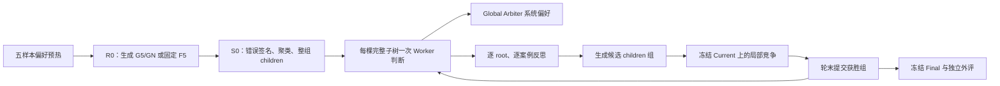

# 当前方法与代码边界

`structured_rubrics/` 提供 Agent、JSON 解析、Rubric schema、验证、后端规格和调用遥测。`experiments/evolving_structured_rubrics/` 中 `generated_root_initialization.py` 负责预热及 R0，`rubric_pipeline.py` 负责 S0 与外评，`subtree_local_reflection.py` 负责逐例反思和局部接受，`aligned_system_runtime.py` 负责 Worker/Arbiter 判断与报告复用。`aligned_prompts.py` 固定 prompt 和解析器，`model_call_support.py` 固定请求身份与多模态内容，`vlrb_official.py` 固定正式 K=3 日程和指标。`run_subtree_experiment.py` 是这三个阶段的命令入口。

局部接受可配置为 Covered ACC 或 Strict ACC；Preserve5 是独立的正确案例提示干预。它们的冻结配置与已保存结果见[结果页](experiments/subtree-local-reflection/results.md)。正式 VLRB 采用至少两票一致的 K=3 多数口径；`aligned_system_runtime.metrics` 的相对多数仅用于运行时诊断。两者不能混作同一结果。

`manager_runtime.py` 提供 Manager 调用、解析、缓存、并发、429 冷却及最多 10 次尝试，并保留初始化的 `signature`、`cluster`、`children` 三个阶段。`subtree_local_reflection_manager.py` 注入演化的 `case_reflection`、`subtree_split` prompt 和校验。旧 `system`、`root` 阶段已移出当前代码；历史实现保留在实验分支。

`aligned_system_runtime.py` 保留三条核心路径：`evaluate` 为每棵完整子树生成报告后调用 Global Arbiter；增量评测复用冻结基线中未改动的子树报告，并在新报告组合上重新执行 Arbiter；`root_from_system` 和 `evaluate_root` 分别提取局部基线、仅调用 Worker 验证候选，局部接受仍由 `subtree_local_reflection.compare` 决定。报告中的 A/B 标签按每次调用的展示顺序还原。请求缓存键、prompt、解析器、最多 10 次尝试及正式计分规则沿用冻结实现。无调用的 `paired_root`、`paired_root_all_samples`、`attributed_error_ids` 已移出当前代码；历史实现仍可在实验分支查看。

原 Gate/Cascade、joint、分层反思和历史 runner 的完整实现保存在 `codex/subtree-local-reflection` 分支及阶段标签。当前入口不会导入那些模块。
