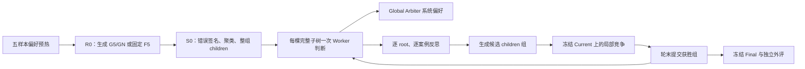

# 当前方法与代码边界

`critiq/` 保留 Agent、JSON 解析、Rubric schema、验证、后端规格和调用遥测。`experiments/evolving_structured_rubrics/` 中 `generated_root_initialization.py` 负责预热及 R0，`current_method.py` 负责 S0 与外评，`subtree_local_reflection.py` 负责逐例反思和局部接受，`aligned_system_runtime.py` 负责 Worker/Arbiter 判断与报告复用。`current_prompts.py` 固定 prompt 和解析器，`current_runtime_support.py` 固定请求身份与多模态内容，`current_vlrb.py` 固定正式 K=3 日程和指标。`current_experiment.py` 是这三个阶段的命令入口。

局部接受可配置为 Covered ACC 或 Strict ACC；Preserve5 是独立的正确案例提示干预。它们的冻结配置与已保存结果见[结果页](experiments/subtree-local-reflection/results.md)。正式 VLRB 采用至少两票一致的 K=3 多数口径；`aligned_system_runtime.metrics` 的相对多数仅用于运行时诊断。两者不能混作同一结果。

原 Gate/Cascade、joint、分层反思和历史 runner 的完整实现保存在 `codex/subtree-local-reflection` 分支及阶段标签。当前入口不会导入那些模块。
