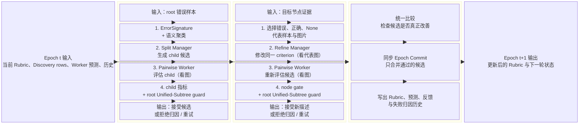

# Split 与 Refine 算子算法框架

这张模块图从算法接口的角度展示当前 Local Unified-Subtree 演化协议。左侧输入在每个 epoch 开始时被冻结；中间两列分别是 Split 和 Refine 的独立候选生成与评估模块；右侧统一比较并同步提交。每个模块都标出了主要输入、模型调用、评估输出，以及失败后的归因和重试状态。图片只在代表性 Refine 证据和 Pairwise Worker 评估阶段实际参与推理。

